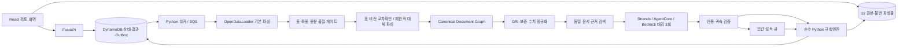

# 00 · 최상위 개발 명세

> ESG ProofOps · 개발 명세 1.0 · 2026-09-08
> 도메인 정본: `sources/PROJECT_DOMAIN_V2_ORIGINAL.md` (원문 2.0, 2026-09-07).

## 1. 확정 범위와 문서 우선순위

**기업 공시 안의 환경 관련 주장을 원자 단위로 분리하고, 같은 공시 안의 근거를 연결하여 발간 전 입증 검토를 지원한다.** 기업의 실제 환경성과, 법 위반, 그린워싱의 진실 여부를 판정하지 않는다. 이번 작업은 기존 도메인을 새로 기획하는 작업이 아니라, 승인된 도메인을 구현 가능한 소프트웨어 계약으로 바꾸는 작업이다.

우선순위는 **사용자의 이번 지시 → 원문 v2.0의 도메인 정의 → 본 문서의 기술 계약 → 개별 명세 → 기존 저장소**다. 두 번째 첨부의 “먼저 비판적으로 검토하고 요구사항을 수정”하라는 일반 지침은 이번 사용자의 도메인 동결 지시에 의해 적용하지 않는다. 본 문서는 기술적 충돌 해결의 정본이며, 원문 도메인을 덮어쓰지 않는다.

원문 규정이 없는 경우 값을 추측하는 대신 `decision_status=blocked_rule_gap`, `evidence_grade=null`, `label=null`을 반환한다. 이것은 새 도메인 라벨이 아니라 **판정을 아직 산출하지 않았다는 처리 상태**다. 기존 `review_status`의 세 값은 그대로 유지한다. 미정 조항·규제 효력은 `31_DOMAIN_IMPLEMENTATION_GAPS.md`의 게이트로 관리한다.

## 2. 제품의 일곱 산출물

원문 §1.5를 유지한다: 클레임별 E0~E3/라벨, 결손과 조항 근거, 보증 연결, 수정 제안, 세이프하버 대응 기록, 감사 추적, 기준별 충족 현황. 대시보드는 결손·검토 대상을 먼저 보여주며 종합점수를 전면에 내세우지 않는다. `SUBSTANTIATED`는 진실·인증·법적 면책의 보장이 아니다.

## 3. 바꾸지 않는 도메인 계약

| 항목 | 고정 내용 |
|---|---|
| 판정 주체 | LLM 은 추출·태깅만, 순수 Python 규칙엔진이 등급·라벨 계산 |
| 트랙 | goal / performance / management, 주제로 역추론 금지 |
| 등급·라벨 | E3=SUBSTANTIATED, E2/E1=INCOMPLETE, E0=UNSUBSTANTIATED |
| 세부 라벨 | PERF / IMPL; 원문에 매핑이 없는 경우 임의 결정하지 않음 |
| 전역 근거 | 같은 문서의 범위·방법론·외부검증은 허용; 숫자·목표연도는 해당 주장/동일 표 직접 확인 |
| 최상급 | 비교기준과 외부검증이 모두 부재한 경우 E0 특칙 |
| 세이프하버 | 일반 사다리와 분리된 경로, 근거·가정·한계의 기록을 보존 |
| 보증 | covered / not_covered / undetermined 와 수준·기간·경계·지표 연결 |
| 산업·유예 | 적용 제외는 결손과 구분하고 적용 기준 분모에서 제외 |
| 외부 자료 | 뉴스·외부 배출량 DB 를 개별 클레임 입증 입력으로 사용하지 않음 |
| 인간 검토 | 사람은 원문 근거와 태깅을 수정; 라벨을 직접 수정하는 API 없음 |

## 4. 채택한 구현 구조

**2026-09-09 사용자 변경 승인:** 모델 제공자는 Bedrock 고정에서 Upstage 또는
다른 저비용 API 모델로 변경한다. 최초 Upstage 로컬 테스트의 누적 승인 예산은
USD 10이다. **2026-09-18 추가 승인:** 기존 사용·미정산 예약을 포함한 누적
상한을 USD 20으로 확장한다. 새 장부로 사용액을 초기화하지 않는다.
아래 AWS 구성도는 기존 배포 설계이며, 현재 로컬 모델 실증은
`evaluation/upstage_live_probe.py`의 별도 경로다. 이 변경은 판정 도메인이나
원문 근거 검증을 완화하지 않으며 AWS 배포 완료를 의미하지 않는다.

**하나의 Python 도메인 패키지 + React 웹 + 세 실행 단위(API, 작업 워커, 태깅 에이전트)**로 만든다. 기능별로 독립 마이크로서비스를 만들지 않는다. 원문 AWS 선택을 유지하여 S3, DynamoDB, OpenSearch Serverless, Bedrock, Strands, AgentCore 를 사용한다. 문서 파싱은 장시간/Java 프로세스가 필요하므로 ECS Fargate 워커에서, 제한된 태깅 호출은 AgentCore Runtime 에서 수행한다.

## 5. 핵심 구조 보완

1. 파싱 실패를 근거 부재로 취급하지 않는다. `unknown/unreadable/conflict`가 등급에 영향을 주면 자동 확정을 중단한다.
2. 여러 파서의 문자열 합집합은 최종 근거가 아니다. 원시 후보를 보관하고, 하나의 canonical 블록/셀과 여러 출처를 연결한다.
3. 최종 태깅 3회는 **동일하게 고정한 evidence packet**을 읽는다. 초기 태깅 후 RAG 만 덧붙이고 기존 등급을 유지하지 않는다.
4. 문자열이 실제 있다는 것과 해당 주장의 근거라는 것은 별개의 검증이다. 기업·연도·지표·범위·표 행열 연결까지 확인한다.
5. 동일 요청 캐시를 세 번 읽어 3회 자기일관성으로 계산하지 않는다. replicate_id 를 요청 식별자에 넣는다.
6. 규칙 재채점은 새 decision revision 을 만든다. 기존 결과·검토 이력·수출 리포트를 덮어쓰지 않는다.

## 6. 출시 범위

P0는 업로드부터 파싱, 근거 연결, 일반 사다리, 세이프하버 기록 경로, 보증 연결, 산업/유예 적용 상태, 검토 큐, 감사 리포트까지의 닫힌 수직 경로다. 일반 사다리 중 원문으로 결정 가능한 경우만 자동 확정한다. 미확정 규칙은 정직하게 검토 대기 상태로 노출한다. 광고 모드와 다년도 비교는 P1 기능으로 유지하며 도메인에서 삭제하지 않는다. 광고 모드는 승인된 전용 규칙팩이 없으면 실행을 차단한다. 전년 보고서가 없으면 비교는 `not_run`이다.

P0 구현과 실서비스 공개는 다르다. 대회 실증은 권리가 확인된 공개 보고서로 수행한다. 기밀문서 공개 서비스는 데이터 이동, 접근 통제, 규칙 조항 및 라이선스 게이트를 통과한 뒤 열 수 있다.

## 7. 외부 값과 미확정 값의 취급

계정·리전의 허용 모델 ID, AWS ARN, 실제 대회 요강, 기준 조항 승인, 동의 프로필은 사용자 계정/공식 원문으로 채워야 하는 배포 입력이다. 코드가 임의로 만들지 않는다. 환경값이 없는 기능은 구체적인 오류와 비활성 사유를 반환하며, 가짜 결과·목업을 운영 결과로 표시하지 않는다.

## 8. 완료 기준

`25_DEFINITION_OF_DONE.md`를 따른다. 도메인 등급 재현성, 원문 위치 왕복, 타 테넌트 차단, 세 번의 실질적으로 별개 태깅 기록, 검토 충돌 처리, 부분 실패 표시, 리포트 스냅샷 일관성은 타협하지 않는 출시 게이트다. 이 개발 패키지 자체의 검증과 실제 구현·AWS 실증 검증은 구분한다.

## 9. v2.2 연계(C군) 추가분 — v2.0 위에 additive (2026-09-20 R00)

**이 절은 v2.0 도메인을 덮어쓰지 않는다.** 1~8장의 G/P/M 사다리·라벨·세이프하버·보증·산업·유예 계약은 그대로 유지된다. 아래는 사용자가 반영을 요청한 원문 v2.2(`ROOT handoff/team-v3/reference/PROJECT_V2_2.md` §3.7/4.5/4.10, `RECONCILIATION_SPEC.md`)의 **추가 요구**만 기록한다.

- **범위**: C1~C5는 지속가능성 공시 클레임과 같은 기업·같은 기간 재무제표(DART 조회, B 담당)를 대조해 "차이를 설명하는 문구가 공시에 있는가"만 판정한다. C군은 별도 `reconciliation[]` 축으로 출력하며 `label`/`evidence_grade`에 절대 반영하지 않는다(v2.2 §4.10).
- **status 값은 `matched`/`needs_explanation`/`not_applicable` 세 값만.** `mismatch`/`error`류 값을 추가하지 않는다.
- **1단계 구현 순서는 C1·C3만.** C2·C4는 최종 범위에 포함하되 구현 순서는 후순위. **C5는 런타임 진입을 차단**하며(회계 판단 개입, 오탐 위험) 착수하지 않는다 — 이는 P1 보류가 아니라 명시적 실행 차단이다.
- **소유**: C1~C5의 domain/adapters/DART 연동 구현은 개발자 B 담당(`ROOT handoff/team-v3/contract/CONTRACT.md`). A는 기존 G/P/M 등급 계약이 C군에 오염되지 않는 경계만 보증한다.
- **현재 코드 상태**: A가 확인 가능한 공유 저장소 기준(commit ff61f41, `ROOT handoff/team-v3/SOURCE_RECONCILIATION.md`)으로는 `domain/reconciliation`, `application/reconciliation`, `adapters/dart`, `config/accounting`가 아직 보이지 않는다. 이는 **A가 접근 가능한 범위의 마지막 공유 상태**이며, B의 로컬/미공유 작업이 실제로 없다는 뜻은 아니다(`SOURCE_RECONCILIATION.md`: "B의 아직 공유되지 않은 작업 상태도 추정하지 않습니다"). 계약·예제는 존재하며 구현 완료로 표시하지 않는다.
- **회계 판단 경계**: "설명이 확인되지 않았다"까지만 산출하며 인식·금액·분류의 적정성, 추정·가정의 합리성은 판단하지 않는다(v2.2 §4.10 경계선 표). 조항은 `source-supplied`로 기록하고 `verified`를 임의 부여하지 않는다.
- **미해결 항목**: 동일 개수-다른 집합 경계(원문 count-only 경로 vs 내부 exact-set 계약), C3 5.0 임계값의 실 적용치, `not_applicable`(판단 근거 불충분)과 기술적 `blocked`(수집/판독 실패)의 구분 표현은 `ROOT handoff/team-v3/OPEN_DECISIONS.md`의 DEC-C1/DEC-C3/DEC-STATUS로 남아 있으며 이 문서가 대신 결정하지 않는다.

이 절 작성으로 C군 구현이 완료됐다고 표시하지 않는다. 실제 조항 대조·B 통합 검증은 `32_PIPELINE_COMPLETION_PLAN.md` R08을 따른다.
