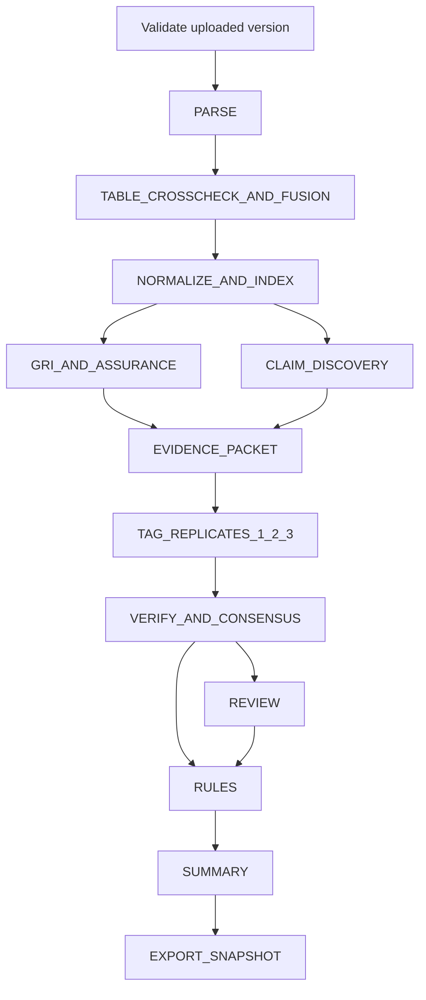
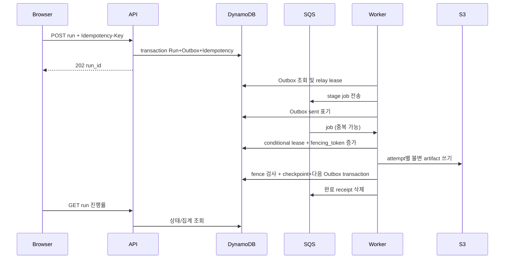

# 03 · 시스템 아키텍처

> ESG ProofOps · 개발 명세 1.0 · 2026-09-08
> 도메인 정본: `sources/PROJECT_DOMAIN_V2_ORIGINAL.md` (원문 2.0, 2026-09-07).

## 1. 경계와 의존 방향
웹은 HTTPS API 만 호출한다. API 와 워커는 동일한 `proofops` 도메인 패키지를 import 한다. 태깅 에이전트는 허용된 입력 packet 에서 후보 태깅만 반환한다. `domain`은 AWS SDK, FastAPI, Strands, 파일 I/O, 네트워크, 환경변수를 import 하지 않는다. `application`은 domain 과 Ports 만 의존한다. `adapters`가 Ports 를 구현하고 각 app 의 composition root 가 조립한다. `scripts`, `evaluation`, `legacy`를 runtime domain 에서 import 하지 않는다.

AWS 에서 API 와 워커는 ECS Fargate 의 별도 task definition 이며 한 Docker base/source tree 를 공유한다. 태깅 app 은 AgentCore Runtime 지원 형태로 별도 패키징한다. 도메인별 독립 DB/마이크로서비스, Kafka, Kubernetes, Neo4j 는 도입하지 않는다. 문서 graph 는 S3 JSON artifact 와 인메모리 인덱스다.

## 2. 컴포넌트
| 실행체/저장소 | 책임 | 금지 |
|---|---|---|
| React | 입력, 진행률, 근거 viewer, 태깅 검토 | 판정 계산, 브라우저 모델 API 호출 |
| FastAPI/BFF | 세션, tenant 권한, 요청 검증, 읽기/변경 use case | PDF 파싱을 요청 스레드에 오래 붙잡기 |
| Worker | stage graph, lease, 파싱, packet, rules, export | 자의적 domain 변경, 전체 재실행으로 성공 artifact 덮기 |
| AgentCore/Strands | allowlisted 모델로 태깅·구조화 | 등급 산출, 임의 S3 key·URL 열기 |
| DynamoDB Core | 문서·job·revision·review·outbox·멱등키 | 400 KB 넘는 본문/LLM 응답 저장 |
| DynamoDB Audit | 변경 이벤트와 해시 사슬 | 원문 본문·secret 기록 |
| S3 | 원본, graph, table, raw response, report snapshots | public ACL, key 만으로 tenant 권한 인정 |
| OpenSearch Serverless | tenant+document_version 필터의 근거 회수 | 검색 hit 만으로 citation/ownership 검증 대체 |
| SQS + DLQ | at-least-once 작업 운반 | job 완료 상태의 최종 정본 역할 |

## 3. 실행 DAG

`PARSE`는 원문 전체를 대상으로 한다. 환경 파트는 claim discovery 범위이고 방법론·Index·보증 부록은 근거 검색 대상으로 남긴다. 사전 키워드 필터는 우선순위이며 페이지를 영구 삭제하는 장치가 아니다. 각 stage 는 입력/설정/content hash 를 기록하고 schema+hash 가 맞는 성공 checkpoint 만 재사용한다.

## 4. 요청·작업 흐름

Outbox 에는 `pending/sent`, attempt, next_attempt_at 을 두며 워커 서비스 내부 relay loop 가 2초 주기로 조회한다. DB 기록 후 SQS 전송 실패는 재시도하고, 전송 후 sent 표기 실패로 인한 중복은 job key 로 제거한다. DDB write 와 SQS send 가 하나의 원자 transaction 이라고 가정하지 않는다.

## 5. 인증 흐름
Cognito Authorization Code+PKCE/OIDC callback 을 BFF 가 처리한다. 서버는 암호화된 refresh token 을 세션 record 에 저장하고 브라우저에는 임의 opaque session ID cookie 만 발급한다. `GET /v1/session`은 사용자, 활성 tenant, role, CSRF token 을 반환한다. 서버가 tenant membership 을 재검증한 후 tenant prefix 를 만든다. query/body 의 tenant_id 는 권한 근거가 아니다.

## 6. 실패·재시도·부분 완료
작업 시작 lease 120초, heartbeat 30초, stage 별 강제 제한은 파싱 600초·모델 120초/호출·export 180초다. lease 획득마다 fencing token 을 증가시켜 이전 worker 완료 쓰기를 거부한다. 작업 메시지 visibility 는 lease 와 독립적으로 연장한다. DB checkpoint 커밋 실패 시 성공으로 ack 하지 않는다. 응답 지연으로 중복 모델 호출이 생길 수 있으므로 정확히 한 번 과금이라고 약속하지 않는다. 사용 ledger 에는 모든 시도를 남기고 accepted artifact 는 하나만 고정한다.

문서 일부가 실패하면 `partial`; 모든 필수 stage 가 끝났지만 사람 검토가 있으면 실행 `completed`와 별도 `review_pending_count>0`를 함께 표시한다. 처리 성공과 판정 확정은 다른 축이다. 미처리 source 가 하나라도 있으면 분석범위를 함께 표시하고 “전수 완료” 배지를 주지 않는다.

## 7. AgentCore 기능 배치
Runtime 은 P0 태깅 호출에 사용한다. Observability 는 본문 없는 메트릭/trace 만 보낸다. Gateway/Identity 는 P1 외부 도구 접점이 생길 때 연결하며 단순한 P0 packet 입력을 위해 중복 인증 계층을 만들지 않는다. Memory 는 기본 OFF 다. 다년도 공시의 사실 저장은 S3 버전·DynamoDB 참조가 정본이며 대화 기억으로 전년도 수치를 대체하지 않는다. 이 배치는 원문의 기술 후보를 기능별 필요에 맞게 구현 시점만 나눈 것이다.
