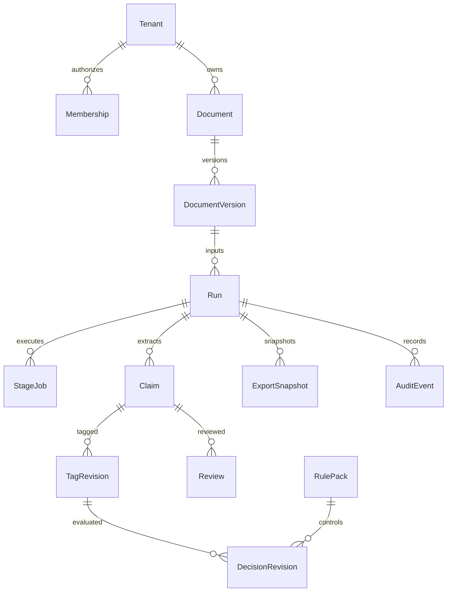

# 06 · DynamoDB·S3 데이터 모델

> ESG ProofOps · 개발 명세 1.0 · 2026-09-08
> 도메인 정본: `sources/PROJECT_DOMAIN_V2_ORIGINAL.md` (원문 2.0, 2026-09-07).

## 1. 저장 방식과 타입
AWS 운영 정본은 DynamoDB `proofops-{env}-core`와 `proofops-{env}-audit` 두 테이블이다. PK/SK 는 string partition/sort key, on-demand capacity, encryption KMS, point-in-time recovery 를 사용한다. 외래키는 엔진이 자동 보장하지 않으므로 application 의 동일 transaction/tenant 검증으로 보장한다. `!`는 필수, `?`는 생략 가능(개념적 null), S=string, N=number, BIN=binary, BOOL=boolean, SHA=64hex, TS=UTC RFC3339, Date=YYYY-MM-DD, UUID=서버 UUID. 명시 기본값 외에는 입력을 요구한다. AWS 숫자 codec 은 Decimal 이며 값 원문은 문자열로 별도 보존한다.

각 business record 는 `schema_version=1`, `created_at`, `updated_at`(불변 record 는 created_at 과 같음), `tenant_id`를 기본 필드로 갖는다. Session 은 tenant membership 선택 전 존재할 수 있으므로 tenant_id 예외다. ArtifactRef 는 `{bucket, key, version_id, sha256, media_type, byte_size}`이며 서버 내부 전용이다. 클라이언트에는 버킷 경로 대신 authorized source/export id 만 노출한다. 200 KiB 에서 artifact 분리를 시작하고 350 KiB 초과 inline record 는 거부한다. DynamoDB 의 400 KB 제한보다 앞서 차단한다.[S11]

## 2. 엔터티 사전
### Tenant

PK: `T#{t}` / SK: `META`.

필드: `name:S!, status:S!=active, created_at:TS!, updated_at:TS!, schema_version:N!=1`.

무결성·삭제: 테넌트 설정; 물리 삭제는 retention 작업만.

### Membership

PK: `T#{t}` / SK: `MEMBER#{user}`.

필드: `user_sub:S!, role:Enum(viewer|editor|reviewer|admin)!, status:Enum(active|revoked)!, revision:N!=1`.

무결성·삭제: 테넌트별 PK/SK unique; 모든 권한 검사에 사용.

### Session

PK: `SESSION#{hash(sid)}` / SK: `META`.

필드: `user_sub:S!, active_tenant_id:UUID?, encrypted_refresh_token:BIN!, csrf_hash:S!, expires_at:N!, revision:N!=1`.

무결성·삭제: 로그인 때 생성, 8시간 절대 만료/30분 idle; TTL 은 청소용.

### Document

PK: `T#{t}` / SK: `DOC#{d}`.

필드: `document_id:UUID!, company_id:UUID!, title:S!, document_type:Enum(sustainability_report|annual_report_section)!, latest_version_id:UUID?, deleted_at:TS?, revision:N!=1`.

무결성·삭제: 회사·문서 logical entity; latest pointer 변경은 CAS.

### Upload

PK: `T#{t}#UPLOAD#{u}` / SK: `META`.

필드: `document_id:UUID!, upload_id:UUID!, original_filename:S!, expected_size:N!, expected_sha256:SHA!, s3_quarantine_key:S!, status:Enum(pending|validating|accepted|rejected|expired)!, expires_at:N!`.

무결성·삭제: 원본 파일명은 표시용, S3 key 는 서버가 생성.

### DocumentVersion

PK: `T#{t}#DOC#{d}` / SK: `VER#{v}`.

필드: `version_id:UUID!, s3_key:S!, s3_version_id:S!, sha256:SHA!, size_bytes:N!, page_count:N!, company_id:UUID!, report_year:N!, industry_code:S?, industry_system:Enum(gics|sasb|custom|unknown)!, consolidation_scope:S?, statement_period:Map!, rights_profile_id:UUID!, status:S!`.

무결성·삭제: 파일 bytes 와 metadata snapshot 불변; 수정은 새 버전.

### Run

PK: `T#{t}#RUN#{r}` / SK: `META`.

필드: `run_id:UUID!, document_version_id:UUID!, mode:Enum(disclosure|advertising)!, scope:Enum(full|declared_subset)!, selected_pages:L<N>?, rule_pack_id:UUID!, rule_pack_sha256:SHA!, parser_profile_hash:SHA!, model_binding_hash:SHA!, status:Enum(queued|running|partial|completed|failed|cancelled)!, mutation_epoch:N!=0, revision:N!=1, counters:Map!, manifest_ref:ArtifactRef?`.

무결성·삭제: epoch 은 claim/tag/decision/head 와 같은 transaction 에서 증가.

### StageJob

PK: `T#{t}#RUN#{r}` / SK: `JOB#{stage}#{shard}`.

필드: `job_id:UUID!, input_hash:SHA!, stage:S!, shard:S!, status:Enum(pending|leased|succeeded|failed|cancelled)!, attempt:N!=0, fencing_token:N!=0, lease_owner:S?, lease_until:N?, heartbeat_at:TS?, artifact_ref:ArtifactRef?, error_code:S?`.

무결성·삭제: 동일 stage/shard/input hash unique. worker conditional write 필수.

### Outbox

PK: `T#{t}#RUN#{r}` / SK: `OUTBOX#{event_id}`.

필드: `event_id:UUID!, event_type:S!, payload_ref:ArtifactRef?, job_id:UUID!, status:Enum(pending|sent)!, next_attempt_at:N!, attempts:N!=0`.

무결성·삭제: GSI queue bucket=OUTBOX#{hash(event_id)%16}, due_at 정렬.

### Claim

PK: `T#{t}#RUN#{r}` / SK: `CLAIM#{c}`.

필드: `claim_id:UUID!, source_ref:ArtifactRef!, claim_artifact_ref:ArtifactRef!, track:S?, head_tag_revision:N?, head_decision_revision:N?, review_status:Enum(auto_confirmed|needs_review|human_confirmed)!, decision_status:S!, revision:N!=1`.

무결성·삭제: 원문과 전체 배열은 S3; 목록에 필요한 필드만 inline.

### TagRun

PK: `T#{t}#RUN#{r}#CLAIM#{c}` / SK: `REPLICA#{packet_hash}#{i}`.

필드: `packet_sha256:SHA!, replicate_id:Enum(1|2|3)!, request_signature:SHA!, raw_ref:ArtifactRef!, guarded_ref:ArtifactRef?, status:S!, provider_request_id:S?, usage:Map!`.

무결성·삭제: 같은 replica 의 재시도와 다른 replica 를 구분.

### TagRevision

PK: `T#{t}#RUN#{r}#CLAIM#{c}` / SK: `TAG#{zero_pad(rev,10)}`.

필드: `tag_revision:N!, packet_sha256:SHA!, elements_ref:ArtifactRef!, source_hash:SHA!, origin:Enum(consensus|human)!, reviewer_sub:S?, review_reason:S?, created_at:TS!`.

무결성·삭제: immutable; 사람이 변경해도 기존 revision 유지.

### DecisionRevision

PK: `T#{t}#RUN#{r}#CLAIM#{c}` / SK: `DECISION#{zero_pad(rev,10)}`.

필드: `decision_revision:N!, tag_revision:N!, rule_pack_sha256:SHA!, engine_version:S!, semantic_hash:SHA!, evidence_grade:Enum(E0|E1|E2|E3)?, label:Enum(SUBSTANTIATED|INCOMPLETE|UNSUBSTANTIATED)?, sublabel:Enum(PERF|IMPL)?, decision_status:S!, artifact_ref:ArtifactRef!`.

무결성·삭제: 완전 decision 은 S3, 조회 필드 inline; null 은 미산출.

### Review

PK: `T#{t}#RUN#{r}` / SK: `REVIEW#{q}`.

필드: `review_id:UUID!, claim_id:UUID!, status:Enum(open|resolved|superseded)!, revision:N!=1, reason_codes:L<S>!, base_tag_revision:N!, resolved_by:S?, resolved_at:TS?, resolution_ref:ArtifactRef?`.

무결성·삭제: review_id locator 도 같은 transaction 생성; 낡은 태깅 기준 확정 금지.

### RulePack

PK: `T#{t}` / SK: `RULEPACK#{id}`.

필드: `rule_pack_id:UUID!, artifact_ref:ArtifactRef!, sha256:SHA!, ontology_version:S!, version:S!, effective_date:Date!, mode:S!, status:Enum(draft|validated|active|retired)!, approved_by:S?, approved_at:TS?`.

무결성·삭제: 루브릭 콘텐츠 불변; 상태/활성 pointer 만 revision CAS.

### ExportSnapshot

PK: `T#{t}#RUN#{r}` / SK: `EXPORT#{id}`.

필드: `export_id:UUID!, snapshot_epoch:N!, claim_revision_refs:L<ArtifactRef>!, state:Enum(queued|building|ready|failed)!, format:L<S>!, manifest_ref:ArtifactRef?, partial:BOOL!, errors:L<S>!`.

무결성·삭제: 대량 revision 목록은 S3 snapshot manifest 로 옮김.

### UsageLedger

PK: `T#{t}#RUN#{r}` / SK: `USAGE#{request_id}#{attempt}`.

필드: `request_id:S!, attempt:N!, role:S!, model_id:S!, input_tokens:N?, output_tokens:N?, cache_read_tokens:N?, latency_ms:N!, cost_decimal:S?, pricing_snapshot_id:S?, status:S!`.

무결성·삭제: 실패·재시도도 기록; 가격 없음=null.

### Idempotency

PK: `T#{t}#IDEMPOTENCY` / SK: `{route_hash}#{key_hash}`.

필드: `request_hash:SHA!, response_status:N!, response_ref:ArtifactRef?, response_inline:Map?, resource_id:UUID?, expires_at:N!`.

무결성·삭제: 24시간 같은 키+다른 body409; 인증정보는 hash 입력 제외.

### ArtifactPointer

PK: `T#{t}#RUN#{r}` / SK: `ARTIFACT#{type}#{id}`.

필드: `artifact_id:UUID!, kind:S!, ref:ArtifactRef!, schema_version:S!, content_sha256:SHA!, status:S!`.

무결성·삭제: SourceArtifact/ParseManifest/Observation/IndexEntry/AssuranceStatement/EvidencePacket/CheckResult/Comparison/SafeHarborRecord/Evaluation 의 통일 metadata 저장.

### DeletionRequest

PK: `T#{t}#DOC#{d}` / SK: `DELETE#{id}`.

필드: `deletion_id:UUID!, status:Enum(requested|running|blocked_retention|completed|failed)!, manifest_ref:ArtifactRef!, requested_by:S!, requested_at:TS!, completed_at:TS?`.

무결성·삭제: 삭제되지 않은 version/cache/index 가 있으면 completed 금지.

### AuditEvent [Audit table]

PK: `T#{t}#RUN#{r}` / SK: `EVENT#{zero_pad(sequence,15)}`.

필드: `sequence:N!, event_id:UUID!, actor_sub:S!, action:S!, target_id:S!, before_hash:SHA?, after_hash:SHA!, previous_event_hash:SHA?, event_hash:SHA!, timestamp:TS!, reason:S?`.

무결성·삭제: HEAD record 와 CAS 동시 기록, append-only IAM.

## 3. 조회 인덱스와 접근 패턴
| 조회 | 데이터 경로 | 일관성/페이지 |
|---|---|---|
| tenant 문서 목록 | PK=T#tenant, SK begins DOC# | strongly consistent Query; 50 기본/100 최대 |
| 문서 버전 | PK=T#tenant#DOC#doc, VER# | strong |
| 사용자 tenant 목록 | Membership GSI1PK=USER#sub, GSI1SK=T#tenant | eventual 목록, 사용 시 base membership strong 확인 |
| run 목록 | Run GSI1PK=T#tenant#RUNS, GSI1SK=created_at#id | eventual; 새 run id 직접 조회 strong |
| claim/review/export 목록 | PK=T#tenant#RUN#run, 해당 prefix | strong; filter 후 부족하면 한도 내 추가 query |
| Outbox due | GSI2PK=OUTBOX#bucket, GSI2SK=next_attempt_at#id | eventual, worker strong lease 재확인 |
| review_id/export_id lookup | PK=T#tenant#LOOKUP, SK=kind#id | strong; locator 가 있어도 parent 권한 재확인 |
| audit | Audit PK=T#tenant#RUN#run, EVENT# | strong; 50 events pagination |

GSI projection 은 최소 목록 필드만 포함하며 본문을 포함하지 않는다. 특정 tenant 의 대용량 분산/claim listing 속도 문제가 실측되기 전 임의 sharding 은 하지 않는다. pagination cursor 는 마지막 key+tenant+endpoint+필터 hash 를 HMAC 한 opaque token 이며 만료 15분이다. 다른 필터/tenant 재사용은400이다.

## 4. 관계

## 5. 원자성·동시성
Review 확정 transaction 은 (1) review revision/state condition, (2) 새 TagRevision put-if-absent, (3) 새 DecisionRevision put-if-absent, (4) Claim head CAS, (5) Run epoch 증가, (6) Audit HEAD CAS+EVENT put, (7) Idempotency 저장을 포함한다. 동일 항목을 한 transaction 에서 두 action 으로 조작하지 않는다. 이 모든 쓰기는 같은 AWS 리전에서 처리하며 cross-region 원자성을 가정하지 않는다. 조건 실패는 재읽기 또는 412이고 사용자 확정을 자동 merge 하지 않는다.

S3와 DynamoDB 는 단일 transaction 이 아니다. 먼저 attempt 고유 key 에 S3 artifact 를 업로드·hash 검증한 후 DDB 포인터를 publish 한다. CAS 실패로 참조되지 않는 artifact 는 orphan cleanup 대상으로 남긴다. publish 전 artifact 는 조회 API 에 보이지 않는다. 이벤트와 결과만 atomic 하게 pointer 를 갱신한다.

## 6. 마이그레이션·삭제·백업
스키마는 additive-first reader 를 배포한 뒤 backfill→validator→writer 전환→구 필드 retire 순서다. 중간 migration 에서 런타임이 원본 source 를 수정하지 않는다. DynamoDB migration 도 버전, dry-run, 진행 checkpoint, 재실행 멱등성이 필요하다. OpenSearch 는 새 generation 후 alias 전환, S3 artifact 는 새 버전 생성이다.

문서 논리 삭제는 즉시 사용자 조회에서 숨기고 deletion manifest 로 원본·파생물·캐시·검색·세션/도구 메모리의 실제 잔존을 추적한다. audit 의 본문 없는 최소 metadata 는 승인된 보존 정책을 따른다. TTL 은 즉각 삭제가 아니므로 권한/만료를 요청마다 검사한다. 백업 복구 후 기존 deletion tombstone 을 재적용해 삭제된 원고가 부활하지 않게 한다. 보존/삭제 약속은 원문 계약으로 승인해야 하며 S3 Object Lock 을 모든 문서에 무조건 켜서 삭제 정책과 충돌시키지 않는다.

## 7. 기업·승인 옵션 레지스트리
Company 는 Core table `PK=T#{tenant_id}`, `SK=COMPANY#{company_id}`다. 필수 company_id, legal_name, aliases(list), created_at/updated_at, revision=1. registration_identifier 는 nullable 이며 없는 식별번호를 모델이 만들지 않는다. 이름이 같다고 자동으로 법인을 합치지 않는다. Document.company_id 는 같은 tenant Company 존재를 확인한다. 회사정보 수정으로 과거 DocumentVersion 의 company snapshot 을 덮지 않는다.

RightsProfile/ConsentProfile/RuntimeBinding 은 `PK=T#{tenant_id}`, `SK=PROFILE#{kind}#{id}` metadata 에 status, version, artifact_ref, sha256, approved_at/by 를 저장한다. P0 admin CLI 가 생성·승인하고 API 는 비밀 없는 승인 옵션만 조회한다. RuntimeOptions 응답에 model credentials/secret ARN 은 노출하지 않는다. metadata 정정은 같은 PDF artifact 를 참조하는 새 DocumentVersion 을 만들어 이전 판정 의미를 보존한다.
