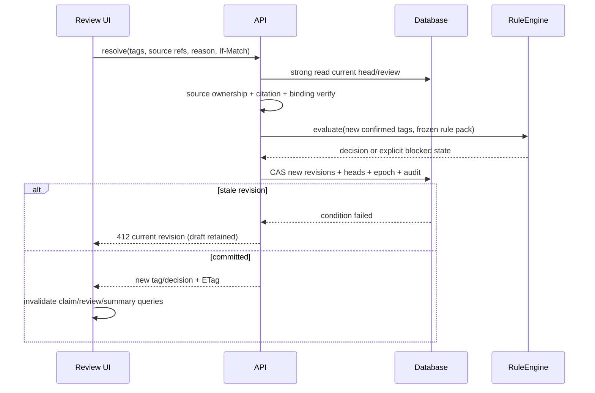

# 12 · 상태와 데이터 흐름

> ESG ProofOps · 개발 명세 1.0 · 2026-09-08
> 도메인 정본: `sources/PROJECT_DOMAIN_V2_ORIGINAL.md` (원문 2.0, 2026-09-07).

## 1. 세 종류의 상태
Frontend local state 는 선택한 필터, 열려 있는 패널, 아직 제출하지 않은 review draft 뿐이다. Server state 는 TanStack Query 에 둔 API response 이며 key 에 tenant_id/run_id/revision 을 포함한다. Persistent state 는 DynamoDB+S3 immutable artifact 이며 client cache 가 정본이 아니다. PDF signed URL 은 메모리에서만 캐시하고 만료/tenant 전환시 지운다.

## 2. 주요 상태 기계
Run: queued→running→completed/partial/failed/cancelled. partial→retry 요청시 running, completed 에서 rules-only rescore 는 기존 run manifest 를 덮지 않는 하위 rescore artifact 를 만든다. job 실패와 review pending 은 별개다.

Review: open→resolved 또는 superseded. 태깅 재실행으로 base revision 이 바뀌면 기존 open review 는 superseded 이고 새 review 를 만든다. TagRevision/DecisionRevision 은 생성 후 변경 불가다. Claim 의 head pointer 만 CAS 변경된다.

Element: present/absent/unknown/conflict/not_applicable. absent 는 관측상 결손, unknown 은 처리 미완료/귀속 불명, conflict 는 경쟁 후보, not_applicable 은 승인된 조건상 제외다. Boolean present 만으로 이5종을 표현하지 않는다. 원문의 boolean schema 는 API compatibility projection 으로만 제공 가능하고 unknown 을 false 로 변환하지 않는다.

Decision: decided 일 때 E/label 존재; blocked_evidence/blocked_rule_gap/not_applicable/not_run 일 때 null. `review_status`는 기존3값으로 유지하되 처리 상태와 나란히 표시한다. human_confirmed 인 태깅이라도 미정 규칙으로 최종 판정은 blocked_rule_gap 일 수 있다.

## 3. 수정·재판정 흐름

## 4. 무효화와 재사용
PDF bytes 변경→새 document_version, 새 parse. parser/normalizer/geometry 변경→새 parse_manifest, source IDs 와 citation 재검증. evidence packet 변경→새 tagging ensemble. model/prompt/schema 변경→새 request signatures. rulepack 만 변경→ontology/source scope compatibility 검사 후 새 decision. basis 요약만 바뀌어도 output basis version 은 새 snapshot 에 명시한다. 임베딩 변경은 새 index generation, 원문 artifact 와 grade 를 자동 수정하지 않는다.

## 5. 재접속·경합
페이지 refresh 는 run GET 부터 복원하며 browser 가 백그라운드 job 을 소유하지 않는다. 네트워크 재시도로 동일 POST 를 보낼 때 최초 idempotency key 를 유지한다. 사용자가 의도적으로 새 실행을 요청한 경우에만 새 키를 만든다. 탭2개 review 충돌은 서버 CAS 가 결정하고 SSE/WebSocket 을 추가해도 이 원칙은 바뀌지 않는다. P0는 polling 이며 WebSocket 을 성급히 도입하지 않는다.
