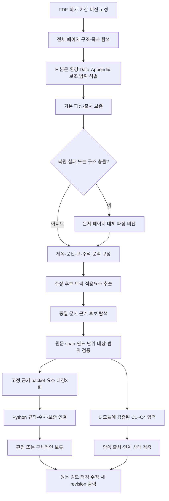

# ESG ProofOps 전체 파이프라인 완성 개발 계획

> 작성: 2026-09-20. 상태: **개발 계획 확정본 — 아래 구현·성능 달성을 뜻하지 않음.**
> 실행자: 각 작업의 입력·산출물·실제 사례를 확인하고 순서대로 구현한다. 이미 승인된 범위의 구현에 별도 계획 승인 절차를 반복하지 않는다. `outcome-first`를 적용하고, 직접 실행에는 `superpowers:executing-plans`를 참고한다. 에이전트 사용은 기존 사용자 지시와 담당 경계를 따른다.

**목표:** 보고서의 E 본문에서 주장을 추출하고, 환경 데이터·부록·관련 범위/방법론/보증을 연결하여, 검증된 태깅과 승인된 Python 규칙으로 입증 상태를 계산하고 사람이 원문과 함께 검토·수정·출력할 수 있게 한다.

**구조:** 기존 Python domain/application/adapters, FastAPI, 작업 워커, React를 유지한다. 기본 파싱과 필요한 대체 파싱을 비교해 선택하고, 후보 분석과 확정 근거 채택을 분리한다. 새 마이크로서비스·벡터DB·범용 에이전트 프레임워크를 선행 조건으로 만들지 않는다.

**적용 명세:** [Master](00_MASTER_SPEC.md), [재사용](26_LEGACY_REUSE_AUDIT.md), [파싱](27_PARSING_AND_PROVENANCE.md), [규칙](28_RULE_ENGINE_CONTRACT.md), [미정 기준](31_DOMAIN_IMPLEMENTATION_GAPS.md), [기존 Task](20_TASK_BREAKDOWN.md), `contracts/task_catalog.json`, `contracts/task_execution_order.json`. v2.2 추가 요구는 ROOT `handoff/team-v3/SOURCE_RECONCILIATION.md`와 `REQUIREMENT_TRACE.csv`로 추적한다.

**문서의 역할:** 이 파일은 현재 개발 순서·산출물·완료 기준의 단일 계획이다. `service-readiness-plan.md`와 `autonomous-completion-plan.md`의 날짜별 내용은 실행 이력이다. 이 계획은 기존 도메인 계약이나 미확정 규칙을 덮어쓰지 않는다. 날짜별 일정 대신 의존성과 완료 결과로 관리한다.

**2026-09-20 후속 실행 지시:** 사용자는 계획의 작업을 순차적으로 계속 실행하고, 가능한 코딩을 Kiro(Opus/Sonnet) → Antigravity(Opus/Gemini 3.8 Flash) → OpenCode(MuseSpark1.3/MiMo) 순으로 위임하도록 지시했다. 실제 제공 모델 ID/가용성은 공급자에서 확인한다. 도메인 판단도 조정자가 원문·사례에 근거해 수행하도록 위임했으므로, AI가 선택한 프로젝트 해석과 승인 기록을 남기며 진행한다. 이를 독립 전문가 gold·공식 기준 원문 검증·법적 효력 확인으로 가장하지 않는다. **Codex 중단 기준은 최신 재개 지시에 따라 잔여50%로 변경**되었으며 이전10% 지시보다 우선한다.

### 현재 실행 기록 · 2026-09-20

- 14:27 UTC: 공용 모델 장부 USD12.2653791172/20, 2488호출 기록·미정산9건; Codex 잔여72%. 롯데74쪽 전수 실행은 추출172주장/원문검증118·보류54에서 계속 중(태깅 시작 전). 기아63쪽은 기존20MB 출력한도를 실제24.73MiB가 초과하여 모델 호출 전 실패했고, 새64MiB 고정 profile로 다시 파싱 중이다. `--parser-max-output-bytes`는 새 실행에만 적용하며 최대128MiB, 재개 시 변경을 거부한다.
- R06d/e: 검증된 주장 차원과 수치 원문으로 미승인 비교 binding을 제안하는 CLI 연결을 구현했다. 다만 롯데117쪽 원본이 숫자 열12개로 분리 저장돼 지표·단위·행 관계가 없으므로 실제 정규화 관측0건이다. 구분 별칭 추가로 해결되지 않음을 확인했고 생산 코드는 변경하지 않았다. 표 전체 구조 복원 후보 실험으로 전환한다.
- R07b: 위임된 프로젝트 해석으로 체크리스트 문서화 충족 여부를 계산하는 새 불변 규칙팩 파생 경로를 구현했다. 법적 효력·E등급 매핑은 미확정 그대로이며, 현재 실행 팩을 덮어쓰지 않았다. 체크리스트 입력 생산과 실제 적용은 남아 있다.
- R09: CLI 단계 실패가 종료코드0으로 보이던 문제를 수정했다. 후속 단계를 중단하고 inspection에 실패 stage/status를 저장한 뒤 비정상 종료한다(관련30검사 통과). 이는 실패 보존 기능이며 실제 완주·정확도 개선 수치가 아니다.

- 13:58 UTC: OpenCode MuseSpark1.3와 MiMo 무료한도 소진을 각각 확인했다. 남은 코딩은 Codex로 전환(직전 잔여75%). 오리온 원본은 optional null 외에 필수 내부 이동 목적지 `/A/D[0]`도 undefined여서 검사를 완화하지 않고 unsupported로 보존했다. R10 두 번째 전체 실행은 기아63쪽/본문32쪽으로 진행한다.
- R06c: 주장별 검증된 metric/기간/entity/facility를 목록·상세 보증 판정의 공통 입력으로 연결. 원문 기간 `YYYY`, `YYYY년`, `YYYY 년도`를 비교 시에만 정규화하고, 제외 기간에도 동일하게 적용한다. 불명확한 제외 범위는 보류; 저장된 의견서/해시 불변.

Orca run `run_da368bec0794`의 Kiro Opus5/Sonnet5 작업을 사용했다. 신규 TUI 종료는 legacy UI로 해결한 실행 문제였고, 이후 **11:51 UTC에 월간 한도 소진을 별도로 확인**했다. Kiro 작업 권한을 fence/abandon하고 Antigravity의 Opus4.6·Sonnet4.6·Gemini3.8 Flash로 이어서 구현 중이다. GUI 대화는 Orca dispatch로 가장하지 않고 아래 ID로 추적한다. 이후 Antigravity Claude와 Gemini3.8 Flash 한도 소진을 확인하여 OpenCode MuseSpark1.3 무료 모델로 전환했다. 완료된 작업 터미널은 재사용 또는 정리한다.

| 작업 | 실제 완료한 부분 | 아직 남은 부분 |
|---|---|---|
| R00 | v2.0/v2.2·GAP와 AI 위임 판단 이력 정리. 현재와 계획된 후보 검증 계약 구분 | 실제 승인 기록·적용은 R07 코드 경로에서 진행 |
| R01 | 5기업 입력/기존 실행 수집(KEPCO 파싱만), 롯데·기아 동일3페이지 Upstage enhanced 실제 호출과 원문 시각 대조. 원문 이미지 기반 AI silver40건 및 오리온20건 고정 | 선택 사례60건은 전수 누락률 분모나 독립 gold가 아님. 오리온 원문 단위 충돌·공시 합계도 임의 보정하지 않음 |
| R02 | 이웃 제목의 경계 겹침 수정. 동일 CLT 환경 롯데 인용1/12→10/12, 카카오11/14 유지, KB0/4 유지. 이전 롯데 receipt 바이트 동일 재생 | 남은2인용 OCR·읽기순서, 표 구조·기타 환경의 과거 검증기 차이 |
| R03a | `analyze_report.py --auto-scope` 후보 범위 연결. 롯데36본문/74근거, 기아32본문/63근거 페이지 제안, 불확실성 표시 | dry-run 검증이며 실제 전수 처리 완료 아님. 문맥 입력·전수 처리/재개 R03b 이후 |
| R03b | 올바른 2025기간의 롯데3쪽 실제 실행: parse2.54초, 추출8호출14.07초·12주장(10원문검증), 태깅48호출231.48초 | 판정0: 선행 분류 보류7·원문 미검증2·요소 미확정3. 문맥 profile만으로 해결되지 않음. 추출용 문맥 통합·전수 처리는 진행 중 |
| R02b | 새 선택 셀 검증 정책: 기아 숫자12개·KB3개 원문/렌더 읽기 일치, 기아238.6의 numeric source gate 통과. 보조 파서 셀 박스를 실제 글자 경계로 복원 | 진단 재구성 결과이며 새 production parse 검증 대기. 연도·단위·사업장 귀속은 별도, 롯데는 font bbox와 실제 glyph ink 위치의 차이가 원인임을 확인. 실제 ink crop 3/3 숫자 일치, parser 경로 반영 중 |
| R03a2/c | 링크 없는 목차를 실제 목적지 제목과 대조: 오리온 all-unknown116쪽 → E68–82(15쪽), 근거41쪽 제안. 롯데·기아 기존 범위 유지. 새 실행용 총 호출한도와 배치 재개 구현 | 전체 범위 실제 처리 대기. 배치 scope·실패 receipt 수정, 총 호출한도·실패 차감·태깅 전 연속 배치 확인. 새 CLI 선택 검증·문맥·AI 규칙집 플래그 연결; 실제 전체 범위 실행 대기 |
| R04 | 같은 롯데12후보의 검색 packet 보유0→12. 선행 분류 필드별 합의/충돌 보존. 원문·판정 가드 유지 | 검색 가능한 검증 근거11건뿐이며 전체 표 후보 커버리지는 별도 병목. 확정 등급 증가를 뜻하지 않음 |
| R05 | 실제 표24사례 BM25 진단:6건만 명확히 매핑,12건 매핑 실패·6건 모호. 표 전체 문맥 추가는 개선0/순위 악화6이라 되돌림 | 검색 점수보다 원문 표 행·제목 매핑 문제가 우선. 개선되지 않은 검색 코드는 배포하지 않음 |
| R06a | 원문 block→실제 보증 모델→인용 재검증→불변 저장 경로. 기아130쪽 실제2호출: 첫 형식/인용 오류 거절, 두 번째 Scope1·2·3 인용 저장 | 기관·기간 문단은 OCR 따옴표 차이로 보류, 수준/기간 최소 인용 개선 필요. covered 주장0. 전체 의견서 경계 보존 수정은 이후 결과에 적용 |
| R07 | AI 위임 검토 규칙집으로 실제 롯데 run 태깅 완료, 화면에서 AI 프로젝트 검토 출처 표시. 기존 pack/run 불변 | 태깅 미확정으로 등급0. GAP·기준 조항 일괄 승인 아님 |
| R08a | C1–C4 packet builder·반환의 원문 바이트/인용 검증 구현. 실제 롯데 run CLI에서 재무 문맥 없음이 정확히 blocked로 출력됨 | B 엔진 반환·실제 재무 자료 교환은 not_run. 업로드 시각을 발행일로 쓰던 오류와 항목별 trigger 선택 수정 |
| R09 | 실제 태깅 checkpoint에서 보류 사유·후보 인용·필드별 합의 projection/API/UI 연결. 실제 KB 원문·검토 화면과 부분 ZIP 다운로드 확인, UI/저장/다운로드 SHA 일치 | 롯데 원문25쪽 목표 문구를 AI 위임으로 goal/G1–G8 unknown으로 정정: 태깅rev2·판정rev1·등급보류. JSON/CSV/HTML ZIP726862바이트와 SHA 일치 확인. 이전 draft 실행 편집 차단 및 독립 human/gold와 구별 유지. 부분 export는 전수 완료가 아님 |

- 12:35 UTC 공용 장부 누적 사용·예약 USD12.2124982672/20, 2334호출 기록·미정산9건. 롯데 새 추출8회/태깅48회 포함. 미정산을 삭제해 한도를 늘리지 않는다.
- 외부 파서에서 롯데 문장 끝 분리/Scope행 귀속 오류, 기아 그림 목표연도 오류/국내·해외 집약도행 병합을 확인했다. 전면 교체하지 않고 선택적 후보 파서로 유지한다.
- Codex 2026-09-20 13:20 UTC 확인 잔여76%; 잔여60% 도달 시 진행 중 작업을 정리하고 중단한다.
- 13:45 UTC: 새 문맥/연도 추출 profile과 유한 태깅한도(명시6..2000, 기본48, 공용USD20유지)로 롯데74쪽/본문36쪽 실행을 시작했다. 오리온41쪽/본문15쪽은 PDF 업로드의 undefined object0 처리에서 거절돼 모델 미호출; 원본을 바꾸지 않고 검사 원인을 수정 중이다.
- 기아 실제 보증 전체126블록을2요청으로 나눠 보존하고 기관로이드인증원(LRQA)·limited·원문기간2024 년도를 불변 저장했다. 추가비용USD0.002000790. explicit_exclusions/statement_source 미확정 유지, covered 주장으로 과장하지 않는다.
- 13:25 UTC: 새 실행 CONFIG_GATE_BLOCKED는 실험 fixture 두 폴더의 심볼릭 링크가 source scan에 걸린 원인이었다. 실제 사본으로 교체해 보안 검사를 유지했고 기아 새 run 생성·2쪽 native parse109.85초·reader재생58.93초를 완료했다. 따옴표 서체 차이뿐인 기관/기간 문단1개가 새 typography 정책으로 실제 승격됨.
- 추출 연도 축약 표기(`‘24 년도`)를 미닫힌 인용으로 오인하던 opt-in 정책 수정. 실제 저장 응답5문장이 원문 그대로 복구되며 bare 숫자/개수/시간 및 일반 미닫힌 인용 반례는 거절. 새 규칙 hash와 구 실행 호환 경로 유지.
- 입력 기간 점검: 롯데 최신 보고서 원문은2025년(발간2026년). 새 실행 `02ae67b3-c474-49e1-aa3b-30805f24a066`은 올바른2025기간으로 생성했다. `lotte-context-ai-v2`는 잘못된2024입력이므로 모델 미호출 상태로 제외한다. 기존 `kb-cpu`도 원문2025와 snapshot2024가 불일치하므로 UI/ZIP 무결성 실증에만 사용하며 의미 판정/기간 정확성 증거로 쓰지 않는다. 과거 snapshot은 수정하지 않았다.
- Antigravity 작업: R03c `78412be9-a7a6-4eb8-8bfa-694a6ae052e4`, R02d `abc22ebd-d155-44d4-9245-761d53418bd9`, R03a2 `13efde53-4914-4707-b0f0-927f47927cfc`, R02c `bc6a74f9-4b0d-476e-8a81-b0570e4eb665`, R08a `fd89626e-af85-42d5-9c6d-63188cd1bd73`, R04 `4a70018f-fb2a-4ca7-9e4d-f6f61d043f9f`. 프로젝트 밖 접근은 공개 표본의 APP `outputs/agent-fixtures/` 사본으로 해결하며, 제한된 실제 검사는 조정자가 실행한다. 결과는 APP `outputs/agent-results/`에서 취합한다.
- 실제 화면 raw 후보204개가 JSON UUID/tuple의 strict DTO 변환 오류로 숨겨지던 문제를 수정했다. 첫 주장 후보20개 UI 표시 확인. 동일 원본·정책·receipt에 대한 성공 검증만 프로세스 안에서 재사용: load_evidence 반복 읽기6.434초→0.198초, 실제 상세20.34초→0.983초. discovery/graph SHA 동일; 최초 검증은 유지. 증거 APP outputs/agent-results/R09-claim-read-after.json, ROOT outputs/pipeline-recovery-20260920/review-ui/lotte-raw-candidates.png.
- 증거: ROOT `outputs/pipeline-recovery-20260920/source-span/REPORT.md`, `baseline/RESULTS.v3.md`, `api/{lotte,kia}/VISUAL_REVIEW.md`, `corpus/source-silver-v1/`, `candidate-flow/`, `assurance/REVIEW.json`. 위 결과는 서비스 정확도나 전체 계획 완료를 뜻하지 않는다.

## 1. 현재 위치와 바꾸지 않을 원칙

### 1.1 작업 위치

- ROOT: `/Users/ss020/Dev/ESG_ProofOps` — 원문, 기업보고서, 인계 패키지, 실행 래퍼, 일부 평가 산출물.
- APP: `/Users/ss020/Dev/ESG_ProofOps/.local/team-publication-20260918` — 현재 실제 앱 checkout. 이 문서의 코드·테스트 경로는 별도 표시가 없으면 APP 기준이다.
- Python 명령은 APP의 `.venv/bin/python`을 사용한다. 현재 작업 트리에 미커밋 변경이 있으므로 시작 시 diff와 담당 파일을 확인하고 다른 작업을 덮어쓰지 않는다. 전체 `git add .`, 자동 push, 작업 트리 초기화를 하지 않는다.
- 원격 main과 로컬 구현이 같다고 가정하지 않는다. 통합/납품 시 실제 commit과 미커밋 patch의 식별값을 기록한다.

### 1.2 확인한 기준선

| 항목 | 확인된 사실 | 해석의 한계 |
|---|---|---|
| 롯데 최신 부분 실행 | 물리25·117·138쪽 파싱, 주장 추출은25쪽; 후보12, 원문 보류11, 선행 분류 보류1, 태깅 게시0 | 전체149쪽 처리나 모델 정확도0%가 아님 |
| 이전 롯데 원문 보류 | 10건 모두 `clipped_or_rotated_words`; 이웃 제목의 글자가 문단 경계와 겹침 | 모든 보고서의 실패가 같은 원인이라는 뜻은 아님 |
| 선행 분류 | 한 주장에서 goal은 3회 일치, 세이프하버만 불일치하여 검색 전에 보류 | 트랙 분류 자체의 오답 사례로 세면 안 됨 |
| 실행/출력 | 실제 모델 호출, HTTP 목록·상세200, 부분 ZIP, 기존 실행 재생 확인 | 검토 가능한 전체 결과와 서비스 품질은 별도 |
| 근거/수치/보증 | 검색·구조화·규칙·저장 경로 있음 | 자동 필드 생산·귀속·원문 검증의 실제 커버리지 부족 |
| 일반화/정답 | 개발·silver 평가 자산 있음 | 독립 전문가 gold의 최종 정확도 미측정 |

원자료: ROOT `outputs/scope-flow-20260920/RESULTS.md`, `before.json`, `after.json`, `geometry-diagnostic.json`. 문서의 표본 수·시간·비용은 이 실행에만 해당한다. 138쪽 선택으로139쪽의 구체적인 GRI305 링크까지 검증했다고 주장하지 않는다.

### 1.3 모든 작업에 적용하는 제약

1. LLM은 추출·태깅을 담당하고 등급·라벨은 순수 Python 규칙엔진만 계산한다.
2. `unknown/conflict/unreadable`을 부재로 바꾸지 않는다. 검색 실패·검색 범위 부족·해석 불일치도 부재가 아니다.
3. `present`에는 검증된 원문과 해당 주장에 대한 귀속이 필요하다. 동일 단어·숫자가 있다는 사실만으로 채택하지 않는다.
4. 테넌트·문서버전·원본 hash·물리페이지·좌표·모델·프롬프트·정책·replica·receipt를 유지한다. 이전 revision/export를 수정하지 않는다.
5. 숫자·목표연도는 직접 근거 정책을 지킨다. 문서 전체의 임의 숫자·연도를 다른 주장에 차용하지 않는다.
6. 기존 문서의 표 비전 교차확인 요구를 유지한다. 대체 파싱은 선택적으로 하더라도 최종 검증에 요구되는 확인을 생략하면 `fast_preview`로 남긴다. Upstage 등으로 공급자를 바꾸는 것과 확인 요구를 생략하는 것은 다르다.
7. 후보 분석을 확장해도 최종 태깅은 동일하게 고정한 evidence packet에 대한 서로 다른 실제3회 호출 기록을 요구한다. 캐시3회 조회를 독립 호출로 세지 않는다. 3회 일치를 정확도 보증으로 해석하지 않는다.
8. 사람은 근거·태깅을 수정한다. 등급 직접 입력은 허용하지 않고 If-Match, 새 판정 revision, 불변 보고서를 유지한다.
9. G/P/M·특칙·보증·세이프하버·산업·유예·C1~C4·검토·출력을 범위에서 삭제하지 않는다. 광고/다년도는 기존 P1 순위를 유지하고 실행 조건·미실행 상태를 보존한다.
10. 불확실한 규칙/법적 효력을 만들어 넣지 않는다. 원문에 이미 명시된 구현 요구를 전문가 미승인이라는 이유로 전부 뒤로 미루지도 않는다.
11. 일반 E 입증에는 같은 공시 안의 근거를 사용한다. 뉴스·외부 배출량 DB·다른 기업 보고서를 근거로 섞지 않는다. B의 재무공시 연계는 별도 C결과이며 기존 E등급을 변경하지 않는다.

## 2. 목표 흐름과 상태 구분



### 2.1 서로 섞지 않을 세 가지 상태

| 구분 | 의미 | 허용/금지 |
|---|---|---|
| 후보 | 어느 원문에서 나왔는지 추적되지만 아직 승인되지 않은 추출/검색 결과 | 검색·검토용으로 표시 가능. 요소 충족·등급 근거로 직접 사용 금지 |
| 검증된 근거 | 원문 인용과 위치가 확인되고 특정 주장/요소 귀속도 수용됨 | 해당 요소 판단 입력. 위치 검증만으로 의미 충족을 자동 인정하지 않음 |
| 확정 가능한 판정 | 필요한 태깅·합의·범위·규칙 조건 충족 | 규칙엔진이 계산. 미충족이면 이유와 확인된 부분을 표시 |

위 표는 의미 계약이다. 기존 public enum을 임의로 늘리라는 뜻이 아니다. 새 필드가 필요하면 R00/R04에서 내부 산출물의 버전과 변환을 먼저 정의한다. 후보용 결과를 `ConfirmedTags`, 기존 preliminary 검증 성공, accepted binding으로 위장하지 않는다.

처리 전수성과 판정 가능성도 구분한다. 모든 후보가 보류라면 작업 순회는 끝났더라도 결과 품질이 충분하다고 표시하지 않는다. 반대로 검토가 필요한 주장이 있다는 이유로 읽은 페이지 수를0으로 표시하지 않는다.

### 2.2 문맥과 검색의 단위

- 주장 원문: 실제 인용문과 정확한 위치를 보존한다. 주변 문맥을 합성해 원문인 것처럼 바꾸지 않는다.
- 모델 입력: 절 제목 경로 + 중심 문단 + 필요한 인접 문단/도표 제목 + 각 source 참조. 총 토큰 제한에서 잘린 범위를 기록한다.
- 표 근거: 값 + 행 제목 + 열의 연도/기간 + 단위 + 적용 대상 + 관련 각주. 병합 셀과 이전 페이지에서 이어지는 제목을 출처와 함께 연결한다.
- 주장 검색: 지표·기간·대상·제품/사업장·경계로 후보를 좁힌다. GRI는 탐색 경로이며 지표값 입증 자체가 아니다.
- E가 별도 장에 없거나 다른 장에 흩어진 보고서도 고려한다. About/범위/방법론/보증은 관련 근거로 포함하되 S/G 문장 전체를 자동 E 주장으로 바꾸지 않는다.
- 관련 부록이 처음 선택 범위 밖이면 미검색으로 표시하고 범위 확장은 새 불변 입력/후속 실행으로 처리한다. 기존 run의 입력 페이지를 몰래 수정하지 않는다.

## 3. 전체 범위와 책임

| 결과 | 담당 | 이 계획의 작업 | 외부 입력이 없을 때 |
|---|---|---|---|
| 회사·업로드·버전·권한·실행 | A | R00, R09 | 없는 회사/기간 추정 금지 |
| E 범위·파싱·문맥·원자 주장 | A | R01~R03 | 미확정 범위와 미처리 구간 표시 |
| 근거 검색·표·귀속·수치 | A | R04~R06 | 후보와 수용된 근거 분리 |
| 보증·G/P/M·특칙·산업·유예·세이프하버 | A, D | R06~R07 | 해당 미정 조합만 보류 |
| DART 원문·C1~C4 비교·C5 실행 차단 | B | B 기존 v3 업무 유지 | 실제 B 결과 없으면 not_run, 합성 출력으로 완료 주장 금지 |
| B packet 생성·반환 검증·화면/출력 | A, B | R08 | 모듈 교환 테스트만 완료로 기록 |
| 기준·크로스워크·루브릭·gold | D, A 통합 | R00, R01, R07, R10 | supplied/silver와 verified/gold 구분 |
| 검토·재판정·불변 출력·운영 | A | R09~R10 | 로컬 시연과 공개 운영을 구분 |
| 광고·다년도 | A, D | R11 | 승인 규칙/전년 원문 없으면 명시적 차단/미실행 |

D 기존 전체 목표(주장100+, 요소200+, 수치조합100+, 보증 음성50+, C군120+, 금지판단 challenge10+)는 유지한다. 첫30~50쌍 진단 실험으로 이를 대체하지 않는다. 초기에 같은 주장5건으로 작성 형식을 확인하고, 평가용 기업의 정답은 모델 입력·프롬프트 예제로 사용하지 않는다.

## 4. 개발 순서와 작업별 산출물

우선 경로: **R00 → R01 → R02 → R03 → R04 → R05 → R06 → R07 → R09 → R10**.
R08은 B의 독립 작업과 병행 준비하되 실제 통합은 R05~R07의 검증된 입력을 사용한다. R11은 기존 P1이다. 아래 R번호는 남은 통합 업무 묶음이며 기존 TASK 완료를 초기화하거나 Task DAG를 대체하지 않는다. 각 작업 시작 시 연관 TASK의 실제 선행 기능을 확인한다.

### R00. 정본·입력·호환성 정리

**관련:** TASK-025/033/036, A01/D01. **선행:** 현 코드/미커밋 변경 확인.

**대상:** `docs/00_MASTER_SPEC.md`, `docs/28_RULE_ENGINE_CONTRACT.md`, `docs/31_DOMAIN_IMPLEMENTATION_GAPS.md`, `config/rule_pack_manifest.yaml`; ROOT의 v3 `SOURCE_RECONCILIATION.md`, `REQUIREMENT_TRACE.csv`, `OPEN_DECISIONS.md`. 기존 manifest/schema를 우선 사용한다.

- [ ] v2.0 구현과 사용자가 반영 요청한 v2.2를 요구사항별로 대조해 명시 요구/충돌/진짜 미정으로 분류한다. 원문·hash·절 번호를 보존하고 승인 여부를 일괄 true로 바꾸지 않는다.
- [ ] 관련 계약 변경마다 생산자·소비자, 새 버전, 구버전 읽기, 저장 전환, rollback을 기록한다. DTO에 새 값을 억지로 넣거나 구버전 snapshot 의미를 바꾸지 않는다.
- [ ] 새 검증 정책은 새 실행에 고정한다. 기존 `claims.py` 전체 파일 hash를 고정한 과거 실행은 과거 검증기로 재생하고, 다른 기능 편집 때문에 과거 source가 무효화되지 않게 변경 경계를 정한다. 범용 버전 관리 시스템을 새로 만들지 않는다.

**산출물/완료:** 각 요구에 소유 작업·원문·상태가 있으며, 신규 입력의 reader/version과 구버전 replay 경로가 정해짐. 기준 승인과 코드 배포 승인을 구분함.

**확인:** 문서/계약만 변경하면 해당 schema·참조 검사만 한다. runtime 정책을 변경하는 구현 시 `tests/integration/test_frozen_native_replay.py` 및 변경한 설정 검사를 실행한다. 새 정책을 구버전으로 읽어야만 성공하는 방식은 불합격이다.

### R01. 작은 동일 입력 비교로 우선 해결 대상을 결정

**관련:** TASK-003/032. **선행:** R00의 출처·범위 식별. 문서 충돌 검토와 독립적인 오프라인 진단은 함께 진행 가능.

**재사용:** `evaluation/review_benchmark.py`, `evaluation/cross_report_probe.py`, `evaluation/preliminary_probe.py`, `packages/proofops/adapters/local/upstage_parse.py`, 기존 parser receipts. 새로운 평가 프레임워크는 만들지 않는다.

- [ ] 서로 다른 기업5개에서 본문·데이터·부록 약20쪽을 고정한다. 3개 기업 개발, 2개 기업은 이번 수정에서 제외한다. 과거 노출된 기업이면 patch 평가라고 표시하고 독립 gold로 부르지 않는다.
- [ ] 다단 본문, 병합/다단 헤더 표, 페이지 넘김 표, 짧은 도표 주장, 스캔/혼합 또는 저품질 페이지가 표본에 포함되는지 기록한다. 희귀한 유형을 못 찾으면 미평가 유형으로 남긴다.
- [ ] 같은 원본·페이지·모델·입력 한도로 A=현행 파서, B=기존 대체 파서 하나를 비교한다. 우선 기존 Upstage Parse를 검토하며, 사용 불가 시 설치된 OpenDataLoader hybrid를 확인한다. 모델과 파서를 한꺼번에 바꾸지 않는다.
- [ ] 일부 페이지의 확인된 전사/좌표를 별도 진단 입력으로 사용한다. 이것은 production source_quality를 강제 verified로 바꾸는 기능이 아니다. 이미 승인된 원문 검증 경로를 통과시키거나 진단 전용 결과로 격리한다.
- [ ] 주장·근거30~50쌍을 전수 주석해 분모를 만든다. 모델이 추출한 후보만 라벨링하면 누락률을 측정할 수 없으므로 원문에서 빠진 주장도 기록한다.
- [ ] 동일 입력의 비교표 하나에 누락·오류·보류 단계·비용·시간·정답 종류를 기록한다. 원문/근거가 정답이어도 downstream이 실패하는지 별도 확인한다.

**산출물:** `outputs/pipeline-recovery-20260920/`의 불변 입력 manifest, 기존 형식의 cases/predictions/review, 비교 결과 하나. 기업별 결과와 미평가 유형을 포함한다.

**결정:** 대체 파서에서만 올바른 위치/표 복원이 늘면 선택적 fallback을 채택. 양쪽 다 같은 검증기에서 막히면 R02 검증 단위를 먼저 수정. 확인된 문맥에서도 주장 추출이 나쁘면 R03 입력·모델을 수정. 근거를 직접 줬을 때만 좋아지면 R05 검색을 수정한다.

**확인 명령(평가기 수정 시에만):** `.venv/bin/python -m pytest tests/unit/test_review_benchmark.py -q`.
**완료:** 성능이 좋다는 선언이 아니라, 다음 수정의 원인과 대안 선택이 같은 입력으로 설명됨. 추가 호출 예산은 §8을 따른다.

### R02. 주장 span과 표 구조의 원문 복원

**관련:** TASK-002/003/004/012. **선행:** R01 실패 사례.

**대상:** `packages/proofops/adapters/local/claim_source_verification.py`, `source_verification.py`, `table_source_verification.py`; `packages/proofops/adapters/parsing/opendataloader.py`, `odl_table_repair.py`; `packages/proofops/application/ingest/graph_fusion.py`, `normalize.py`.

**입출력:** 기존 parser artifact·CanonicalDocumentGraph·literal claim span → 원문 근거가 있는 span/표 후보와 검증 결과. 새로운 숫자나 누락된 셀값을 생성하지 않는다.

- [ ] 이웃 제목이 문단 박스에 걸리는 실제 실패를 작게 재현한다. 실제 주장에 해당하는 문자/행 좌표를 원문에서 찾아 검증하며, unrelated glyph 포함 여부와 주장 자체의 잘림을 구분한다.
- [ ] 같은 페이지에 같은 문구가 두 번 나오면 첫 번째를 임의 선택하지 않고 source/영역으로 유일하게 결정한다. 못 정하면 모호 상태를 유지한다.
- [ ] 회전·CropBox·물리/인쇄 페이지 변환을 기존 geometry 코드로 처리한다. unsupported는 명시적으로 남기고 `[0,0,0,0]`으로 가짜 위치를 만들지 않는다.
- [ ] 표는 병합 셀·행/열 제목·연도·단위·각주를 복구한다. 서로 다른 파서의 숫자 충돌은 다수결/합집합으로 지우지 않는다.
- [ ] 대체 파서는 실패 영역에만 제한적으로 호출하고 원본 페이지 역매핑을 보존한다. 표의 필수 비전 확인과 재파싱은 별개로 기록한다.

**확인:** 수정하는 축의 기존 `tests/integration/test_claim_source_verification.py`, `tests/integration/test_native_source_verification.py`, `tests/acceptance/test_parsing.py` 또는 `tests/acceptance/test_tables.py`에 재현 사례를 추가하고 해당 사례부터 실행한다. 같은 변경에 모두를 습관적으로 재실행하지 않는다.

**완료:** 개발·평가 기업에서 올바른 원문 anchor가 늘고, 이웃 숫자/반복 문구/잘린 주장 반례를 잘못 승인하지 않음. 단순 source 승인율 상승만으로 완료하지 않는다. 구버전 replay도 관련 정책 변경 시 확인한다.

### R03. 문맥 보존과 E 범위의 빠짐없는 처리

**관련:** TASK-008/027/028. **선행:** R02에서 확인된 문서 구조.

**재사용/대상:** `evaluation/report_sections.py`, `evaluation/section_pipeline.py`, `evaluation/context_extraction.py`의 유효한 로직을 application/adapter로 최소 이식한다. 제품에서 evaluation을 import하지 않는다. `apps/worker/src/proofops_worker/extract_runner.py`, `apps/agent/src/proofops_agent/upstage_extraction.py`, `packages/proofops/application/claim_scope.py`, `coverage.py`, `scripts/analyze_report.py`를 연결한다.

- [ ] 목차/outline/본문 신호로 E 본문·환경 Data·Appendix·관련 범위/방법론을 찾는다. 충돌한 범위는 숨기지 않고 수동 범위 설정 경로도 유지한다. 보고서 회사명·고정 페이지 예외는 넣지 않는다.
- [ ] 제목 경로·중심 문단·필요한 이웃 문맥을 source와 함께 전달한다. 인용 span은 원문 그대로 두고 검색용 해석을 별도로 취급한다. 짧은 명사형 목표를 글자 수/마침표 여부만으로 버리지 않는다.
- [ ] 복합 주장은 원자 주장으로 나누되 공유 주어/기간을 출처로 연결한다. 겹치는 문맥에서 같은 주장이 중복 생성돼도 위치가 같은 경우에만 중복 제거한다.
- [ ] 현재8회 한도를 전수 완료로 보이지 않게 한다. 기존 checkpoint·lease·budget을 사용해 처리한 source와 남은 source를 저장하고 다음 배치에서 이어간다. 한도만 무제한으로 올리지 않는다.
- [ ] 후보 범위·실제 처리 범위·읽지 못한 범위·토큰 잘림을 구분한다. 범위를 뒤늦게 넓히면 새 입력 식별값/후속 실행으로 처리한다.

**산출물:** source-linked 주장 후보, 문맥 출처, 페이지/청크 coverage, 재개 가능한 남은 목록. 전체 E 범위가 미확정이면 full_scope를 선언하지 않는다.

**확인:** `tests/unit/test_report_sections.py`, `tests/unit/test_context_extraction.py`, `tests/integration/test_real_extract_runner.py`, `tests/acceptance/test_coverage.py` 중 변경 동작 검사. 중간 예산 소진→재개 사례는 처리 누락/중복 주장/중복 청구를 함께 확인한다.
**완료:** 서로 다른 보고서에서 명시한 E 범위의 모든 후보 구간이 처리 또는 구체적인 미처리 사유로 설명되고, 주장 precision/recall이 측정됨.

### R04. 후보 탐색과 최종 근거 채택 분리

**관련:** TASK-009/010/011/013. **선행:** R00 새 의미 계약, R03 문맥 입력.

**대상:** `apps/worker/src/proofops_worker/tag_runner.py`, `live_tagging.py`; `packages/proofops/application/tagging/preliminary.py`, `consensus.py`; `packages/proofops/application/evidence/retrieval.py`, `binding.py`와 관련 local store/API projection.

- [ ] 원문 위치를 추적할 수 있는 미검증 후보는 저비용 검색/검토로 진행하고, 위치 불명·잘못된 문서/테넌트는 차단한다. 실행 상태와 원문 신뢰 상태를 혼동하지 않는다.
- [ ] 현재 `validate_preliminary`와 `accept_binding`이 verified 입력을 요구하는 점을 보존한다. `continue`만 제거하거나 모든 validator에 우회 옵션을 붙이지 않는다. 후보용 검색 입력·산출물을 worker 내부의 명시된 버전으로 구분하고 기존 confirmed 경계에서 거부되는지 확인한다.
- [ ] 선행 응답을 필드별로 비교한다. goal이 일치하면 탐색 힌트로 사용하고 세이프하버 충돌은 그대로 표시한다. 트랙까지 불일치하면 단일 트랙을 강제하지 않고 제한된 공통/복수 후보 검색만 한다.
- [ ] 확정 태깅/판정에는 기존 합의·원문·귀속 가드를 유지한다. 미합의 필드가 등급이나 분기 선택에 영향을 주면 최종 판정은 보류한다. 다수결로 unknown을 present로 바꾸지 않는다.
- [ ] 검색 packet이 바뀌면 기존 최종 태그를 그대로 붙이지 않고 새 packet hash/태깅 revision을 만든다. 후보 UI/출력에 확정 배지를 붙이지 않는다.

**확인:** `tests/integration/test_local_tag_runner.py`, `tests/integration/test_live_tagging_pipeline.py`, `tests/acceptance/test_preliminary.py`에 해당 재현 추가. 핵심 단언: goal 합의/세이프하버 불일치에서도 검색 후보는 생기고, 판정에 영향을 주는 불일치나 미검증 source가 있으면 확정 grade/present는 생기지 않는다.
**완료:** 올바른 후보 탐색·검토 커버리지가 늘며, 미검증→확정의 우회가 없음. 정답률 개선과 단순 처리량 증가는 별도로 보고한다.

### R05. 표·본문을 묶는 근거 검색과 귀속

**관련:** TASK-006/011/012/013. **선행:** R02~R04.

**대상:** `packages/proofops/adapters/local/evidence_search.py`, `gri_routing.py`; `packages/proofops/application/evidence/retrieval.py`, `binding.py`, `source_condition_ownership.py`; `packages/proofops/application/ingest/gri.py`.

- [ ] 현재 BM25의 정답 Recall@10/20을 먼저 측정한다. 다른 연도/사업장의 비슷한 표가 상위에 오는 경우도 기록한다. 정답 근거가 파싱 범위 밖인 실패와 검색 순위 실패를 분리한다.
- [ ] 지표·기간·대상으로 질의를 구성하고, 표의 셀만 잘라 보내지 않고 필요한 헤더/단위/주석을 함께 묶는다. 연결에 사용한 모든 source를 보존한다.
- [ ] GRI 인쇄 페이지를 물리 페이지로 검증해 이동한다. 링크된 페이지가 누락됐으면 미검색이다. INDEX 행만으로 배출량이나 외부검증 충족을 인정하지 않는다.
- [ ] 같은 숫자라도 목표/실적, 절대량/집약도, Scope1/2/3, 제품/법인, 연결/별도, 기간이 다르면 잘못된 귀속을 거부한다. 단위 변환은 승인된 코드와 원본값/단위를 함께 남긴다.
- [ ] BM25 보완 후에도 정답 근거 누락이 주요 원인이면 기존 포트를 이용해 임베딩 또는 reranker 한 가지를 비교한다. 벡터DB 도입 자체를 목표로 삼지 않는다.
- [ ] top-K에서 못 찾았다는 사실을 absent로 쓰지 않는다. 해당 요소가 요구하는 source scope·읽기 성공·검색완료 정책이 충족된 경우에만 기존 absence 계약을 적용한다.

**확인:** 기존 `tests/acceptance/test_retrieval_row_scope.py`, `test_retrieval_verified_spans.py`, `test_binding_verified_spans.py`의 변경 사례와 실제 고정 표본. 숫자는 같고 연도/대상만 다른 음성쌍을 반드시 포함한다.
**완료:** 정답 근거 검색 성공과 최종 귀속 정확성이 별도로 측정되고, 검색 점수나 LLM 자신감만으로 accepted가 되지 않음.

### R06. 수치·보증 자동 입력 생산까지 연결

**관련:** TASK-005/007. **선행:** R02 원문 구조와 R05 귀속.

**대상:** `evaluation/table_numeric_candidates.py`의 검증된 로직, `packages/proofops/application/numeric_analysis.py`, `assurance.py`; `packages/proofops/adapters/local/assurance_store.py`, `analysis_store.py`; worker/API의 기존 연결점.

- [ ] 수치 후보를 기존 `NumericObservation`/`ClaimBinding`에 연결한다. 값·단위·연도·기간·대상·경계·수치 역할을 원문에서 확인하고, binding이 없으면 계산 결과를 만들지 않는다.
- [ ] 대시/공란/0, 부호, 천 단위, 백분율/%p, intensity/absolute, 재작성 수치, 목표/실적을 구분한다. 반올림 허용값·증감 기준은 기존 승인 정책을 사용하고 새 기준을 임의로 넣지 않는다.
- [ ] 검증의견서의 제공기관·수준·대상 지표·기간·조직경계·제외 항목을 원문에서 추출해 `extract_assurance`/`match_assurance`로 연결한다. 의견서가 있다는 이유로 모든 주장에 covered를 주지 않는다.
- [ ] 후보 필드 수정→원문 재검증→새 수치/보증 revision→화면/보고서까지 연결한다. 여러 보증의견서가 있으면 어느 의견서의 범위인지 보존한다.

**확인:** `tests/integration/test_numeric_analysis.py`, `tests/integration/test_assurance_publication.py`, `tests/acceptance/test_numeric.py`, `test_assurance.py` 중 변경 경로. 최소 반례는 다른 기간의 의견서, 제외 지표, 결측을0으로 읽는 경우다.
**완료:** 수동으로 만든 binding만 계산하는 상태를 넘어 실제 원문에서 자동 후보가 생성·검증되어 수치/보증 결과와 원문 링크에 도달함.

### R07. 기준·크로스워크·루브릭을 실제 판정에 적용

**관련:** TASK-014~018/025/033. **선행:** R00 정본 대조, R04~R06 검증된 태깅. D 자료 수령/검토와 병행.

**대상:** `packages/proofops/domain/rules/`, `domain/rulepacks.py`, `packages/proofops/application/rulepacks.py`, `registry.py`, 기존 config; ROOT v3의 규칙/요소/acceptance 양식.

- [ ] 기준 registry·crosswalk·루브릭을 source/version/조항/적용 범위/권리/검토 상태와 함께 받는다. 크로스워크의 관련성 매핑을 모든 기준의 동등 충족으로 해석하지 않는다.
- [ ] 요구사항 추적표로 G/P/M 사다리, GHG 하위 요소, 최상급/제품/범주형 특칙, 산업/유예, 세이프하버 기록의 명시 누락을 구현한다. 기존 엔진을 새로 작성하지 않는다.
- [ ] 원문에서 이미 결정되는 조합과 진짜 GAP를 구분한다. 전문가 미수령 때문에 모든 일반 사다리를 막거나, 임의 승인으로 모든 경로를 여는 양쪽 오류를 피한다. 실제 pack 활성화는 기존 registry 승인 절차를 따른다.
- [ ] D는 원문·양성/음성/경계 사례를 제공한다. 법률 효력·회계정책의 전문 판단까지 자동 위임하지 않는다. 미해결 조합은 영향받는 결과만 보류하고 필요한 정보를 표시한다.
- [ ] 같은 confirmed tags+rulepack이면 같은 의미 결과를 재현한다. 새 요소가 필요한 pack은 `retag_required`; 기존 태그에 없는 사실을 재채점 중 추론하지 않는다.

**확인 명령:** `.venv/bin/python -m pytest tests/acceptance/test_rules.py tests/acceptance/test_safe_harbor.py tests/acceptance/test_industry.py tests/acceptance/test_registry.py -q` (규칙 통합 시 한 번, 이후 관련 변경 때만).
**완료:** 승인된 적용 조합의 기대 결과와 일치하며, 미승인/미정 조합·법적 효력은 구분해서 출력됨. 시험용 pack 결과를 실규칙 승인으로 발표하지 않는다.

### R08. 개발자 B 결과 통합

**관련:** v3 B01~B07/X01. **선행:** 교환 계약 준비는 R00 이후, 실제 입력 생성은 R05~R07 이후.

**대상:** ROOT `handoff/team-v3/contract/CONTRACT.md`, `V22_CONTRACT_GAPS.md`, input/output/policy/collection manifest schema, `validate.py`. 제품 연결 코드는 기존 application/store/API 경계에 둔다. B 엔진을 A가 중복 구현하지 않는다.

- [ ] 검증된 태그·회사·기간·정정 버전으로 B packet을 생성한다. 자유 텍스트의 이름만 바꿔 trigger 승인을 가장하지 않는다.
- [ ] B 반환의 구조검사와 별도로 원본 bytes hash, locator/quote, tenant/company/FY/접수번호/연결기준·수집시점을 확인한다. 외부 링크는 임의 URL 접근이 아닌 승인된 reader를 사용한다.
- [ ] C1~C4는 기존 E grade와 별도 저장/표시한다. C5는 호출 차단한다. 수집 오류·미공시·비적용·설명부재를 혼합하지 않는다.
- [ ] strict1.1에 임의 필드를 끼워넣지 않는다. 추가 presentation/provenance는 versioned projection을 확정하고 구버전 reader/rollback을 함께 둔다.
- [ ] 실제 B 반환이 없을 때는 합성 계약 검증과 미실행 상태까지만 완료로 보고한다. 실제 C기능 통합은 미완료로 남긴다.

**확인:** ROOT `handoff/team-v3/contract/validate.py`의 `return` 모드로 실제 input/policy/output을 검사하고, 제품 통합 검사에서 C on/off의 기존 grade/label 동일성과 양쪽 출처 확인을 추가한다. 형식 통과는 원문·의미 검증 성공이 아니다.
**완료:** B의 실제 C1~C4 결과가 claim/원문/버전과 연결되어 검토·출력되고 기존 판정이 오염되지 않음.

### R09. 검토·재개·출력의 한 경로 완성

**관련:** TASK-019~022/026~031/034~041. **선행:** R03~R07. B 표시가 가능한 경우 R08 결과도 포함.

**대상:** `apps/api/src/proofops_api/routers/claims.py`, `apps/web/src/features/claims/ClaimWorkspace.tsx`, `features/reviews/ReviewWorkspace.tsx`, `features/runs/RunForm.tsx`; `packages/proofops/application/reviews.py`, `reporting.py`, `exports.py`, 관련 local stores와 기존 worker lease/budget.

- [ ] 주장→원문 하이라이트→근거 후보/채택 이유→결손/보류 이유→수정→재판정→다운로드를 실제 브라우저에서 수행한다. HTTP200만으로 완료 처리하지 않는다.
- [ ] 화면에서 후보/검증/판정, 처리완료/부분실행, 지표상 부재/검색실패를 구분한다. 가능한 다음 행동(다시 파싱, 범위 추가, 태깅 검토, 규칙 수령)을 구체적으로 표시한다.
- [ ] 태깅 변경은 If-Match로 경합을 막고 새 revision을 만든다. 기존 ZIP/PDF/JSON과 인용 링크는 당시 snapshot을 유지한다.
- [ ] 예산 소진·429·timeout·응답 저장 중 종료·lease 만료에서 상태/비용/재개를 확인한다. 응답 여부가 모호한 유료 요청을 새 request ID로 무조건 재전송하지 않는다.
- [ ] 문서 속 명령문/HTML은 데이터로 취급한다. 모델 tool/network 실행이나 로그의 비밀 노출, 후보 HTML의 스크립트 실행을 막는 기존 경계를 유지한다.
- [ ] 앱을 재시작한 뒤 결과·미처리 목록이 유지되고 이미 완료된 모델 호출을 다시 청구하지 않는지 확인한다.

**확인:** 변경 경로의 `tests/acceptance/test_reviews.py`, `test_exports.py`, `test_jobs.py`, `tests/integration/test_live_review_publication.py`와 실제 브라우저 경로. 웹 변경이 있으면 `npm --prefix apps/web run build`. 접근성·테넌트·비용 검사는 해당 경계 변경 및 통합 시 수행한다.
**완료:** 사용자가 한 실행에서 분석 결과를 보고 수정·재개·내보내기까지 수행하며, 오류가 있어도 원본/기존 결과/비용 기록을 잃지 않음.

### R10. 통합 평가와 출시 수준 구분

**관련:** TASK-032/034/035/040/044. **선행:** R00~R09의 적용 범위.

- [ ] 개발에 쓰지 않은 기업의 원문을 독립 주석하고 §5 지표를 산출한다. 표본이 작으면 건수와 불확실성을 함께 표시하고 서비스 전체 정확도라고 부르지 않는다.
- [ ] 서로 다른 레이아웃의 보고서 최소2개는 E 범위와 관련 Data/Appendix를 끝까지 처리한다. 부분20쪽 비교만으로 전체보고서 완주를 대체하지 않는다. 예산 부족이면 검사를 축소 성공으로 바꾸지 않고 미완료로 남긴다.
- [ ] 코드 변경의 영향에 맞는 lint/type/unit/integration/contract/build/E2E/security 검사를 통합 시 한 번 실행한다. 실제 모델 결과·모델 미호출 재생·합성 검사를 구분한다.
- [ ] 배포 대상에서 설치·환경 설정·권한·저장소·작업 복구·백업 복원·삭제/보존·동시 사용자 경계를 검증한다. 로컬 HTTP 서버를 인터넷 공개 서비스로 취급하지 않는다.
- [ ] 제공 가능한 기능·품질 수치·보류율·비용·시간·사용 제한·외부 의존을 하나의 기존 납품 기록에 남긴다. AWS 등 실제 미실행 항목은 `not_run`으로 남긴다.

**완료 수준:** §5의 데모/파일럿/공개 운영 게이트를 충족한 수준까지만 표시한다. 배포 권한과 도메인 승인 없이 공개 서비스 완료로 선언하지 않는다.

### R11. 보존된 P1 범위

**관련:** TASK-023/024. **선행:** 기존 DAG 및 필요한 입력/승인.

- [ ] 다년도는 회사·기간·정정·단위·경계의 비교 가능성을 확인하고, 자료가 없거나 비교 불가이면 이유와 함께 `not_run`/기존 미확정 상태로 표시한다.
- [ ] 광고 검토는 전용 승인 규칙팩과 모드를 요구하고 공시 grade에 섞지 않는다. 규칙팩이 없으면 실행을 차단한다.

**완료:** 기존 명세의 P1 범위·진입점·입력/승인 조건이 보존된다. P0 제출을 위해 기능을 삭제하거나 P1 전체를 P0 선행 조건으로 확대하지 않는다.

## 5. 성능·완료 판정 기준

### 5.1 측정 정의

| 지표 | 분자/분모 또는 확인 방법 | 잘못된 해석 방지 |
|---|---|---|
| 처리 coverage | 처리한 페이지/청크 ÷ 명시한 대상 페이지/청크 | 파서가 블록을 못 만든 페이지도 분모에 남김 |
| 주장 precision/recall | 올바른 추출 ÷ 전체 추출 / 올바르게 찾은 원자 주장 ÷ 원문 정답 주장 | one-to-one 대응, split/merge 오류 기록; 후보만 라벨링 금지 |
| source anchor 정확성 | 올바른 문구·페이지·영역에 연결된 수 ÷ 평가한 anchor 수 | 검증기 승인율과 별도; 거절된 올바른 anchor도 집계 |
| evidence Recall@10/20 | 정답 근거 집합 중 최소한 필요한 근거가 후보 내에 포함된 주장 비율 | 복수 필수근거는 부분 hit와 완전 hit 구분; 파싱 누락도 end-to-end 실패에 포함 |
| 요소/관계 태깅 | gold 대비 상태별 precision/recall/F1과 트랙별 혼동 | absent/unknown/conflict/N/A를 합치지 않음 |
| 판정 | 승인된 기대 등급/라벨과 비교; 미판정은 별도 실패/보류 건수 | 결정된 사례만의 정확도로 전체를 대표하지 않음 |
| 유용한 결과 | 올바른 주장·출처·근거 또는 타당한 결손 설명을 제공한 수 ÷ 전체 gold 주장 | 단순 "검토 필요"만으로 유용한 결과로 세지 않음 |
| 비용·시간 | 파싱/모델/OCR 호출 수, actual/예약 비용, 단계별 시간 | 3쪽 결과를 전체 보고서 비용/시간으로 환산해 보장하지 않음 |

기업별 수치와 전체 집계를 함께 제시한다. 읽기실패·범위누락·모델실패·규칙미정·B미수령별 건수를 별도 표시한다. 전체 분모 지표와 읽을 수 있고 승인된 입력에 한정한 조건부 지표를 함께 보고해 선택 편향을 드러낸다.

### 5.2 개발용 목표와 출시 게이트

아래 숫자는 **현재 성능이나 논문에서 가져온 보증이 아닌, 첫 비교를 위한 내부 목표**다. 평가 전에 고정하고 결과를 본 뒤 통과시키려고 낮추지 않는다. 충족해도 작은 표본만으로 공개 서비스 신뢰성이 입증되는 것은 아니다.

| 단계 | 완료 기준 |
|---|---|
| 진단/R01 | 고정 입력·정답 종류·노출 이력·실패 원인·대안 선택이 재현됨. 개선 없음도 유효한 결과이나 같은 수정을 반복하는 근거가 아님 |
| 개발 비교/R02~R06 | 주장 precision≥90%, recall≥85%; anchor 정확성≥95%; 정답이 읽힌 범위의 evidence Recall@20≥90%를 첫 목표로 측정. 기업별 수치와 전체 파싱 누락 포함 지표를 함께 공개 |
| 안전한 근거 채택 | 고정한 잘못된 연도/단위/대상/이웃문구/테넌트 반례에서 잘못된 present·E3 인정0건. 이는 그 반례에서의 요구이지 전체 오류율0% 주장 아님 |
| 제출 가능한 데모 | R09 실제 사용자 경로 및 서로 다른 보고서2개의 대상 범위 완주. 원문과 근거 연결의 양성 사례와 정상적인 보류 사례를 제시. 불변 export·비용 한도·재개 유지. B/도메인 미완료를 숨기지 않음 |
| 제한된 검토 파일럿 | 독립 주석 데이터, 개발 비교 목표 충족, 승인된 적용 조합 판정 회귀 통과, 알려진 충분한 근거가 있는 사례의 올바른 결과 제공 비율≥80%를 확인. 전체 gold 주장 분모의 비율도 같이 공개. 사람이 원문 확인하는 용도로 운영 |
| 공개 운영 | 파일럿 결과와 실제 대상 환경의 접근통제·복구·삭제/보존·외부전송·라이선스·비용/부하 한계 확인. 허용 오류/보류율은 실제 표본·사용 위험에 근거해 확정. 미확정이면 제한 파일럿 상태 유지 |

임시 AI 주석은 silver다. 독립 사람이 원문부터 검토하기 전에는 gold 정확도를 계산/표시하지 않는다. 30~50쌍은 방향 결정용이며 D의 전체 목표·독립 평가를 대체하지 않는다.

## 6. 기존 문제와 추가 실패를 막는 필수 사례

모든 기능마다 거대한 새 테스트 묶음을 만드는 대신 아래 사례를 담당 작업의 기존 검사/실제 표본에 넣는다. 기존에 충분히 확인된 사례는 관련 변경이 없으면 재실행하지 않는다.

| 위험 | 기대 동작 | 소유 작업 |
|---|---|---|
| 이웃 제목 겹침 / 실제 주장 잘림 | 전자는 정확한 span 복구 가능, 후자는 미검증 유지 | R02 |
| 동일 문구 반복 / 같은 숫자 다른 표 | 위치·행열·대상으로 구분, 첫 일치 임의 채택 금지 | R02/R05 |
| 회전·CropBox / 인쇄페이지 오프셋 | 화면 하이라이트와 원문 위치 왕복, 매핑 불명은 보류 | R02/R05 |
| E가 흩어짐 / 목차 없음 / 혼합 S·G 페이지 | 범위 후보와 불확실성 유지, E 누락/오염 측정 | R03 |
| 문맥 잘림 / 명사형 목표 / 복합 주장 | 잘림 기록, 길이만으로 제거 금지, 원문 보존한 분해 | R03 |
| 첫8회만 처리 / 중간 재개 | 남은 범위 유지, 부분완료 표시, 중복 호출/주장 방지 | R03/R09 |
| 트랙 합의·세이프하버 충돌 | 탐색 가능, 영향받는 최종 판정 보류 | R04 |
| 후보를 confirmed API/편집으로 제출 | 원문·귀속 검증 경계에서 거부, UI 우회 금지 | R04/R09 |
| top-K 실패 / 부록 미포함 | 검색 불충분 표시, absent/E0로 강등 금지 | R05 |
| 목표/실적·연도·단위·경계 혼동 | 잘못된 연결 거부, 명시적 변환만 허용 | R05/R06 |
| 표 병합/이어짐 / 각주 제외 / 0과 결측 | 원본 구조·조건 유지, 알 수 없는 셀 추정 금지 | R02/R06 |
| 보증의견서 있음·해당 지표 제외 | 해당 주장 covered 금지 | R06 |
| 모든 모델이 같은 오답 / 3회 결과 재사용 | 독립 gold와 비교, receipt 구분, 일치=정답으로 취급 금지 | R01/R07/R10 |
| 기준 버전 변경 / 새 요소 필요 | 새 rulepack/revision, 필요 시 retag_required | R00/R07 |
| B 다른 회사/FY/정정 / 수집 실패 | 반환 거부/보류, E등급 불변 | R08 |
| 응답 도중 종료 / 429 / 예약 미정산 | 비용·요청 기록 보존, 무조건 재호출 금지 | R09 |
| 동시 검토 / 오래된 export / 다른 tenant | If-Match 충돌, 당시 snapshot 유지, 권한 거부 | R09 |
| PDF prompt injection / HTML / 외부 URL | 원문은 데이터, 승인된 통신만, 출력 escape | R04/R09 |
| 평가 기업을 튜닝에 재사용 | 노출 이력 갱신, 개발풀 편입 후 새 평가 표본 확보 | R01/R10 |
| 로컬 macOS 의존 / 서버 재시작 | 대상 환경의 parser/OCR 지원 확인, 미지원은 명시 오류; 복구 실증 | R10 |

새 실패를 발견하면 기존 실패 원인/담당 작업에 추가한다. 개인정보·비용·원문 무결성·잘못된 확정 판정 문제는 해당 경로를 차단하고 우선 수정한다. 나머지는 사용자 결과에 미치는 영향과 발생 건수로 우선순위를 정한다. 모든 새 사례를 전체 시스템 중단 사유로 만들지 않는다.

## 7. 변경·검증·작업 운영

### 7.1 한 작업의 종료 방식

1. 대표 실패 입력과 기대 사용자 결과를 고정한다.
2. 호출 경로와 기존 구현을 확인하고 변경 행동을 재현하는 검사 하나부터 실패시킨다.
3. 최소 구현 후 같은 검사와 영향을 받는 경로를 확인한다. 제품 코드에 실제로 연결한다.
4. 같은 실제 입력에서 처리/누락/오류/보류/비용/시간 변화를 확인한다. 모의 응답 통과를 모델 성능으로 쓰지 않는다.
5. 기존 진행 기록에 결과·미완료·다음 한 작업을 적고 종료한다. 같은 결과를 여러 문서/지표판에 복제하지 않는다.

관련 수정 두 번에도 같은 실제 병목이 개선되지 않으면 또 다른 미세 수정보다 R01의 원인 분리/대안 비교로 돌아간다. 이는 새로운 승인 단계가 아니라 작업 우선순위 규칙이다.

### 7.2 계약·저장 변경 시 확인할 항목

- 기존 reader가 새 artifact를 지원하지 않으면 명시적 unsupported로 거절한다. 잘못 해석한 성공보다 낫다.
- 변경된 문맥/범위/정책/모델/프롬프트는 새 hash에 반영한다. 과거 payload를 같은 요청으로 재사용하지 않는다.
- additive projection도 strict schema 소비자와 맞춘다. 필요한 migration과 rollback을 코드보다 먼저 정하고 이전 artifacts는 보존한다.
- rollback은 새 producer 비활성화/이전 reader 유지로 한다. 기존 결과 삭제나 미정산 비용 초기화로 복구하지 않는다.

### 7.3 검사의 크기

- 문서만 변경: 경로·명세 정합성 확인. 앱 전체 검사는 하지 않는다.
- 일반 구현: 수정 동작과 주요 호출 경로의 검사, 변경 파일 lint/type.
- 비용·권한·출처·계약 경계: 해당 보안/회귀 검사 추가.
- 수직 흐름 통합/릴리스: 필요한 lint/type/unit/integration/contract/build/E2E/security 실행. 명령·결과·미실행 범위를 남긴다.
- `scripts/validate_package.py` 성공은 문서/계약 검사이며 앱 실행·모델 정확도 증명이 아니다.

이 계획 작성 시 새 계획의 로컬 링크·명시된 APP 파일 경로·R00~R11 순서·코드블록 닫힘을 확인했다. 앱 테스트·새 모델 호출·새 성능 평가는 실행하지 않았다. 문서 작성으로 R작업을 완료 처리하지 않는다.

### 7.4 에이전트 업무 지시 형식

```text
작업: R번호와 이번에 바꿀 사용자 결과 하나
입력: 고정 원본/페이지/실패 artifact, 현재 코드와 계약
수정 범위: 담당 파일/공유 경계, 다른 개발자 소유 영역
금지: 후보의 검증 승격, 규칙 발명, 예산/receipt 초기화, 기존 결과 수정
완료: 대표 입력의 전후 결과 + 필요한 관련 검사 + 남은 제한
중간 확인: 구현 전에 원인과 최소 변경을 짧게 공유
종료: 변경/검사/결과 위치를 인계하고 관리 대상 worker 정리
```

Kiro → Antigravity → OpenCode 무료 모델을 우선한다. 로그인/실행 불가와 크레딧 소진을 구분해 기록하고, 막힌 공급자를 무한 재시도하지 않는다. 독립 작업만 위임하고 공유 파일 통합은 A가 담당한다. 테스트 재실행이나 에이전트 수를 생산성 지표로 삼지 않는다.

## 8. 비용·외부 호출·중단 조건

- Upstage 누적 승인 한도는 **USD20**. 마지막 저장 관찰은 `committed_reserved_usd=11.962819607200000000059`, 미정산9건이다(ROOT `outputs/scope-flow-20260920/budget-after.json`). 이는 현재 잔액 조회가 아니므로 실제 호출 직전에 동일 원장을 다시 읽는다.
- R01 첫 비교의 추가 사용/예약 상한을 **USD2 이내이면서 실제 남은 승인 한도 이내**로 둔다. 별도 원장을 만들지 않고 기존 원장의 실제/예약 증가를 함께 계산한다. 예약 때문에 실행이 막혀도 미정산을 지워 공간을 만들지 않는다.
- 호출 전에 실제 공급자/모델/요금 snapshot 유효성·전송 승인·페이지/토큰 한도를 확인한다. 현재 소스의 오래된 USD10 주석이나 다른 공급자의 무료 크레딧을 예산 근거로 삼지 않는다. Vercel/OpenRouter 등의 별도 승인 한도는 Upstage와 합산/전용하지 않는다.
- 출력 품질을 보려는 비교는 동일 입력·명시한 모델로 한다. provider 오류나 가격 미확인 시 결과를 채우지 않고 해당 비교를 미실행으로 남긴다.
- 예산이 부족하면 이미 받은 결과의 오프라인 분석·구현·재생을 진행하고, 미실행인 실제 API 평가를 완료라고 쓰지 않는다.
- Codex 일반 사용량이 실제로 확인되어 남은50% 이하이면 새 작업을 시작하지 않고 현재 한 작업을 정리해 중단한다. 오래된 quota 값을 현재 값으로 단정하지 않는다. 초기 관찰(2026-09-20)은 주간13% 사용/87% 잔여였으며 현재 값으로 고정하지 않는다.
- 사용자가 이번 작업 후 중단을 요청하면 자동 알림으로 재개하지 않는다. 이 계획 문서 작성은 유료 호출·배포·push를 실행한 사실이 아니다.

## 9. 참고 자료와 적용 범위

- [Claimify, ACL 2025](https://aclanthology.org/2025.acl-long.348/): 문맥·모호성·원자 주장 평가를 참고. 한국어 ESG PDF 성능으로 전용하지 않고 재서술/원문 인용을 구분한다.
- [FEVEROUS](https://aclanthology.org/2021.fever-1.1/), [Structured Evidence Extraction](https://aclanthology.org/2023.emnlp-main.409/): 본문+표, 표/행/열/셀 근거 탐색. 연구의 라벨을 우리 G/P/M 판정으로 가져오지 않는다.
- [Docling](https://arxiv.org/abs/2408.09869), [OpenDataLoader](https://github.com/opendataloader-project/opendataloader-pdf): 레이아웃·표 복원 비교 후보. 설치 버전과 의존성/라이선스를 먼저 확인하고 자체 benchmark를 우리 정확도로 인용하지 않는다.
- [ALCE](https://arxiv.org/abs/2305.14627): 인용 존재와 내용의 뒷받침 정도를 분리 평가하는 접근.
- [ESG 연구 코드](https://github.com/tskwak111/esg-evidence-audit): 문맥/EvidenceBundle/평가 분리 재사용 후보. 개발 silver를 독립 gold로 취급하지 않는다.

## 10. 다음 실행의 첫 결과

R00의 충돌·호환성 경계를 필요한 범위만 정리한 뒤 R01 비교를 수행한다. 첫 결과는 새 프레임워크나 테스트 수가 아니라 **같은 보고서에서 현행 파서·대체 파서·확인된 원문 입력이 각각 어디까지 진행되는지와, 그 결과에 따라 선택한 수정 하나**다. 이후 해당 수정이 원문→근거→검토 결과를 실제로 개선했는지 확인한다.

이 계획은 모든 미래 오류가 없다는 보장이 아니다. 알려진 위험의 책임·기대 동작·검증 단위를 정하고, 예상하지 못한 실패도 비용·원문·판정을 오염시키지 않은 채 드러내고 복구하도록 만드는 실행 기준이다.

### 2026-09-20 13:07 UTC 진행 보충

- Kiro 월 한도, Antigravity Claude 및 Gemini3.8FlashMedium baseline 한도 소진 확인. OpenCode MuseSpark1.3 Free에 파서·배치·AI 검토 출처를 분담; 완료 작업은 즉시 종료 또는 다음 명시 작업에 재사용. 로그인 오류와 소진을 구분한다.
- 롯데25쪽 원문 비전 재검토: 우측 하단 `추진 목표` 문구는 관리체계 이행 실적보다 목표형에 해당한다. AI 위임 검토로 수정하되 사람 gold를 주장하지 않는다.
- 좌측 EMS 문단의 실제 모델 응답5문장은 `‘24 년도`를 닫히지 않은 인용부호로 해석하여 전부 거절됨. 원문·숫자·과거 receipt 불변을 유지하는 새 선택 정책으로 수정 중이며, 이전 결과를 덮어쓰지 않는다.

### 2026-09-21 이번 작업 마감 — 사용자 요청으로 중단

이전의 전체 계획 자동 진행 지시보다 사용자의 최신 `이번 작업까지만 하고 마무리` 지시를 우선한다. 새 실험·유료 호출·전체 보고서 처리를 시작하지 않는다. 다음 실행은 새 사용자 지시가 있을 때만 한다. 실제 수정 APP은 `.local/team-publication-20260918`이며 기존 공유 변경을 보존했다.

- **R09 재개/시간 만료:** 긴 파싱의 lease heartbeat, 중복 전달 뒤 추출 continuation 누락, 만료된 미게시 tag 작업의 atomic supersession을 수정했다. 활성 lease/기존 태깅·검토는 계속 차단하고 오래된 fencing token은 재사용 불가다. 파서 PDF/CLI42개, 추출·재개 통합63개 검사가 통과했다. 관련4모듈 mypy/ruff 통과. 이 수치는 모델 정확도가 아니다.
- **R09 반복 원문 검증:** 같은 원문·그래프·정책·환경의 검증된 결과와 읽기 완료 후 불일치 결과만 보존한다. unknown은 그대로 unknown, 읽기 실패는 재시도한다. 실제 롯데12주장(검증10/보류2)에서 기존 원문 재생5.5656초 → 캐시 재생0.1375초, canonical receipt 및 discovery/graph bytes 동일. 전체256주장 성능은 사용자 중단으로 미측정. 자세한 기록 `outputs/agent-results/R09e-cache.md`.
- **R07 실제 AI 위임 검토:** 롯데25쪽 신규 투자환경 검토 문장을 원본 비전과 대조했다. 새 tag revision2에서 M1 present, M2–M4 unknown을 유지하고 조건부 M5/M6은 이 주장이 해당 내용을 주장하지 않음을 명시 검토하여 제외했다. 순수 Python 최종 결과는 blocked_evidence/GAP003·등급미정이며, 사람 gold나 독립 전문가 승인으로 표시하지 않는다. 과거 revision과 모델응답은 불변이다.
- **R02/R06 표 복원:** 자동 파서 설정·외부 API 실험이 지표/단위/연도를 잘못 연결하는 경우를 확인했다. 원본 좌표와 검토한 행열 경계·병합/부모행을 입력하는 별도 평가 CLI로 롯데117쪽·기아106쪽에서 각각10행×3연도 후보를 복구했다. 수동 AI 레이아웃 입력이며 원문검증/단위정규화/수치판정 runtime 통합은 아직 미완료다. `evaluation/table_layout_review.py`, `outputs/agent-results/R02g-layout-review/` 참조.
- **실제 전체 실행 중단 상태:** 롯데 `lotte-full-context`는 주장256개·원문 검증참조165개까지 저장, 전체 추출 및 태깅 완주 아님. 기아 `kia-full-context-64m`은 약24.73MiB prepared 파싱 산출물을 저장했으나 native 검증 단계가 아직 게시되지 않았다. 재개 시 heartbeat가 실제 갱신됨을 확인한 뒤 사용자 요청으로 중단했다. 실행 프로세스를 종료했으며 DB의 historical running/expired lease 상태를 수작업으로 지우지 않았다.
- **남은 핵심:** 두 보고서 대상 범위 완주와 전체 속도 측정, 복원 표의 원문·단위·의미 연결을 수치검증으로 통합, 독립 표본 정확도/누락 평가. 개발자B 실반환·도메인 기준 자료 등 외부 의존은 계속 미완료다. 전체 계획이나 서비스 준비 완료로 표시하지 않는다.
- 마지막 공유 Upstage원장 관찰은 USD12.3594393472/20, 미정산9건을 그대로 보존했다. 이번 마감 검사는 추가 유료 호출0건이다. Codex 잔여60% 제한 도달에 의한 종료가 아니라 최신 사용자 중단 요청에 따른 종료다.

마감 확인: R02g 평가 CLI의 실제 두 보고서60개 후보와 회귀·lint·format·type검사 통과 기록을 확인했다. 코디네이터도 최신연도20개 값을 원본 이미지와 대조했다. 새 에이전트 작업 없이 모든 이번 관리 대상 worker를 종료했다. 최종 Codex 잔여 조회69%.

### 2026-09-21 개발 재개 — 현재 지시

- 사용자 재개 승인: 계획 작업과 전체 흐름의 큰 병목부터 진행. Codex 잔여50% 이하에서 새 작업을 멈추고 현재 작업을 정리한다. 직전 중단 기록은 이력이다.
- 우선 결과: 롯데/기아 전체 실행의 정상 재개·완주, 검토된 원문 표를 기존 정규화·판정 경로에 연결. Kiro→Antigravity→OpenCode 한도 소진 관찰에 따라 Codex Sol/Terra/Luna를 사용한다. 실제 모델 비용은 기존 공유 USD20 원장에 계속 합산한다.

- 16:28 UTC 재확인: Kiro Sonnet5 실제 짧은 호출 성공(2초,0.08크레딧). 이전 월간 한도 소진 관찰은 현재 가용성을 뜻하지 않았다. 진행 중 Codex 두 작업은 유지하고 다음 독립 작업은 Kiro에 우선 배정한다.

- R07d 완료(입력 경로): 기존 AI 위임 검토 CLI에 `--safe-harbor-review-json`을 연결하여, 해당 새 규칙팩이 고정된 실행에서 출처가 검증된 체크리스트를 새 불변 태깅 revision에 저장한다. 충족/미충족/미확정 계산 관련79검사·정적검사 통과. 자동 추출/실제 보고서 적용은 아직 not_run, 법적 효력과 E등급 매핑은 미정 유지. `outputs/agent-results/R07d-checklist-inputs.md`.
- 실제 재개 관찰: 롯데271주장(원문 참조175검증/96보류), 추출 대기930구간. 대기 중838개는60자 미만으로 제목·표 라벨뿐 아니라 짧은 유효 주장도 포함하여 길이만으로 삭제하지 않는다. 기아 prepared 결과 재사용 후 native검증 진행 중. 전체 완주0/2.

- R09g 근본 원인/수정: 실제 롯데282주장 attestation18.392MiB가 기존 per-entry8MiB 캐시를 초과해 반복 검증되었다. 프로세스 내부 자료형을 그대로 보존하는 marshal+zlib 저장으로 재사용 가능233기록을3.773MiB에 저장(쓰기0.116s/읽기0.074s, 모든 보존필드 동일), 기존8entries×8MiB 저장 한도 유지. 원문을 읽지 못한49기록은 기존 정책대로 재검증한다. 실패 재현 후 관련13검사·ruff·mypy 통과. 원문 정책/claims.py 변경 없음. Lotte를 배치 사이에서 정상 중단 후 같은 manifest로 재개하여 전체 배치 시간 개선 확인 중. 측정: `outputs/agent-results/R09g-cache-capacity.json`.

- R09g 실제 전체 실행 관찰: 캐시 수정 전 연속 배치 완료 간격515.864초(관찰1개), 수정 후63.787/66.526/71.961/79.851초(관찰4개). 입력 구간이 달라 고정 배율 benchmark는 아니며 cold 시작 시간은 제외했다. 롯데324주장/원문 검증197개까지 저장, 아직 전체 완주0/2.
- R09h 출력 잘림 복구: 실제 요청119feee6-e555-5521-aa83-1b7e943a121e는 HTTP200·정상 모델·입력1535/출력1024토큰·finish_reason=length였다. 기존 오류는 UPSTAGE_RECEIPT_INVALID_RESERVATION_RETAINED. 저장된 요청/원장 signature/응답 ID/모델/토큰을 읽기 전용으로 대조한 경우에만 추출 실패로 이어가도록 수정했다. 원문 승인·부분응답 사용·동일 요청 재호출·예약 해제 없음. 과거 failure와 가격/프롬프트/규칙 pins도 불변; rollback은 새 분류 경로를 끄고 기존 stop으로 돌아가는 방식이다. 실제 저장 응답의 오프라인 분류 성공, 추출/transport68검사 및 위조 usage/변경 request 거절 검사 통과, ruff/mypy 통과. 같은 manifest 재개 후 실제 후속 배치 확인 중.
- 17:09 UTC 비용 관찰: Upstage 공유 원장13.3769547572/20 USD, 미정산10건(기존9+이번 출력 잘림1) 모두 보존. Codex 사용33%/잔여67%. 실제 모델 비용을 Kiro 구독 크레딧과 합산하지 않는다.

- R09h 실제 재개 확인(17:17 UTC): 출력 잘림 원인 source가 pending에서 failed로 새 revision에 기록되고, 롯데352주장/원문 검증200개까지 후속 배치가 진행됐다. 해당 요청119feee6-e555-5521-aa83-1b7e943a121e의 저장 failure와 USD1 예약은 그대로이며, 잘린 응답으로 근거를 승인하지 않았다. processed227/failed60/pending867로 전체 추출은 미완료다. 실행 로그 `outputs/agent-results/R10-lotte-truncation-recovery-20260921.log`.

- R09f Kiro Sonnet 완료: 동일 native_ocr.swift를 xcrun swiftc로 한 번 컴파일해 재사용하는 독립 helper와7검사·ruff 확인. 실제 롯데24쪽 이미지 stdout 동일, script1.235s/compiled0.793s(단일 표본); 첫22초 지연 원인은 미분리. 기존 정책을 고정한 reader에는 아직 연결하지 않아 live 속도 개선으로 계상하지 않는다. worker 종료. `outputs/agent-results/R09f-cold-native.md` 참고.

- R09i 장기 배치 충돌 수정: 실제 롯데의 `declared_subset-b1-...` shard가128자에 도달해 뒤의 배치 번호가 잘리고 다음 작업이 이전 stage/shard와 충돌했다. 새 작업에 한해 긴 shard를 deterministic job UUID 기반의 짧은 이름으로 생성하고, 이미 존재하는 legacy 메시지는 그대로 재사용한다. DB 계약/원문·모델 pins/기존 checkpoint 변경 없음; rollback 시 기존 compact 작업을 보존하고 이전 consumer 재사용을 피한다. 같은 충돌을60개 유효 원문 구간 연속 처리로 재현한 뒤 관련14검사·ruff·mypy 통과. 동일 manifest 실제 재개 진행 중: `outputs/agent-results/R10-lotte-shard-recovery-20260921.log`.

- R09i 실제 재개 확인: 기존 충돌 대상 job `69b4f85b-a6bd-57d7-8e58-20e9ce65b449`의 EXTRACT operation_completed/OK를 재개 로그에서 확인했다. 긴 shard 경계를 넘어 다음 배치가 처리되었으며 전체 보고서 완주를 뜻하지 않는다.
- R02i Kiro Opus 결과: 검토자가 고정한 native word의 실제 glyph ink로 canonical 셀 좌표를 계산하여 기존 원문 검증 정책 그대로 롯데14개/기아12개 숫자 셀 selection을 검증했다(이전 각각0). 원래 검토 좌표·원문·행열·단어 연결을 보존하고 geometry v2의 별도 parse identity를 부여한다. 두 산출물 모두 eligible_for_admission=false, 단위/연도/범위/주장 의미 연결은 not_attested이며 실행 파이프라인 통합은 아직 not_run이다. 관련13검사·ruff·mypy 및 실제 두 표 CLI 실행 성공. 상세: `outputs/agent-results/R02i-native-table.md`.

### 2026-09-21 후속 실행 — 전체 처리 복구와 표 연결

- 시작 관찰: Codex 사용35%/잔여65%, Upstage 사용·예약13.6105703372/20 USD(미정산10건 보존). 롯데583주장/원문 검증368개, 추출 processed748/failed83/pending323. 기아501주장, processed279/failed33/pending483; 마지막 native receipt는250건만 포함하므로 전체501건의 검증률로 계산하지 않는다. 두 실행 모두 미완주다.
- R09j 캐시 후속 근본 수정: 롯데583주장에서 재사용 가능471기록이9.45MiB로 커져8MiB 항목 제한을 다시 넘겼다. 기존 최대64MiB 저장 용량을 최대8항목이 공유하도록 변경하여 큰 단일 보고서도 재사용한다. 초과 시 가장 오래된 항목 제거, 원문 정책·보류·읽기 실패 재시도는 불변. 실제 저장 기록471개/reading 동일성 확인, 관련14검사·ruff·mypy 통과. 실제 전체 실행 속도는 아직 not_measured. `outputs/agent-results/R09j-pooled-cache.json`.
- Kiro Sonnet은 장시간 native 검증 중 lease 갱신 및 pilot 결과 조회의 세션 만료를 수정하고, Opus는 검토 표를 기존 수치 분석 입력에 연결한다. 기아 충돌은 수정 전 코드를 import한 과거 프로세스에서 발생했으며 동시 실행 race로 확정하지 않는다.

- R10 후속 복구: 기존 parser keepalive를 공통 helper로 재사용하여 후속 추출 배치의 긴 원문 검증 동안 lease를 갱신하고, pilot은 장시간 작업 뒤 동일 tenant/user의 새 local session으로 결과를 조회한다. 조정자는 같은 위험이 있는 첫 추출 run_once도 동일 helper로 보완했다. 두 진입점 모두 시간 초과 재현에서 keepalive off→discarded/on→committed를 확인(4검사), 관련 정적검사 통과. 기존 모델/원문/규칙 pins와 실제 auth TTL은 불변. 과거 stash를 사용한 비교는 기능 자체를 제거한 실패이므로 유효한 red 증거에서 제외했다.
- 실제 롯데/기아 재개: `R10-lotte-keepalive-20260921.log`, `R10-kia-keepalive-20260921.log`. 기존 prepared/체크포인트/모델응답을 재사용하며 전체 완주는 아직 미확인. Codex 최신 사용36%/잔여64%.
- 표 문맥 셀 feasibility: 롯데117쪽 r1c0 지표명과 r1c2 단위에 기존 `_read_paragraph`를 읽기 전용 진단으로 적용한 결과 실제 glyph matched, 렌더 text와 원문 literal이 각각 일치했다. 이는 아직 context-cell 승인 receipt나 생산 규칙 연결이 아니다. 기존 숫자 band 검증과 별도로 전체 셀 literal을 확인하는 명시적 경로를 검토한다.

- 기아 검증 수 해석 보충: 저장 discovery에서251주장은 이미 문단 원문 검증을 통과했고, 추가 span attestation 대상250개 중97개가 통과했다. 따라서 최신501주장 중 검증된 원문 인용은348개이며 나머지153개 보류. 이는 판정 정확도가 아니다.


- R06f/R02j 통합: Kiro Opus 두 작업을 검토하고 기존 reviewed_table_bridge의 `--numeric-input --verify-context-cells` 경로로 연결했다. 같은 원본·검토 표에서 롯데 문맥셀12/15, 기아6/17이 원문+렌더 literal 검증을 통과했다. 정규화된 관측의 지표/단위/연도 미검증 참조는 롯데90→9, 기아36→15로 감소했다. 각주·사업장 미연결, 미검증 값, 기아18개 행열 불일치는 그대로 보류한다. 수치 판정 결과는 여전히0건이며 별도 reviewed parse와 실제 본문 주장을 연결하는 작업이 남았다. 상세/실제 산출물은 `outputs/agent-results/R06f-reviewed-table-integration.md` 및 인접 JSON.
- R10/R09k 재개 병목: 롯데는6배치를 추가 저장하여598주장/377원문검증까지 진행 후 통신 실패로 중단됐다. 단순 재개는 과거 불변 failure.json을 다시 읽어 같은 stop을 되풀이했고 추가 과금은 없었다. 재개 시 기존 통신 실패 두 코드만 failed/unknown 원문으로 보존해 다음 원문으로 진행하도록 수정했다. 최초 통신 실패는 계속 배치를 중단하고 예산·인증·정산·무결성 오류는 기존 중단 규칙을 유지한다. 실패 영수증/예약금 불변·같은 요청 재호출 없음·다음 문장 진행 회귀를 재현 후 수정했고, 실제 extractor 호출경로49검사/ruff/mypy 통과. `R10-lotte-recorded-failure-resume-20260921.log`로 동일 실행을 재개했다. 기아 기존 실행은 긴 native 재생 중이며 전체 완주0/2.
- 이번 Kiro 연결 실패는 runtime 서버 I/O 오류였고 동일 터미널에서 재개 후 두 작업을 완료했다. 크레딧 소진으로 기록하지 않는다. 두 worker는 settlement 후 원래 생성한 터미널까지 종료했다. 원문 검증/claims.py 고정 해시는 불변이다.

- 마감 관찰: 기아 긴 최초 native 재생 뒤 새 배치가 저장되어504주장/원문검증351개로 증가했다(이전501/348). 롯데598/377에서 R09k 적용 재개 중이다. 두 실행 프로세스는 계속 실행하며 전체 완주0/2로 유지한다. Upstage 공유 사용·예약USD14.6226333222/20, 미정산11건; Codex 사용38%/잔여62%로 사용자 잔여50% 중단선에 도달하지 않았다. 최종 입력 경계 보완 검사는6.65초 통과했으며 잘못된 notes 자료형과 지원하지 않는 숨은 역할을 거절한다.


### 2026-09-21 후속 실행 — 표 밖 문맥 누락·각주 오연결 수정

- Kiro Sonnet R06h 완료: `review[context]`의 표 밖 각주·커버리지가 수치 입력에서 사라지던 문제를 수정했다. 원문·좌표·word index·읽기 상태를 보존하고 비어 있지 않으면 미연결 보류를 유지한다. 조정자는 `review_lineage_complete`(검토자료의 참조 완결성)와 `source_verification=not_run`/`association_status=unknown`을 분리하고 null context도 거절하도록 보완했다. 휴대 가능한 관련8검사·ruff·mypy 통과. 실제 표/셀 원문 승인이나 각주 적용연도 승인으로 취급하지 않는다.
- 실제 Upstage 각주 하네스에서 공통 오류 두 가지를 확인해 공유 `table_notes`/`note_extraction`에서 수정했다. `1.2024년부터`처럼 공백 없는 번호 각주를 인식하고, 가까운 유일한 표와 원본 위첨자 번호가 함께 맞는 경우에만 대상 후보를 허용한다. 다른 표의 같은 번호를 전역에서 가져오지 않는다. 명시적인 `데이터 커버리지:`/`Data coverage:` 원문은 모델이 누락해도 미확정 후보로 보존한다. 거리 기준은 텍스트 높이2배의 보수적 후보 제한이며 먼 각주는 unknown으로 남긴다.
- 실제 기아106쪽 동일 응답 오프라인 재생: 올바른 Scope1/2 각주 연결은 유지, 다른 표의 원소재·도매기준 각주2건 오연결 차단. 변경 후 새 실제 호출은 Scope1/2 각주→해당 지표셀, 국내+해외 생산공장 커버리지→해당 표를 후보로 반환했고, 옆 표·아래 표의 커버리지는 미확정으로 남겼다. `outputs/agent-results/R06h-kia-live-notes-boundaries-20260921/result.json` 참조. 다른 보고서 일반화 정확도나 semantic 승인 완료를 뜻하지 않는다.
- 각주 관련49검사·정적검사 통과. 과거 검토 artifact는 최신 원문·연결 제약으로 먼저 재검증한 경우에만 과거 validator hash와 호환되며 기존 artifact는 불변이다. 실제 각주 실험3회 총6호출 모두 정산, 요청별 비용 합계USD0.0076329000(동시 전체 실행 비용은 제외). 추가 API 평가를 반복하지 않는다.
- 03:12 UTC 저장 상태: 롯데727주장/원문 참조429검증·298보류, 기아586주장/원문 참조398검증·188보류. 전체 추출·태깅·판정 완주0/2, 두 실행 계속 진행 중. 공유 Upstage 사용·예약USD15.7946047372/20, 미정산12건 보존(실제 청구액으로 단정하지 않는다). Codex 조회38% 사용/62% 잔여. 완료한 Sonnet worker와 생성 터미널은 종료했다.

- 롯데 단계 완료 확인: `extract_batches` 마지막 상태 `complete`, model_processed_before/replayed1154, pending_before/after0. 따라서 대상 범위 추출 단계 완료는1/2이며 최종 태깅·판정 포함 완주는 여전히0/2다. 이 완료는 실패·보류 원문의 정확한 추출을 뜻하지 않는다. 후속 태깅은 기존 승인·원장을 사용하여 진행 중이다.

- 롯데 원문별 저장 상태를 분리하면 정상 모델 처리1059, 실패95, 대기0, 비문단 건너뜀168, 범위 등 제외4263이다. 로그의1154는 정상1059+실패95를 포함한 소비 구간 수여서 성공 추출 수로 쓰지 않는다. 기아는 같은 관찰에서 정상479/실패41/대기275이며 추가 처리 중이다.

- pilot 콘솔의 배치 상태 출력이 원문ID 배열을 반복해 롯데 한 줄2,639,352바이트가 되는 것을 확인했다. 출력만 배열/유예목록 개수로 바꾸어 동일36배치24,515바이트로 줄였으며 상태·비용 usage는 그대로다. 저장 checkpoint·원문ID·재개 판단은 변경하지 않았다. 실제 저장 로그로 상태/usage 보존을 확인하고 해당 파일 Ruff 통과.

- R06g Kiro Opus 완료/검토 반영: 기아 E본문35쪽 저장된 실제 공시행과 부록106쪽 검토 표를 연결 후보로 구성했다. 새 bridge provenance에서 두 기존 출처를 보존하고 Python 수치 서비스에 제안1개를 전달했으나 `needs_review/binding_not_accepted`, 실제 수치 findings0건이다. 원문 텍스트 재읽기를 native/render 검증으로 표시하던 구현을 candidate/not_run으로 바로잡았고, 주장값을 표값으로 복사하지 않고 독립적으로 유지하도록 수정했다. 서로 다른 수치를 거절하지 않고 후보에 보존하는 portable 검사1개 통과(0.29초); 앞선 실제 입력 검사5개와 정적검사도 통과. 별도 parse의 검증된 통합·단위/범위 연결은 미완료다. `outputs/agent-results/R06g-narrative-bridge.md` 참조. 완료 worker와 생성 터미널을 종료했다.

- 이번 wave 최종 관찰: lotte-full-context 주장727/원문검증429/보류298/추출대기0; kia-full-context-64m 주장610/원문검증414/보류196/추출대기243. 공유 사용·예약USD15.999149297200000000059/20, 미정산12건. 두 기존 실행은 유지하며 결과 파일이 나오기 전 최종 완주로 표시하지 않는다.


### 최신 상태 보고 — 두 실행 종료 확인

직전의 실행 중 관찰 이후 두 프로세스가 exit1로 종료됐다. 롯데는 추출대기0/주장727/원문인용검증429/보류298이며 태깅에서 `INTERNAL_ERROR` 후 `discarded`로 종료(작업 약969.9초). 사전분류168·요소45·관계33개 응답 파일은 저장됐지만 최종 태깅 revision과 판정은 게시되지 않았다. 태깅에는 요청 사이 heartbeat가 이미 있으므로 '갱신 기능 자체 없음'으로 진단하지 않는다. 긴 내부 작업 중 갱신 공백 및 INTERNAL_ERROR의 세부 원인은 추가 확인 대상이다.

기아는 주장610/원문인용검증414/보류196, 정상 모델처리510/실패42/추출대기243에서 `UPSTAGE_REQUEST_FAILED`로 종료했다. 두 전체 실행의 `claims_decided=0`, 완주0/2다. 저장 run의 running 상태는 실제 프로세스 생존을 뜻하지 않는다. 이 보고에서는 재개·추가 유료 호출을 하지 않았다. 공유 Upstage 사용·예약USD17.0211814172/20, 미정산13건 보존. 기아 deferred budget 표식만으로 실제 총예산 소진이라고 단정하지 않는다.

### 2026-09-21 R06i — 실제 두 물리 위치의 계산된 수치 비교 1건

- 기아 본문35쪽 `친환경차 판매실적 및 계획`과 부록106쪽 `친환경 상품`을 하나의 **새 결합 snapshot**(새 parse manifest, 같은 원본 바이트·document version)으로 묶어 순수 Python 수치 판정이 실제로 결정한 비교를1건 얻었다. `consistent`, claim 신고값 `254,327`(35쪽 HEV 2022) 대 계산값 `254327`(106쪽), `has_findings=true`, source_ref 8개. R06f/R06g의 수치 결과0건 상태를 벗어난 첫 결정이다.
- 양측 셀8개를 기존 native 검증기로 재입증했다: 값 셀은 selected-cell(native+render), 지표·단위·연도 셀은 context-cell(native+render 전체 literal). claim `source_quality=verified`, observation `quality=verified`, hold0건. 결합만으로 verified가 되는 경로는 없고 모든 승격은 이 바이트를 다시 읽어 만들었다.
- 보류 2건을 같은 검증 셀로 확인했다: 35쪽2022 값을 106쪽 **2023** 행에 묶으면 `not_comparable/dimension_mismatch`, 35쪽 **총 합계** 행을 106쪽 HEV 관측에 묶어도 동일하다. 부록 `총 합계1`과 본문 `총 합계`의 각주 표식 차이를 도메인이 그대로 거절한다. binding의 모든 차원은 claim 쪽 셀 literal이며 evidence 행에서 복사하지 않는다.
- 표 밖 검토 문구5건은 각각 명시 disposition이 필요하고 근거를 원문·검토 텍스트에서 다시 도출한다. `1. 도매 기준`은 양쪽 동일 literal, `*2025년 CEO Investor Day 발표 기준`은 비교 연도가 아닌 별도2025(목표) 열의 한정, 부록 커버리지·친환경차 정의는 공유12셀 전부 동일·행 라벨 동일이라는 계산된 근거로 처리했다. 근거 없는 자유 서술 승인은 거절되고, 미처리 문구가 있으면 observation이 unverified로 남아 도메인이 계산을 거부한다. AI 위임 검토로 기록하며 사람·전문가 gold가 아니고 본문 표의 커버리지 문구를 입증한 것도 아니다.
- 온실가스 비교는 **단위 셀**에서 막힌다. 35쪽 `총 배출량(Scope 1 & 2)` 2024 `1,178.5`와 부록의 같은 값은 커버리지·각주 문구까지 동일하지만, 106쪽 추출 literal `"천tCOeq\n2"`와 35쪽 `천tCO₂eq`(U+2082)는 둘 다 OCR `천tCO2eq`와 정확 일치하지 않는다. 도메인은 단위 없는 관측을 계산하지 않으므로 최소 증거 공백은 **아래첨자 단위 셀1개의 검증 가능한 literal**이다. 문자 재배열·NFKC 완화는 하지 않았다. 부모-자식 병합 행(`국내`/`해외`) 지표 모호성과 `MAX_READS=96` 공유 예산 제약도 그대로 남는다.
- 변경2파일(`reviewed_table.py`의 `also=` 결합 snapshot, `reviewed_claim_bridge.py`의 교차 위치 비교)과 새 테스트1파일. `reviewed_context_verification.py`의 저해상도 렌더 보완은 실제 보류 셀을 하나도 되살리지 못해 되돌렸다. `normalize.py`는 재현되는 결함이 없어 수정하지 않았다. claims.py 해시 `0cfaad53…`과 원본 native 검증기·정책·frozen 영수증은 불변이다.
- 검사: 새 테스트10(82.6초), reviewed-table 계열20, context/numeric-input 계열25(137.3초), R06g bridge 5 통과. ruff·format·mypy·verify_architecture 통과. 모델·API 호출0건, 새 의존성0건. 등급·라벨·정확도 지표가 아니며 rulepack 판정·독립 사람 확인·고객 실행 편입은 not_run이다. 상세: `outputs/agent-results/R06i-cross-location.md`, 산출물 `outputs/agent-results/R06i-cross-location/result.json`.


### 사용자 요청: 남은 6개 작업 전체 진행

- S1 전체 실행 복구: Kiro Sonnet 태깅 장기 실행/재개 수정, 조정자 기아 저장 응답 재사용 재개. S2 실제 수치판정 입력 통합: Kiro Opus. S3 검토→재판정→출력 및 S6 B/기준자료·로컬 납품 통합: Kiro Sonnet. S4 다른 보고서 실행 및 S5 평가: 별도 Kiro Sonnet. 서로 다른 소유 파일로 진행한다.
- 시작 Codex 사용39%/잔여61%; 사용자 중단선 잔여50% 유지. 공유 Upstage 사용·예약17.0211814172/20, 미정산13건 유지. 모델 호출은 조정자만 기존 원장을 사용한다. 실제 반환 없는 B자료·전문가 gold·미실행 배포를 완료로 표시하지 않는다.
- 기아 첫 재개 launcher는 /tmp 실행 시 evaluation import 경로 누락으로 모델 미호출 실패. PYTHONPATH=.로 실행 환경만 바로잡은 동일 run 재개 로그는 `outputs/agent-results/S1-kia-resume-pathfixed-20260921.log`다. 입력/원문/예산/과거 receipt를 변경하지 않았다.

- S1 태깅 keepalive 수정: 기존 공통 helper로 전체 `_execute`를 감싸고 실제 lease 상실은 계속 차단한다. 짧은 lease/긴 작업 회귀에서 off→discarded/on→publication 확인. 실제 원래 예외의 상세는 완전 복원되지 않았으므로 969초 총 실행시간만으로 단일 갱신공백을 확정하지 않는다. 롯데 실제 재개 로그 `S1-lotte-tag-keepalive-20260921.log`; 전체 완주 판정은 결과 게시 후 한다.
- S3 실제 검토 경로 확인: writable `S3-review-complete`의 롯데25쪽 원문을 브라우저로 열고, 기존 trusted AI 위임 CLI로 관리체계 주장 revision2를 생성했다. UI 검토 완료 표시→브라우저 JSON/CSV/HTML 부분 보고서 생성→인증된 HTTP200 ZIP 다운로드 확인. 기존 태깅/판정/보고서 revision 불변 비교 통과. target은 M1 present, M2–M4 unknown, Python blocked_evidence/GAP003·등급null이다. `outputs/agent-results/S3-acceptance.json`, `S3-review-complete.zip`. 사람으로 가장하는 UI 제출은 하지 않았으며 해당 human submit 경로는 not_run이다.
- S4/S5 첫 worker는 과거 롯데12/기아15 결과를 평가하여 최신 결과의 병목으로 오인할 수 있으므로 완료로 승인하지 않았다. 최신 extract checkpoint와 실제 KB/Naver 원문 검토를 대상으로 보완 작업을 배정했다.
- S6 실제 A측 packet 입력 검사: 기존 CLI는 `missing_financial_context`로 중단했다. B 실제 input/policy/output 및 데이터 담당자의 최종 기준·crosswalk가 발견되지 않았고 사용자가 미수령을 확인했다. 템플릿을 실제 반환/전문가 정답으로 대신하지 않는다. `outputs/agent-results/S6-real-packet-input-check.json`.

- 기아 재개 프로세스는 S1 태깅 수정 전 import 상태여서 원문 native replay 중 SIGINT로 종료(exit130) 후 새 코드로 한 번 재개했다(`S1-kia-tag-keepalive-fresh-20260921.log`). 이 시점 사용·예약17.0211814172USD로 새 모델 과금 변화 없음. cold replay 시간이 다시 발생했으며 이를 속도 개선으로 계상하지 않는다. 롯데는 추출 complete 확인 후 같은 tag job의 lease가 정상 갱신되는 실제 관찰을 확보했다.

- 사용자 확인: B 반환과 최종 기준·crosswalk는 아직 수령하지 않았다. S6 실제 외부 산출물 통합은 입력 대기로 확정하며 임의 반환을 만들지 않는다.
- 롯데 S1 실제 재개는 exit0/HTTP200/tag needs_review로 게시 성공. TAG operation370.855초 동안 lease 유지, run partial/727개 검토필요. 298개 원문 검증 보류, 414개 사전분류 미확정, 15개 합의 미해결이다. 사전분류 중371개는 이전 transport-stop 표식으로 API 호출 전에 UPSTREAM_UNAVAILABLE이 된 것으로 확인해 별도 실제 재개 수정 작업을 배정했다. 단순 실행 종료를 판정 성능 완성으로 계상하지 않는다.
- S4/S5 평가 보완: 최신 checkpoint 해시 확인 및 PDF source_sha256+page 일치 강제. 기아 정의 각주의 오탐 주장은 다른 페이지를 연결한 평가 오류로 철회했다. KB30·네이버90 원본을 직접 렌더·비전검토하여 양성6/음성4 AI silver 사례를 추가했다(전문가 gold 아님, 비독립·의도표본). KB 양성3/3, 네이버2/3 대응, 음성4건 모두 미대응. 실제 current source replay는 두 과거 native정책의 호환성이 없어 중단되어 exact-byte frozen reader 복구를 병행한다. 평가 자체 통과와 pipeline 재실행 성공을 분리한다.

- S2 중간 결과 승인 보류: 기아35/106쪽 HEV 2022 숫자는 양쪽254,327로 원문 셀 검증됐으나, 동일 숫자들을 근거로 집계범위까지 같다고 처리한 비교는 순환논리이므로 승인하지 않았다. 숫자 일치와 의미상 비교 가능성을 분리하고 확인되지 않은 범위는 보류하도록 보완 중이다. 실제 프로덕션 수치판정 완료 건수로 계상하지 않는다.
- S4 역사적 native 검증기 exact-byte 복구 후 KB/Naver가 다음 raster 정책 검증에서 중단됐다. 같은 입력을 끝까지 읽는 호환성 보완을 추가 진행하며 hash 가드와 원문은 유지한다. S1 transport 오류 원인 표시는 개선됐으나 실제 새 호출 재개 기능은 첫 worker가 미구현하여 별도 구현 중이다. 두 부분 모두 완료로 표시하지 않는다.

- S2 조정자 최종 수정·실행: 숫자 일치로 집계범위를 승인하던 최소6셀 조건 및 원문/적용범위가 입증되지 않은 각주 승인 경로를 제거했다. 실제 두 페이지를 한 번 재실행(69.342초, native셀36개)한3사례 모두 Python binding_not_accepted/판정0건이며 문맥5건 보류·독립 값과 출처는 유지됐다. 회귀 재현 후 portable10검사 통과. 앞선 에이전트의1건 성공 보고는 철회한다.
- 기아 새 재개는31분 내외 원문 재생 후 NATIVE_PARAGRAPH_REPLAY_INVALID로 exit1 종료. 추가 모델 호출·비용 변화 없음. 재차 전체 재개하지 않고 일부 원문 영역의 저장/현재 OCR 비교로 원인을 좁힌다.

- 기아 실패 원인 조사: 원문12개 영역을 샘플 재읽기(4.34초)했으며 이미지/텍스트/환경 출력 모두 저장 기록과 일치했다. 이전 S1 worker 보고서의 git stash 사용 및13:30:13 KST HEAD reset 이력이 Kia 재생 시간대와 겹쳐 공유 파일 일시 변경 가능성을 확인했다. 인과관계는 미확정이며, 파일 해시 전후·native record 차이를 남기는 오프라인 재생1회를 진행한다. 과거 receipt나 가드를 덮어쓰지 않는다.

- S4 추가 결과: 네이버는 현재 LocalClaimStore.load_evidence 오프라인 재생에 성공했다(새 모델0). KB는 역사적 정책 비교를 통과한 뒤 RASTER_OCR_REPLAY_INVALID로 중단되어 실제 원문 기록 차이를 조사 중이다. 두 보고서 전수/최종판정 성공으로 묶지 않는다.

- S4 역사적 재생 최종: 네이버 현재 원문 재생 성공(주장5/verified0), KB는 저장/현재 OS기록167개 및 실제 OCR문자1개 차이로 차단. 환경차이를 정규화하여 승인하지 않았다. 현재 환경 KB 새 실행9e96…는3쪽 파싱163.671초, 실제 추출40회로26개 주장 게시/API200. 실행별 고정40회 한도로13개 입력이 남아 TAG not_run이며 공유USD20 소진이 아니다. 추출40회 정산 뒤 공유 사용·예약17.0311160672USD/미정산13건. AI silver 선택양성3/3·음성0/2 대응이며 전체성능 지표가 아니다.
- 기아 오프라인 진단 완료: 원문 receipt11,356개 비교 결과 변경0, native해시 일치·시작/종료 reader파일해시 동일. 주장610개/원문verified414개로 현재 읽기 성공,1959.271초/새모델0. 앞선 재생오류는 이번에는 재현되지 않았고 원인은 확정하지 않는다. 이33분 cold replay는 실제 시간 병목이며 아직 추출잔여243개 및 태깅완주를 해결한 것은 아니다. `outputs/agent-results/S1-kia-offline-replay-diagnostic.json`.

- S1 bounded recovery 실제 실행 완료: recovery job26039014-fb43-404b-b7ab-f9d6fdbf3abd, 주장1개·새호출최대10회 설정으로 실제3회 호출/추가0.002808630000000000000USD/미정산13건 유지. 기존기록208개 및 stop바이트 불변,726개 주장은 원래결과를 이월했다. 상태needs_review/최종판정0으로서 **호출 복구 성공이지 판단 품질 개선 성공은 아니다**. 대상quote `10,551`처럼 표 숫자만 주장으로 남은 문맥 부족을 확인했다. 전체454.900초에는 cold 원문검증이 포함된다. 단독 dry 검증 프로세스는 API0 상태에서 중지한 뒤 계획검증→실제호출을 한 프로세스로 묶어 반복 cold검증을 피했다. `outputs/agent-results/S1-lotte-bounded-recovery.json` 및 로그. root 추가 mixed paid/suppressed 세트 재과금 방지 회귀 포함21검사 통과. 활성 managed agent 없음.
- 여섯 항목 전체 완료 아님: S1 호출재개 구현/소규모 실제복구 완료지만 롯데나머지·기아잔여추출/TAG 미완료; S2 독립 원문수치 연결 가능/의미상 비교가능성 보류로판정0; S3 AI위임수정→재판정→다운로드 확인(humanUI제출not_run); S4 보고서별 일부 재생·KB새실행 확보/완주미완료; S5 실제소표본 평가·표숫자/유형명 오추출 진단,독립gold없음; S6 B결과·최종기준/crosswalk 미수령 대기. 다음 개선은 표 행·열·기간 문맥을 갖춘 주장 입력 확보를 우선하며 동일 숫자만으로 범위나 등급을 승인하지 않는다.

- 2026-09-21 사용자 재개: 문맥있는 주장→실제 근거쌍→규칙 판정→전체완주/속도→B·최종기준 통합 순서로 계속한다. R12 첫 범위는 표 숫자/항목명 단독 주장 문제와 source-linked 행·열 문맥이다. Kiro Opus5 구현 task_987e3e1bf935와 Sonnet5 원문평가 task_479379abfd75를 분리 배정했다. 평가용 기아 사례는 이번 변경의 튜닝 입력에서 분리하되 과거 노출됐으므로 독립gold로 부르지 않는다. Codex 사용44%/잔여56% 확인, 잔여50% 도달 시 진행중 작업 마무리 후 중단. API는 조정자만 기존공유USD20 장부 범위에서 호출한다.

- R12 원문평가 산출물: KB/롯데/기아 10사례를 PDF해시·물리페이지·원문좌표와 함께 확보했다(인공지능 검토 silver, 독립gold 아님). 평가자는 빈 column을 부분문자열로 성공 처리하고 누락된 emitted_as_claim을 false로 취급하던 결함을 조정자가 수정했다. 연도+실적/목표 구분 및 명시적 bool 회귀 실패 재현 후 관련17검사 통과. 실제 새 파이프라인 출력 평가는 아직 not_run. 완료 Sonnet worker를 release하고 터미널 종료했다. Codex 45% 사용/55% 잔여. KB는 이미 있는 table_parent/행열정보 미전달, 롯데29쪽은 table 구조 자체 누락으로 원인이 나뉨을 확인했다.

- R12 실제 연결 구현·검증: 기존 table_parent/행열/병합정보로 같은 셀의 행·열 원문을 찾아 추출 입력에 붙이고, 실제 원문검증을 통과한 축만 새 preliminary 표 profile에서 번호 있는 인용 근거로 제공한다. 새 실행에서 --extraction-context --extraction-table-context 및 --preliminary-context --preliminary-table-context 선택 가능; 기존 실행·기본모델·frozen reader 불변. KB9.9억 원의 이전 이웃숫자2개 대신 실제 사업명/자체예산/투자금액/2025가 전달됨을 실제 그래프로 확인했다. 단 값 자체가 rendered_quote_unresolved여서 preliminary 진입은 여전히 보류이며 등급0건. 롯데29쪽은 table/edge0으로 표복원 미완료.
- R12 실제 모델 비교: Pro3 3호출에서 숫자/정상본문 유지, 자원효율성 항목명 오추출 지속. 동일 입력의 Pro4 2호출은 항목명 제외·정상본문 유지(동일 system/user 내용 두 쌍 확인). 5호출 정산비용USD0.001951125; 공유 사용·예약17.035875822200000000059/20, 미정산13건 보존. KB 선택 사례만이며 다른 보고서 일반화/새 preliminary 실제판단/최종등급은 not_run. 결과 R12-runtime-context/model-comparison.json. Pro4를 다음 소규모 비교 후보로 기록하며 기본값을 일괄 변경하지 않았다.
- R12 통합 종료: worker 관련166+69검사·정적/구조검사 후, 조정자가 놓친 제목문맥 제거 및 같은 표의 다른 셀 근거 혼합을 추가 수정했다(3실패 재현→관련77검사·lint·type 통과). 최종 실제5응답 재생/요청바이트 동일, 새 호출0. 10사례 평가기 관련17검사 통과는 모델정확도가 아니다. 두 Kiro worker release·터미널 종료. 남은 핵심: 롯데 표 구조 복원, 값 셀 원문검증, 다른 보고서의 주장선별 비교, 실제 비교가능 근거쌍·규칙판정·전체완주. B/최종기준 입력은 미수령 상태 유지.

- R13 진행: Kiro Opus5 표구조 복원 task_96906456aa93/ctx_ebd3dc051501, Kiro Sonnet5 숫자 원문검증 task_b62bcaf724c4/ctx_6af595a2b3de 배정. 기존 reviewed-table 및 R12 입력경로 재사용, 새 opt-in 원문/파싱 식별자 보존, 기존 frozen reader 불변. Codex 사용46%/잔여54% 확인; 잔여50%에서 진행중 범위 종료 후 새 작업 중단. 조정자는 실제 입력 연결과 일반화 비교를 담당하며 전체 보고서 cold replay를 반복하지 않는다.

- R13 비교 실제8호출: 롯데2·기아2 실제 parser block을 Pro3/Pro4에 동일한 system/user 내용4쌍으로 전달. 두 모델 모두 폐수 항목명 제외·2045년 목표 유지. Pro4는 롯데2023년 성과문장을 원시응답에는 선택했으나 `2023 년→2023년`으로 고쳐 exact-source 검사에서 탈락(Pro3 유지); 따라서 이를 의미상 recall 실패로 보고하지 않는다. 기아3행·4연도 병합 paragraph는 Pro3 행별3개/Pro4 0개, 둘 다 연도까지 묶인 단일 수치주장 미달. 기본모델 일괄교체 보류. 추가USD0.003568125, 공유 사용·예약17.039443947200000000059/20, 미정산13건. R13-cross-model/comparison.json; 추출 실험만 수행, 원문검증·등급 게시 없음.

- R13 문장ID 선택 경로 재사용 실험: 이미 있는 evaluation/claim_prefilter.py의 sentence_spans/prepare/validate/SYSTEM을 사용하여 Pro4 실제3호출(USD0.000883740, 전부정산). 롯데2023 성과문장을 원문의 `2023 년` 그대로 회수했고 폐수 항목명 제외·기아2045년 목표 유지. 원문을 모델이 다시 쓰지 않아 복사 오류를 피하는 가능성 확인. 다만 첫 문장에 병합된 제목이 남고 atomicity=not_reviewed인 후보 단계다. 기존 추출기·기본설정은 변경하지 않았으며 서비스 통합·광범위 정확도는 미검증. outputs/agent-results/R13-id-selection/summary.json.

- R14 병행 시작: 기존 문장ID 선택 실험이 원문복사 오류를 줄인 것을 확인해 Kiro Opus5 task_84e56883a567/ctx_ae766e2d3fb8에 새 실행 opt-in 추출기·CLI 연결을 배정했다. R13 표 소유 파일·숫자 검증 파일과 분리. 기존 profile/receipt/원문 validator는 유지하고 임의 ID·중복·문맥 ID를 거절하며 누락은 unknown으로 보존한다. 문장 후보의 atomicity 제한은 계속 명시한다.

- 진행 경계: Codex 사용48%/잔여52% 확인. 신규 작업을 늘리지 않고 진행중 R13 표·숫자, R14 문장ID 연결의 실제 결과 확인과 정리에 집중한다. 잔여50% 도달 시 진행중 범위 마무리 후 중단한다.

- R13 표 결과: 기존 검토 격자에 다단헤더/열병합/항목셀 내 단위 opt-in 지원을 추가해 롯데29쪽 49셀을 원문에서 복원했다. 10,551의 문맥은 이전105%/831에서 폐수·천 톤·2025·실적으로 개선됐고 이웃 수질831은 분리된다. 검토 좌표는 AI silver이며 자동 표검출 완성 아님. 세 핵심축은 OCR/숫자헤더 검증 보류로 추출 문맥만 가능하고 preliminary 번호 근거로는 아직 사용할 수 없다. 기존 롯데/기아 산출물 재현 및 관련76·새10검사 통과. 원문 검증 완성으로 계상하지 않는다. 완료 Opus worker release·터미널 종료.
- R13 숫자 결과: 기존 셀 렌더러를 재사용하는 별도 opt-in wrapper, 인용별 재검증·범위 제한·기존 검증 span 보존·실제 retry 읽기 해시를 구현했다. 실제 KB26개 주장 중 원문verified7→10, 새 확인3인용/2원문블록. 9.9억 원은 검증된 사업명/자체예산/투자금액/2025와 preliminary 입력 진입 가능. 기존기록·동결파일 불변, worker/API 기본경로 편입은 아직 미구현. 완료 Sonnet worker release·터미널 종료.
- R13 새 실제 preliminary2호출(Pro3/Pro4, USD0.001452660)은 모두 원문검사 통과하나 track/entity/metric/reporting_period=null. 원문검증 회복과 의미 분류 성공을 분리하며 등급0건이다. 첫 응답 요약 직렬화 mappingproxy 오류는 저장 응답을 재사용해 복구, 중복호출0. outputs/agent-results/R13-runtime-verified-preliminary/summary.json. 같은 사례 추가호출 중단.

- R14 완료: 문장ID 선택을 Upstage 추출기·worker composition·API 설정·pilot/analyze_report의 새 실행 옵션 `--extraction-source-ids`로 연결했다. 기존 문장분절 helper를 순수 domain으로 이동하여 재사용하고, 로컬 원문 offset으로 인용을 복원한다. 기존 인용 검증·기본 profile·과거 receipt는 유지한다. worker 신규22·기존추출/설정174·prefilter24검사 및 lint/구조검사 통과; 변경 파일 type 오류 없음, 기존 odl_table_repair type 오류2건은 남아 있다. 상세 outputs/agent-results/R14-source-id-extraction.md.
- R14 실제 solar-pro4 3호출: 롯데 본문에서 `2023 년부터` 성과문장을 원문 그대로 회수(4문장), 폐수 항목명0개, 기아 `2045년 탄소중립 달성`1개. 저장 receipt 재생은 provider 호출을 차단한 상태에서 동일 결과를 반환했다. USD0.001855920 전부 정산, 실제 산출물 outputs/agent-results/R14-live-source-id/summary.json. 추출기 실호출이며 전체 API job·원문 품질검증·등급 게시 시험은 아니다. 선정 소표본 AI silver이고 문장 내 제목/복합주장은 그대로 남아 atomicity=not_reviewed, 독립 정확도 지표로 사용하지 않는다.
- 이번 R13/R14 실제 호출16건 합계USD0.007760445. 공유 사용·예약USD17.043636267200000000059/20, 과거 미정산13건 보존. R14 worker release 및 생성 터미널 종료, reclaimable worker0. 최종 Codex 조회48%사용/52%잔여로 사용자 중단선(50%잔여)에 아직 도달하지 않았다.
- 다음 우선순위: (1) 표 연도·지표·단위의 검증 가능한 원문 확보 및 복합 표주장 구조화, (2) R13 제한된 인용 검증 wrapper의 실제 실행 경로 편입, (3) 의미 분류가 가능한 주장→근거쌍으로 규칙판정 확인 후 전체 실행 완주. KB9.9억 원은 원문verified 회복에도 두 모델 모두 분류 보류했으므로 같은 입력 반복 호출 대신 입력의 의미 구조를 개선한다. 전체 서비스 완료 아님. B 반환 및 최종 기준·crosswalk는 미수령이다.

- 2026-09-21 R15 시작: R13 원문 인용별 렌더 해상도 보완을 새 실행의 실제 extract checkpoint→LocalClaimStore→후속 입력 경로에 연결한다. Kiro Opus5 task_99f134810aa5/ctx_0eae21795587. 첫 새 TUI는 작업 시작 전 Session ended로 종료 확인되어 이전 dispatch를 정리했고 legacy-ui로 같은 Task 재시도 중이다(크레딧 소진 증거 없음). 조정자는 KB30쪽 새 실행의 parse→추출→HTTP 주장 조회를 준비하며, 호출 상한40·기존 누적USD20 장부를 유지한다. 시작 Codex48%사용/52%잔여.
- R15 입력 확인: KB30쪽 원문 표는 ‘투자 및 처분 계획’이며 2025 투자금액과 ‘향후 계획’을 함께 싣는다. 9.9억 원의 원문검증 회복만으로 실적 트랙을 강제하지 않는다. 새 검증 정책 연결의 성공과 의미 분류·전체 보고서 완주 성공은 분리한다.

- R15 구현 완료: 새 공통 claim_source_policies가 실행 생성/불변 snapshot 검사/단일·배치 extract 게시/LocalClaimStore 재생을 같은 정책으로 연결한다. pilot의 새 실행 옵션 `--verify-claim-spans --claim-span-render-resolution`으로 선택하며, 이전 실행에 옵션을 소급 추가할 수 없다. 기존 base/frozen reader 및 4개 동결 파일 해시 불변. 새 wrapper에 protocol entrypoint·graph hash가 추가됐으므로 과거 R13 단독 실험 영수증은 해당 실험의 역사적 정책 기록으로 보존하며 새 정책 영수증으로 재해석하지 않는다. 신규6·관련254검사, 변경 파일 lint/구조 검사 통과; 기존 odl_table_repair type 오류2건 유지. 구현 상세 outputs/agent-results/R15-render-runtime.md. Kiro 완료 worker release·생성 터미널 종료, reclaimable0.
- R15 실제 실행: 새 KB30쪽 run `1c9ca422-0929-4128-a6fe-ff33e664ce46`에서 실제 API 등록→파싱→solar-pro4 문장ID 추출→worker 영수증 게시→HTTP 주장 목록·상세 조회까지 성공(둘 다200, 주장20개). parse34.53초, 첫 extract 저장 누적92.11초, 후속 배치 누적156.94초. 새 wrapper가 실제 본문 인용2개를 추가검증했다(검증 대상17인용 중 base verified1/unresolved16→wrapper verified3/unresolved14). 원래 파싱에서 검증된 주장3개는 별도이며 이 수치를 전체 모델 정확도로 해석하지 않는다. 숫자9.9억 원은 이번 제한 실행의 추출 주장에 없어 해당 숫자의 runtime 승격 재입증으로 표시하지 않는다.
- 실제40호출 전부 정산 USD0.021508080; 전역 사용·예약 USD17.065144347200000000059/20, 과거 미정산13건 유지. 누적 호출 상한40에서 `BUDGET_EXHAUSTED`, 추출대기13개를 보존했다. 이는 전역 USD20 소진이 아니라 해당 실행의 호출 상한이다. 따라서 결과는 `partial_extraction_call_limit`이며 전체 쪽/보고서 완료나 태깅·등급 완주가 아니다. 코드 경로 통합의 완료와 추출 범위 완료를 분리한다. 기계 판독 실증: outputs/agent-results/R15-live-runtime.json, 원본 로그 R15-live-runtime.log, 새 상태 ROOT/.local/pipeline-recovery-20260921/kb-render-runtime.
- R15 종료 조회: Codex49%사용/51%잔여, 50%잔여 중단선은 아직 미도달. 이번 통합 범위 정리 완료. 다음 핵심은 표 주장에 의미상 필요한 지표·기간·계획/실적을 원문으로 연결하고, 충분한 호출 상한을 처음부터 고정한 새 실행에서 전체 추출·태깅·규칙판정을 완주하는 것이다. B/최종기준·crosswalk 미수령 상태는 그대로다.

- R16 시작: Kiro Opus5 task_a17842d71658/ctx_f850a0451789에 표 사전분류의 지표·기간 회수 및 계획/실적 구분을 배정. 숫자만 있는 원문0과 검증된 행·열 source의 의미를 함께 읽는 지시가 기존 narrative 전제와 충돌하는지 먼저 조사한다. 실제 KB 저장 packet+명시적 반례를 최대4호출 실험한 뒤 효과가 있을 때만 새 opt-in profile 통합을 진행한다. 모호한 track은 null 허용, 지표를 얻었다고 실적/등급을 강제하지 않는다. 조정자만 기존 USD20 원장 사용; 시작 Codex49%사용/51%잔여, 50%잔여 도달 시 이 작업 마무리 후 중단.

- R16 실제4호출(Pro4, USD0.003779820 전부정산) 결과: KB 저장 runtime packet에서 metric ‘투자 금액’ 원문source3 회수, track/entity=null 유지; 기존 production 원문 validator 통과. 기아35쪽 실제 텍스트로 구성한 두 packet에서 2024는 period로 회수, 2025(목표)는 period=null 유지. 합성 활동/계획 반례는 전부null. 기아 packet은 실제 런타임이 직접 생성한 검증 packet이 아니라 AI검토 표의 원문 셀을 조합한 실험 입력이며, 독립gold/모델 정확도/트랙 해결을 의미하지 않는다. 실험 전에 D의 goal 또는null 허용 및 A의2025는 실적기간으로 성공 계상하지 않는 판정 조건을 기록했다. 바뀐값은 지표·기간 후보이며 등급0/게시없음. outputs/agent-results/R16-live-table/summary.json.
- R16 실험의 제한된 효과를 확인해 새 opt-in profile 연결을 승인했다(기존 TABLE wire/validator 재사용, 옛 profile/prompt 불변). 09:49 UTC 조회 Codex50%사용/50%잔여로 사용자 중단선 도달. 진행중 R16 연결·검증만 마무리하며 추가 Task·추가 유료 호출은 시작하지 않는다.

- R16 마무리: 새 `upstage-preliminary-source-quotes-table-role-v1` profile을 request→transport→preflight→live worker→pilot에 연결했다. 새 실행의 `--preliminary-table-role`은 `--preliminary-table-context`와 함께 명시적으로 선택하며 기본값/기존 receipt는 유지한다. 기존 TABLE schema·원문 validator를 재사용한다. Kiro 보고: 신규14 및 관련89+179+46 검사 통과, 변경 파일 lint/type 및 구조 검사 통과. 조정자는 실제4호출 prompt 해시와 새 구현 일치, 기존 TABLE 해시 불변, R15 정책/reader/runner 해시 불변을 직접 확인했다. 실제4응답 재생은 검증했으나 통합 후 새 live job/전체 보고서 완주는 not_run이다. 상세 `outputs/agent-results/R16-table-classification.md`.
- R16 종료: 실제 개선은 표 지표·기간 후보 회수에 한정되고 track은4건 모두null, 등급 게시0건이다. 전체 파이프라인 성능/일반화/서비스 완료로 해석하지 않는다. 전역 사용·예약 USD17.068924167200000000059/20, 과거 미정산13건 유지. worker 완료 수신→release(external_terminal retained)→해당 생성 터미널 pty 종료→delivery ack 완료, reclaimable0. 사용자 Codex50%잔여 중단선에 따라 이번 작업까지만 마무리하고 추가 작업·유료 호출 없이 중단한다.

- 2026-09-21 사용자 재개: Codex50%잔여 중단선을 명시적으로 해제했다. 외부 API 누적USD20 한도는 유지한다. R17(Kiro Opus5 task_83e65d200e74)은 실제 표 문맥 누락 조사, 조정자는 KB30 새 실행의 추출→태깅 연결을 검사한다. 실제 시작은 runs.py:387 CONFIG_GATE_BLOCKED로 호출 전 중단: API 생성 allowlist에 R12 table/R16 table-role profile이 누락됐다. 따라서 R16의 “실제 실행 경로 연결”은 worker/transport 오프라인 연결까지였고 새 API run 생성은 미검증 상태였음을 정정한다. R18(Kiro task_86b7acad5270)에 이 통합 오류의 최소 수정·실제 API 회귀를 배정했다. 실패 상태/로그는 보존한다.

- R18 완료: runs.py의 선행분류 허용목록에 기존 table-v1/table-role-v1 두 profile을 추가했다. prompt↔profile·권한·원문 가드는 그대로. 실제 API POST 회귀에서 두 profile 모두202, 잘못된 prompt/미등록 profile 거절 확인. 해당 생성 터미널 종료·delivery ack 완료. R17 표 제목 D1 실험은 이전 응답과 의미상 동일(track null/지표 투자 금액/기간2025후보), USD0.001261260. 효과 없는 새 옵션·selector 구현은 보류했고 미구현 전용 새 테스트만 제거했다(기존 테스트 불변).
- R17 두 기업 새 실제 실행: KB30쪽 aa4fe1cb…는53추출호출로 대기0/23주장, 24선행분류+12요소태깅 호출까지 진행해 management4건. 결과는 원문검증15/사전분류3/packet1/합의·요소미확정4건 보류, 등급0. 네이버90쪽 d5f7908d…는36추출호출로 대기0/10주장,6선행분류호출 후 원문검증8/사전분류2건 보류·등급0. 두 실행 모두 주장 목록·상세HTTP200. 비용 각각USD0.082204980/0.026824050. 이는 선택한1쪽씩의 처리 완주이며 전체 보고서 완주·정답률·서비스 완성이 아니다. 실증 outputs/agent-results/R17-two-report-runtime.json.
- R19 시작(Kiro task_e53e1719a2b8/ctx_7645596b28ae, R17 터미널 즉시 재사용): 네이버 text_mismatch8건에서 native 첫글자 조판 공백만 다름(시 설/외 수/네 이버/G lobal/K -water). 실제 glyph 영역 재대조로 모두 재현했고, 기존 검증기는 이 단계에서 중단해 렌더 재검증이0회였다. 원문·숫자·기존 reader를 바꾸지 않고 독립 렌더가 원래 인용과 일치하는지 먼저 측정한다. 전역 사용·예약USD17.179214457200000000059/20, 과거 미정산13건 보존.

- R19 구현 완료: 새 실행 opt-in `--claim-span-bullet-spacing`은 R15 render-resolution 정책을 감싸 기존 기능을 유지한다. 관측된 두 글머리표(•/·) 뒤 한 글자 분절 경계에서만 검증기가 넣은 공백 하나를 제거하며, 숫자 인접·다른 단어 경계·간격 동률·다른 문자는 거절한다. 원문 전체 일치 및 독립 렌더의 인용 유일성 검사를 모두 통과해야 원문 verified가 된다. API schema·공통 reader routing·pilot 새 실행/재개 고정에 연결했고, 기존 reader/receipt/등급 엔진은 그대로다. Kiro 신규21·관련92 검사 및 변경 lint/type·구조 검사 통과 보고. 완료 worker release→생성 터미널 종료→ack, reclaimable0.
- R19 동일 입력 대조: 네이버90쪽의 기존10인용을 새 정책으로 오프라인 재계산했을 때 verified2→9(추가7); 따옴표 불일치1은 보류한다. 기존 결과를 덮어쓴 것이 아니다. 독립 KB30쪽18인용 대조는 verified3→3(추가0): native 공백12건은 해결됐지만 OCR이 원문 ·를 •로 읽어 모두 거절했다. 실제 renderer로 확인한 두 문서 결과가 다르므로 일반화 완료·정확도 개선으로 주장하지 않는다. KB 세부 outputs/agent-results/R19-kb-{proof,receipt}.json, R19-kb-offline.log. 네이버 새 API run d379689e…는 추출36호출/10주장/대기0 및 worker receipt verified9/unresolved1까지 확인했고 태깅 중이다.

- R19 실제 실행 종료: 네이버 새 run `d379689e-b597-4920-a84e-6fbe72d55baf`은 이전과 동일한10인용을 추출했고36추출+27선행분류 실제호출, 대기0, 목록·상세HTTP200을 확인했다. worker→claim-store의 새 영수증 verified9/unresolved1로 원문 보류8→1. 최종 상태는 원문검증1/선행분류미확정9 보류·등급0이다. 체계구축1건의 세 응답 management/null/management는 conflict로 유지했고, 나머지8건은 track null; 요소태깅 호출은0. 원문 검증 개선을 트랙·등급 성공으로 해석하지 않는다. 비용USD0.052915500, 공유 사용·예약USD17.232129957200000000059/20, 과거 미정산13건 그대로. 실제 결과 `outputs/agent-results/R19-live-runtime.json`, 신규 실행 로그 `R19-live-naver.log`. 다음 병목은 명사형·위험평가 주장에 대한 문맥/트랙 적합성 및 원문 근거 연결이며, 같은 입력 반복호출이나 합의 기준 완화로 해결하지 않는다. 전체 보고서·독립gold·B/최종 기준 통합은 아직 미완료다.

- 2026-09-21 A+B 통합: 개발자 B의 실제 반환은 GitHub PR #7(`55e3e06`)으로 확인했다. A 미커밋 작업 스냅샷을 별도 `integration/developer-ab-20260921`에서 합쳤으며 원래 A 작업 폴더와 B 브랜치는 보존했다. 합성 브라우저에서 C1/C2/C4 검토·평가·내보내기와 C3 미승인 보류를 확인했고, 네이버 2건/KB 1건의 기존 실행 총43주장 인용문과 검증 상태를 그대로 재조회했다. 이는 기능 통합·재생 호환성 결과이며 실제 기업 정확도 개선이나 독립gold 확보가 아니다. 최종 기준/크로스워크와 C3 정책은 여전히 미확정이다. 검증 결과와 재현 방법: [A+B 통합 기록](AB_INTEGRATION_20260921.md).
