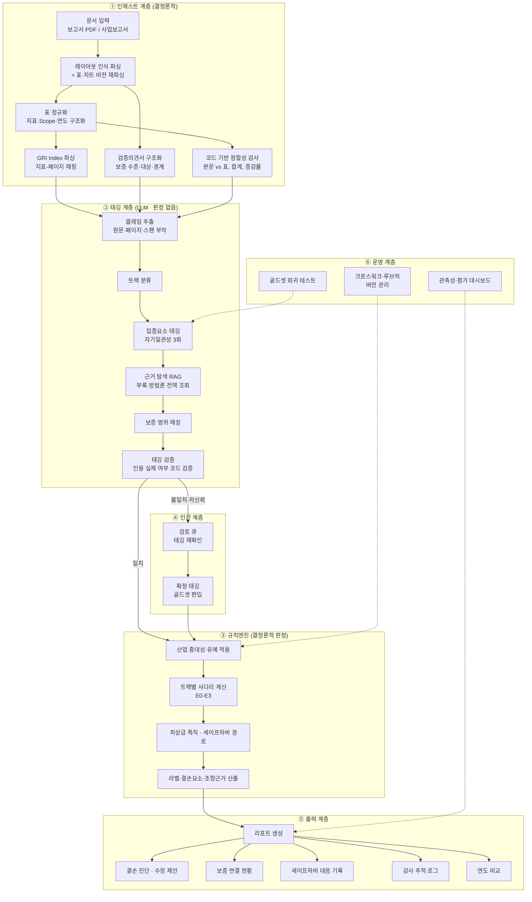

# 지속가능성 공시 입증 검토 시스템 — 프로젝트 문서

고려대학교 × AWS AI Innovators Challenge 출품작
버전 2.0 · 2026-09-07
(v1.0 대비 주요 변경 사항은 부록 C 참조)

---

## 0. 이 문서를 읽는 방법

ESG를 처음 접하는 팀원도 시스템 전체를 이해할 수 있도록 작성했습니다.

- **1장**: 무엇을 왜 만드는지, 규제 환경과 사업 논리
- **2장**: ESG 기초 지식
- **3장**: 우리가 근거로 삼는 기준 체계 (공시기준·보증기준·산업표준)
- **4장**: 판정 체계 — 시스템의 핵심 규칙
- **5~7장**: 시스템 구조와 각 단계가 하는 일
- **8~10장**: 데이터 스키마, 기술 스택, 정확도 확보 방법
- **11장**: 시장·경쟁·과금 등 사업 설계
- **12~13장**: 개발 계획과 확인 필요 사항

처음 읽는 팀원은 1장 → 2장 → 4장 순서로 읽고, 개발 착수 전에 3장·5장·8장을 다시 보면 됩니다. 개발자는 3장·4장·8장이 실질적인 명세입니다.

---

## 1. 프로젝트 개요

### 1.1 한 줄 요약

기업의 지속가능성 공시 원고를 입력하면, 그 안의 환경 관련 주장(claim)을 하나씩 뽑아내어 **주장을 뒷받침하는 증거가 공시 안에 존재하는지**를 조항 단위로 점검하고, 무엇을 보완해야 하는지를 알려주는 발간 전 검토 도구.

핵심 구분을 먼저 못 박습니다. 이 시스템은 **기업의 환경 성과가 실제로 좋은지를 평가하지 않습니다.** 성과 평가는 기업 내부 데이터에 접근해야만 가능하며, 그건 평가기관의 일입니다. 우리가 답하는 질문은 하나입니다.

> **"이 문장이 하는 주장을, 이 공시만 보고 확인할 수 있는가?"**

이 질문은 외부 데이터 없이 문서 내부에서 답할 수 있고, 그래서 **발간 이전에** 쓸 수 있습니다. 이것이 제품 성립의 근거입니다.

### 1.2 규제 환경 (2026년 9월 기준)

> ⚠ 이 절의 내용은 자본시장법 개정 논의가 진행 중이므로 변동 가능합니다. 각 항목의 출처와 확인 일자는 13.1절에 정리했습니다. 문서 갱신 시 반드시 원문을 재확인하십시오.

**제도의 골격 (2026년 7월 8일 당정협의회 '지속가능성 공시 제도화 방안' 기준)**

| 항목 | 내용 |
|---|---|
| 공시 기준 | KSSB 제1호·제2호 (2026년 2월 26일 확정, IFRS S1·S2 기반) |
| 공시 매체 | **사업보고서** — 거래소 공시를 거치지 않고 법정공시로 직행 |
| 1차 대상 | 2028년(FY2027) 연결자산총액 30조 원 이상 코스피 상장사 |
| 2차 대상 | 2029년 연결자산총액 10조 원 이상 |
| 대상 규모 | 종속회사 포함 2028년 291개사, 2029년 3,171개사 |
| 첫해 완화 | 자산·매출이 모두 연결 기준 10% 미만인 종속회사 제외 |
| 제3자 인증 | 2030년부터 의무화 (공시 의무화 2년 후) |
| Scope 3 | 대상별 3년 유예 |
| 온실가스 공시 시점 | 사업보고서 제출 시기(3월 말)가 원칙이나 배출량 정보는 8월 중순까지 유예 가능 |
| 선택적 공시 | 기후 외 사항, 톤당 내부탄소가격, 산업별 지표 |

**면책 장치 (세이프하버) — 이 시스템의 사업 논리와 직결**

- 도입 초기 3년간 공시정보 전체에 대해 자본시장법상 손해배상·행정제재·형사처벌을 포괄 면제
- 단, **고의적인 그린워싱에 대해서는 손해배상과 행정책임을 부과**
- 이후에도 ① 미래 예측 정보 ② 온실가스 배출량 추정치 ③ 협력업체 등 제3자로부터 취득한 정보에 대해서는, **합리적 근거를 갖춰 충실히 공시한 경우 책임을 면제**

### 1.3 왜 이 도구가 필요한가

v1.0은 이 제품을 "규제 제재를 피하기 위한 도구"로 설명했습니다. 세이프하버가 확정된 지금 그 논리는 약합니다. 초기 3년간은 웬만해선 처벌받지 않습니다.

그러나 면책의 조건을 보면 오히려 더 분명한 수요가 보입니다. 면책되지 않는 것은 **고의적인 그린워싱**이고, 면책의 요건은 **합리적 근거를 갖춘 충실한 공시**입니다. 즉 기업에게 필요한 것은 완벽한 보고서가 아니라, **"우리는 근거를 갖추고 성실하게 작성했다"를 사후에 입증할 수 있는 기록**입니다.

> **제품의 판매 명제**
> 그린워싱을 적발해 드리는 것이 아니라, **면책 요건인 '합리적 근거'와 '성실성'을 문서로 남겨 드립니다.**

이 전환은 단순한 마케팅 문구가 아니라 제품 설계를 바꿉니다. 감사 추적 로그가 부가 기능이 아니라 **주력 산출물**이 되고, 판정 결과보다 판정 과정의 기록 가능성이 중요해집니다. 4.6절의 세이프하버 판정 경로와 8장 스키마가 여기에 대응합니다.

### 1.4 고객

| 고객 | 사용 목적 | 진입 시점 |
|---|---|---|
| ESG 인증기관·회계법인 | 인증 착수 전 스크리닝, 인증 범위 식별, 조서 근거 | **지금** — 인증 시장 형성 중 |
| 원청 기업의 공급망 담당 | 협력사 제출 ESG 자료 검토 | **지금** |
| 협력사·중견기업 | 원청 요구 자료 작성 시 자체 점검 | **지금** |
| 대기업 지속가능경영팀 | 사업보고서 지속가능성 정보란 발간 전 점검 | 2027~2028 |
| 마케팅·홍보팀 | 제품 광고 환경성 문구 점검 (별도 모드) | 지금 |

1차 타깃을 대기업 지속가능경영팀이 아니라 **인증기관과 공급망 접점**으로 잡은 이유는 11.1절에 설명했습니다.

### 1.5 산출물

1. **클레임별 입증 등급(E0~E3)과 라벨** — 어느 수준까지 입증되었는가
2. **결손 요소와 조항 근거** — 무엇이 빠졌고, 어느 기준의 어느 조항이 그걸 요구하는가
3. **보증 연결 상태** — 이 주장이 제3자 인증 범위 안에 있는가, 어느 수준의 보증인가
4. **수정 제안** — 어떤 정보를 추가하면 등급이 올라가는가
5. **세이프하버 대응 기록** — 면책 요건 충족 여부와 그 근거
6. **감사 추적 로그** — 판정별 근거 위치, 사용 규칙 버전, 검토자 확정 이력
7. **기준별 충족 현황** — KSSB·K-ESG 등 기준별, 산업 중대성을 반영한 충족률

---

## 2. ESG 기초 지식 (비전공 팀원용)

### 2.1 지속가능경영보고서와 사업보고서 지속가능성 정보란

**둘은 다른 문서입니다.** 지속가능경영보고서는 기업이 자율적으로 발간하는 100~200페이지 PDF이고, 사업보고서 지속가능성 정보란은 2028년부터 DART에 제출되는 법정 공시 서류입니다.

현재 우리 시스템은 전자를 입력으로 다루지만, 2028년 이후 규제 대상은 후자입니다. 두 형식을 모두 처리할 수 있어야 제품 수명이 유지됩니다(6.1절).

### 2.2 클레임과 입증

우리가 다루는 최소 단위는 문장이 아니라 **클레임(주장)** 입니다. 한 문장에 주장이 두 개 섞여 있으면 나눕니다.

> "당사는 2023년 Scope 1·2 배출량을 전년 대비 8% 감축했으며, 2030년까지 2020년 대비 40% 감축을 목표로 합니다."
> → 클레임 A (성과형): 2023년 Scope 1·2 전년 대비 8% 감축
> → 클레임 B (목표형): 2030년까지 2020년 대비 40% 감축 목표

**입증(substantiation)** 은 그 주장이 참인지가 아니라, 주장을 확인할 수 있는 요소가 함께 제시되었는지를 가리킵니다. 참인 진술도 입증이 부족할 수 있습니다. 실제로 감축했더라도 기준연도·산정범위·검증 연결이 문장에 없으면 외부에서 확인할 방법이 없습니다.

### 2.3 온실가스 Scope 1 / 2 / 3

- **Scope 1**: 직접 배출 (공장 연료 연소, 회사 차량)
- **Scope 2**: 구매한 전기·열·스팀의 생산 과정에서 발생한 간접 배출
- **Scope 3**: 그 외 가치사슬 전체 (구매 상품·서비스, 제품 사용, 출장 등 15개 카테고리)

Scope 2는 **위치기반(location-based)과 시장기반(market-based)** 두 값을 모두 공시하는 것이 원칙입니다. 재생에너지 사용을 주장하는 기업이 시장기반만 제시하는 경우가 많은데, 이는 판정 대상입니다.

Scope 3는 "공시했다"와 "15개 중 3개만 산정했다"가 전혀 다른 이야기입니다. 어느 카테고리를 산정했고 어느 것을 왜 제외했는지가 실제 점검 지점입니다.

### 2.4 기준연도 · 목표연도 · 절대량 · 원단위

- **기준연도(base year)**: "몇 년 대비"의 기준. 없으면 목표를 검증할 수 없음
- **목표연도(target year)**: 언제까지
- **절대량**: 총배출량(tCO2e). 실제 환경 영향
- **원단위(intensity)**: 매출·생산량당 배출량. 사업이 커지면 절대량이 늘어도 원단위는 줄 수 있음

합병·분할 등 구조 변경이 있으면 기준연도를 재산정해야 하며, 그 정책을 공시했는지도 점검 항목입니다.

### 2.5 조직경계와 연결범위

배출량 산정 시 어디까지를 "우리 회사"로 볼지 정하는 방식이 세 가지입니다. **지분율 기준 / 재무통제 기준 / 운영통제 기준.** 어느 것을 쓰느냐에 따라 배출량이 크게 달라지므로, 방식을 명시했는지가 점검 항목입니다.

공시 자체는 **연결 기준**으로 이루어집니다. 종속회사 데이터를 취합해야 하고, 첫해에는 자산·매출이 모두 연결 기준 10% 미만인 종속회사를 제외할 수 있습니다. 실무에서 가장 어려운 부분이 여기입니다.

### 2.6 제3자 인증(assurance)

외부 기관이 공시 정보를 검증하는 것. 보고서 뒤에 검증의견서로 실립니다. 중요한 것은 **검증을 받았는지가 아니라 무엇을 어느 수준으로 받았는지**입니다.

| 구분 | 의미 |
|---|---|
| 제한적 보증(limited assurance) | "문제가 발견되지 않았다"는 소극적 결론. 절차가 가볍다 |
| 합리적 보증(reasonable assurance) | "적정하게 작성되었다"는 적극적 결론. 회계감사에 준하는 수준 |
| 보증 대상 지표 | 검증의견서 한 장이 보고서 전체를 보증하지 않는다. 대개 일부 지표만 대상 |
| 보증 조직경계 | 전사 보증과 일부 사업장 보증은 다르다 |

2030년 인증 의무화를 앞두고 있으므로, **어느 수치가 어느 수준의 보증을 받았는지 추적하는 기능**이 이 제품의 핵심 차별점입니다(5.2절).

### 2.7 세이프하버

1.2절 참조. 개발 관점에서 기억할 것은, **미래 예측 정보·배출량 추정치·제3자 취득 정보 세 범주는 "근거 없음"으로 판정하면 안 된다**는 점입니다. 제도상 이 범주들은 합리적 근거만 갖추면 면책되므로, 별도 판정 경로를 탑니다(4.6절).

---

## 3. 기준 체계

이 시스템의 모든 판정은 외부 기준에서 도출됩니다. 자체적으로 만든 척도는 없습니다. 기준은 성격에 따라 네 계열로 나뉘며, **계열을 섞으면 안 됩니다.**

### 3.1 네 계열

| 계열 | 답하는 질문 | 해당 기준 |
|---|---|---|
| **공시기준** | 무엇을 공시해야 하는가 | IFRS S1·S2, KSSB 1·2호 |
| **보증기준** | 공시된 주장이 입증되었는가 | ISAE 3000(개정), AA1000AS v3, ISSA 5000 |
| **산정·산업 표준** | 어떻게 측정하고 무엇이 중요한가 | GHG Protocol, ISO 14064-1, SASB, GRI |
| **평가·표시광고** | 참고 기준 | K-ESG, 환경부 고시, 공정위 심사지침, ISO 14021 |

**핵심**: 루브릭의 항목은 공시기준에서, 그 항목이 충족되었다고 판단하는 논리는 보증기준에서 나옵니다. v1.0은 보증기준이 전혀 없어 판정 논리의 근거가 비어 있었습니다.

### 3.2 공시기준

| 기준 | 역할 |
|---|---|
| IFRS S1 | 충실한 표현·검증가능성 등 일반 원칙, 산업별 지표 식별 시 SASB 참조 요구 |
| IFRS S2 | 기후 관련 목표·지표·전환계획의 구체적 공시 요구사항 |
| KSSB 1·2호 | 위 둘의 국내판. 실제 규제 근거. **IFRS와 1:1 대응하지 않는 조정 사항이 있는지 확인 필요(13.2절)** |

판정 결과에는 **조항 번호와 요구사항 요약**을 함께 표기합니다. "IFRS S2"라고만 쓰면 기업 담당자가 후속 조치를 할 수 없습니다.

### 3.3 보증기준

| 기준 | 시스템에서의 역할 |
|---|---|
| ISAE 3000(개정) | 적합한 기준(suitable criteria)과 충분하고 적합한 증거 요구 → 결손 판정의 논리적 근거 |
| AA1000AS v3 | Type 1(원칙·프로세스 준수)과 Type 2(성과정보 신뢰성) 구분 → 트랙별 판정 논리의 분기 |
| ISSA 5000 | 2026년 12월 15일 이후 개시 기간부터 효력. 프레임워크 중립적 글로벌 기준선 → 2030년 국내 인증 의무화의 준거 |

트랙별 대응은 이렇습니다.

- 관리체계·이행형 → AA1000AS **Type 1** 계열 (체계와 프로세스의 존재)
- 성과·실적형 → AA1000AS **Type 2** 계열 (수치의 신뢰성)
- 목표·미래지향형 → 양쪽 혼합 (목표 설정 프로세스 + 진척 수치)

### 3.4 산정·산업 표준

**GHG Protocol / ISO 14064-1** — 산정방법 요소의 인정 근거이자, 아래 네 개 하위 점검의 출처입니다.

| 하위 점검 | 판정 내용 |
|---|---|
| Scope 2 이중보고 | 위치기반·시장기반 값이 모두 제시되었는가 |
| 조직경계 설정 방식 | 지분율/재무통제/운영통제 중 무엇을 적용했는지 명시되었는가 |
| Scope 3 카테고리 특정 | 어느 카테고리를 산정했고 무엇을 왜 제외했는가 |
| 기준연도 재산정 정책 | 구조 변경 시 기준연도를 재산정했는가 |

**SASB** — 산업별 중대성 판단에 사용합니다. IFRS S1이 산업별 지표 식별 시 SASB 참조를 요구하므로 선택 사항이 아닙니다. 다만 국내 제도에서 산업별 지표는 **선택적 공시**이므로, 판정 시 "필수 미충족"이 아니라 "선택 공시 여부"로 취급합니다.

용도는 두 가지입니다.
1. 해당 산업의 중대 토픽만 필수로 적용 → 금융사에 용수·폐기물 미공시로 감점하지 않음
2. 해당 산업의 핵심 토픽을 놓치지 않음 → 배터리 소재사의 Scope 3 카테고리 1

**GRI** — 국내 보고서 대부분이 GRI 기준으로 작성되고 **GRI Content Index**(지표–페이지 대응표)를 싣습니다. 이를 근거 탐색의 1순위 경로로 사용합니다(6.2절). Index에 기재된 페이지에 실제 정보가 없는 경우는 별도 플래그로 처리합니다(부실 기재 자체가 유의미한 발견).

> 주의: GRI는 2021년 체계 개편 이후 표준별로 개별 재발행되고 있습니다. "300번대가 환경"은 구 체계 표현이므로 사용하지 마십시오.

### 3.5 평가·표시광고 기준

**K-ESG 가이드라인 v2.0** — 공시기준이 아니라 **평가 가이드라인**입니다. 근거란에 성격을 명시하고, IFRS와 같은 강제력으로 보이지 않게 표기합니다.

**환경부 「환경성 표시·광고 관리제도에 관한 고시」, 공정위 환경 표시·광고 심사지침, ISO 14021** — 이들은 **소비자 대상 제품·서비스의 표시·광고**를 규율합니다. 투자자 대상 사업보고서는 직접 적용 대상이 아닙니다.

따라서 적용을 두 갈래로 분리합니다.

| 모드 | 표시광고 기준의 지위 |
|---|---|
| 공시 검토 모드 (기본) | **참고 기준.** 라벨 산출 입력에서 제외. "표현 개선 권고"로만 표기 |
| 광고 문구 검토 모드 (별도) | **1차 근거.** ISO 14021의 자기선언 환경성 주장 요건 적용 |

v1.0은 이 둘을 구분하지 않고 표시광고 규제를 "법적 리스크 근거"로 사용했는데, 그대로 두면 기업 고객에게 존재하지 않는 법적 리스크를 통보하게 됩니다.

### 3.6 기준 대응표(크로스워크)

기준이 늘어나면 같은 항목이 기준마다 다른 코드로 존재합니다. 온실가스 배출 하나만 해도 IFRS S2, SASB 산업별 지표, GRI, K-ESG가 서로 다른 체계를 씁니다.

이를 **독립 설정 파일**로 정의하고 루브릭이 참조하게 합니다. 각 기준의 **버전과 발효일**을 함께 기록하며, 규제 개정 시 이 파일만 갱신하고 회귀 테스트를 돌립니다.

### 3.7 향후 확장

| 기준 | 도입 시점 |
|---|---|
| PCAF | 금융권 고객 확보 시 (금융배출량 산정) |
| CSRD·ESRS, CBAM, EU 배터리 규정 | 수출기업 고객 확보 시 |

---

## 4. 판정 체계

### 4.1 설계 원칙 — 가장 중요한 절

> **LLM은 읽고, 규칙엔진이 판정한다.**

이 분리가 제품의 신뢰성 전체를 지탱합니다. 구체적으로,

| 담당 | 하는 일 | 하지 않는 일 |
|---|---|---|
| **LLM 계층** | 클레임 추출, 트랙 분류, 입증요소의 존재 여부 태깅, 근거 위치 지정 | 등급 부여, 라벨 결정 |
| **규칙엔진** | 태깅 결과를 사전 고정된 임계값에 대입해 E등급과 라벨을 결정론적으로 산출 | 의미 해석 |

이 구조의 이점은 셋입니다.
1. **재현성** — 같은 태깅 입력에는 항상 같은 등급이 나옵니다. "AI가 그때그때 다르게 판정한다"는 반론이 성립하지 않습니다.
2. **설명 가능성** — 왜 이 등급인지를 규칙으로 제시할 수 있습니다.
3. **규칙 변경 비용** — 기준이 개정되어도 문서를 재파싱할 필요 없이 기존 태깅 결과로 전체를 재채점할 수 있습니다.

**따라서 앙상블·조정 같은 정확도 장치는 전부 태깅 계층에서만 작동시킵니다.** 두 모델의 판정을 비교해 라벨을 정하는 구조는 사용하지 않습니다.

나머지 원칙:

4. 결정론적인 일은 코드가 — 파싱·숫자 계산·인용 검증
5. 모든 태깅은 근거 위치를 가리켜야 한다 — 페이지·원문 스팬 없는 태깅은 무효
6. 확신 없으면 사람에게 — 태깅 불일치 건은 검토 큐로
7. 규칙·크로스워크·모델·프롬프트 버전을 기록한다

### 4.2 세 가지 트랙

| 트랙 | 무엇을 주장하는가 | 보증 논리 |
|---|---|---|
| **목표·미래지향형** | 앞으로 무엇을 하겠다 | 목표 설정 프로세스 + 진척 수치 |
| **성과·실적형** | 이미 무엇을 했다 / 수치가 이렇다 | AA1000AS Type 2 (성과정보 신뢰성) |
| **관리체계·이행형** | 이런 조직·제도·프로세스가 있다 | AA1000AS Type 1 (원칙·프로세스) |

**트랙은 주제가 아니라 문장의 성격으로 결정합니다.** 공급망 주제 문장에 목표 선언이 들어 있는 경우가 흔하므로, 주제로 트랙을 역추론하면 안 됩니다. 트랙은 독립 필드로 태깅하고, 조정 단계에서 재분류가 가능하도록 경로를 열어 둡니다.

### 4.3 입증 등급과 라벨

등급은 **E0~E3 연속 사다리**이고, 라벨은 등급의 함수입니다.

| 등급 | 라벨 | 의미 |
|---|---|---|
| E3 | SUBSTANTIATED | 입증요소를 충분히 갖춤 |
| E2 | INCOMPLETE | 핵심 요소는 있으나 검증 연결이 미비 |
| E1 | INCOMPLETE | 주장은 있으나 확인에 필요한 요소가 부족 |
| E0 | UNSUBSTANTIATED | 입증요소가 사실상 부재 |

INCOMPLETE는 결손의 성격에 따라 **PERF**(성과정보 결손)와 **IMPL**(이행체계 결손)로 세분합니다.

**검토 상태는 라벨이 아니라 별도 필드입니다.**

```
label:         SUBSTANTIATED | INCOMPLETE | UNSUBSTANTIATED
review_status: auto_confirmed | needs_review | human_confirmed
```

v1.0은 abstain을 라벨 목록에 넣었는데, 이는 대상의 속성이 아니라 시스템의 상태라 층위가 다릅니다. 한 필드에 섞으면 "UNSUBSTANTIATED 20%"가 보류 건을 포함한 값인지 아닌지 알 수 없게 됩니다.

### 4.4 트랙별 등급 사다리

**목표·미래지향형** (근거: IFRS S2 목표 공시 요구사항)

| 등급 | 조건 |
|---|---|
| E0 | 목표연도 부재. 단 목표수치와 전환계획이 **모두** 있으면 E1을 상한으로 인정 |
| E1 | 목표연도 + 목표수치(지표) |
| E2 | E1 + 기준연도·기준값 + 적용범위(Scope·조직경계) |
| E3 | E2 + 현재 이행률(진척) + 전환계획·달성수단 |

**성과·실적형** (근거: IFRS S1 충실한 표현·검증가능성)

| 등급 | 조건 |
|---|---|
| E0 | 정량수치 부재 |
| E1 | 정량수치 + 단위 |
| E2 | E1 + 비교기준(기준연도·전년) + 산정범위 |
| E3 | E2 + 산정방법 명시 + **보증 연결 확인** |

외부 인증기관명이 명시된 범주형 인증등급(예: 특정 인증의 최고등급)은 제3자 검증 체계 안에서 부여되는 서수적 측정값이므로 정량 성과에 준하는 것으로 인정합니다.

**관리체계·이행형**

| 등급 | 조건 |
|---|---|
| E0 | 의지 표현만 ("노력하고 있습니다") |
| E1 | 명명된 표준·수단 또는 구체적 시행 상태 |
| E2 | E1 + 적용범위(조직경계·사업장) |
| E3 | E2 + 외부검증 |

제품 특성 주장(특정 모델에 재활용 소재 적용 등)은 이 트랙의 변형으로 처리하되, 모델명·소재명의 구체성만으로는 E1을 상한으로 하고, 함유 비율이나 목표 수치가 해당 제품·소재를 직접 언급하며 제시될 때에만 E2 이상을 인정합니다.

**최상급 주장 특칙 (모든 트랙에 우선)**

"세계 최초", "업계 최고" 등 비교·최상급 주장은 **비교기준**(비교 대상군·측정단위·출처)과 **외부검증**(제3자 검증·인증기관명·공인출처)이 모두 부재하면 트랙과 무관하게 E0으로 분류합니다. 최상급 표현의 존재 여부와 원문은 별도 필드에 기록해 사후 감사가 가능하게 합니다.

### 4.5 루브릭 — 요소별 조항 근거와 필수/조건부 구분

**모든 요소에 조항 번호와 요구사항 요약을 부착합니다.** 그리고 필수(mandatory)와 조건부(conditional)를 구분합니다. v1.0은 모든 요소를 필수로 두어 과잉 판정이 발생하는 구조였습니다.

**목표·미래지향형**

| # | 요소 | 구분 | 조건 |
|---|---|---|---|
| G1 | 목표연도 | 필수 | |
| G2 | 목표수치·지표 | 필수 | |
| G3 | 기준연도·기준값 | 필수 | |
| G4 | 적용범위 (Scope·조직경계) | 필수 | |
| G5 | 현재 이행률·진척 | 필수 | |
| G6 | 전환계획·달성수단 | 필수 | |
| G7 | 상쇄(탄소배출권) 사용 계획 | **조건부** | 상쇄를 언급하거나 탄소중립을 주장할 때만 |
| G8 | 과학기반 목표 검증 | **조건부** | SBTi 등 과학기반을 주장할 때만 |

**성과·실적형**

| # | 요소 | 구분 | 조건 |
|---|---|---|---|
| P1 | 정량수치와 단위 | 필수 | |
| P2 | 비교기준 (전년·기준연도) | 필수 | |
| P3 | 산정방법론과 경계 | 필수 | 3.4절 네 개 하위 점검 포함 |
| P4 | 보증 연결 | 필수 | 4.7절의 구조화된 값 |
| P5 | 절대량/원단위 구분 명시 | **조건부** | 감축률·개선율을 주장할 때 |
| P6 | 본문 수치와 데이터 표의 일치 | 필수 | 코드로 검증 |

**관리체계·이행형**

| # | 요소 | 구분 | 조건 |
|---|---|---|---|
| M1 | 이행방법·명명된 표준 | 필수 | |
| M2 | 적용범위 (조직경계·사업장) | 필수 | |
| M3 | 외부검증 | 필수 | |
| M4 | 이행 실적의 구체성 | 필수 | |
| M5 | 담당 조직·거버넌스 | **조건부** | 거버넌스를 주장하는 클레임에 한함 |
| M6 | 경영진 보상 연동 | **조건부** | 보상 연계를 주장하는 클레임에 한함 |

> v1.0의 M4(경영진 보상)·M5(이사회 보고 주기)를 필수에서 조건부로 내린 이유: 이들은 조직 단위 요구사항이라 개별 문장에 요구하면 모든 관리체계형 클레임이 미충족이 됩니다. 조직 단위 점검은 별도 리포트 항목으로 다룹니다.

### 4.6 세이프하버 판정 경로 (신설)

세이프하버 대상 세 범주는 일반 사다리를 타지 않고 별도 경로로 판정합니다.

| 범주 | 판정 대상 |
|---|---|
| 미래 예측 정보 | 예측의 전제·가정·시나리오가 제시되었는가 |
| 온실가스 배출량 추정치 | 추정임이 표시되었는가, 추정 방법과 불확실성이 제시되었는가 |
| 제3자 취득 정보 (협력사 등) | 출처가 명시되었는가, 취득 경위와 한계가 기술되었는가 |

이 범주의 클레임은 정량수치가 없다는 이유로 E0을 받으면 안 됩니다. **"합리적 근거를 갖춰 충실히 공시"했는지**가 판정 기준이고, 이는 면책 요건과 직결되므로 결과를 별도 축으로 병기합니다.

```
safe_harbor: {
  applicable: true,
  category: "emissions_estimate",
  reasonable_basis_documented: true,
  missing: ["불확실성 범위 미제시"]
}
```

이 기능이 1.3절 판매 명제의 실질입니다.

### 4.7 보증 연결 (신설)

v1.0은 제3자 검증을 예/아니오로만 처리했습니다. 실무에서 의미 있는 구분은 다음과 같습니다.

| 항목 | 값 |
|---|---|
| 보증 수준 | limited / reasonable / none |
| 보증 대상 지표 | 지표 목록 |
| 보증 조직경계 | 사업장·법인 범위 |
| 보증기관 | 기관명 |
| 적용 보증기준 | ISAE 3000 / AA1000AS / ISSA 5000 / 기타 |

각 클레임에 대해 **보증 범위 안에 있는지**를 매칭하고, 결과를 `covered / not_covered / undetermined`로 산출합니다.

대부분의 보고서가 부록에 검증의견서를 갖고 있음에도 개별 문장과 검증 범위의 연결이 확인되지 않는 경우가 많습니다. 이 **공시–보증 간극**을 자동으로 측정하는 것이 경쟁 도구에 없는 기능이며, 2030년 인증 의무화를 앞둔 기업이 가장 알고 싶어 하는 정보입니다.

### 4.8 산업 조건부 판정 (신설)

보고서 입력 시 **산업 분류를 함께 받습니다**(GICS 권장). 해당 산업의 SASB 중대 토픽만 필수로 적용하고, 해당하지 않는 토픽은 **미충족이 아니라 결측(not_applicable)** 으로 처리합니다.

충족률 산출 시 결측 토픽은 **분모에서 제외**합니다. 이 규칙이 없으면 금융사가 용수·폐기물 미공시로 자동 감점됩니다.

### 4.9 유예 반영

Scope 3는 대상별로 3년 유예되므로, 유예 기간 중인 기업의 Scope 3 클레임은 **필수 판정 대상에서 제외**하고 "유예 기간, 사전 준비 관점 참고 판정"으로 표기합니다. 유예 일정을 설정 파일로 관리합니다.

---

## 5. 시스템 구조

### 5.1 전체 구조



**v1.0 대비 핵심 변경**: 라벨 결정이 ②(LLM)에서 ③(규칙엔진)으로 이동했습니다. 인간 계층은 라벨이 아니라 **태깅**을 확정하며, 확정된 태깅이 다시 규칙엔진을 통과합니다.

### 5.2 계층별 요약

| 계층 | 역할 | 판정 권한 |
|---|---|---|
| ① 인제스트 | 문서를 구조화된 클레임·표·보증정보로 변환 | 없음 (코드) |
| ② 태깅 | 요소의 존재 여부를 태깅하고 근거 위치를 지정 | **없음** |
| ③ 규칙엔진 | 등급·라벨·결손요소 산출 | **전권** |
| ④ 인간 | 불확실한 태깅을 확정 | 태깅만 |
| ⑤ 출력 | 리포트·감사 로그 | 없음 |
| ⑥ 운영 | 규칙 버전 관리, 회귀 테스트, 관측성 | 없음 |

---

## 6. 단계별 수행 task

### ① 인제스트 계층

**1-1. 문서 입력 및 대상 구간 식별**
- 받는 것: 보고서 PDF 또는 사업보고서 지속가능성 정보란
- 하는 일: 문서 유형 판별 → 환경 파트 페이지 범위 식별(목차 파싱, 실패 시 키워드 밀도) → 메타데이터 추출(기업명, 보고연도, 산업분류, 적용 기준, 검증기관, 연결범위 정보)
- 넘기는 것: 대상 구간, 메타데이터
- 기술: Python 규칙 기반 + 경량 LLM

**1-2. 레이아웃 인식 파싱 + 비전 재파싱**
- 하는 일: 텍스트 블록·표·각주 추출 → 표 포함 페이지는 비전 모델로 재추출해 두 결과 비교 → 페이지 경계 분리 문장 재결합 → **모든 단위에 page·bbox·원문 해시 부착**
- 차트가 이미지로만 제공되어 판독 불가한 경우 임의 추정하지 않고 `UNREADABLE`로 기록
- 넘기는 것: `{chunk_id, page, bbox, type, content, hash}`

**1-3. 표 정규화**
- 하는 일: `{지표, Scope, 사업장, 연도, 값, 단위, 검증여부}` 정규 레코드 변환, 단위 통일, 동일 지표 다중 표 병합(출처 페이지 모두 기록)
- 기술: LLM 구조화 출력 + pandas 검증

**1-4. GRI Content Index 파싱 (신설)**
- 하는 일: Index 페이지 식별 → 지표 코드–페이지 매핑 표 추출 → 근거 탐색의 1순위 인덱스로 등록 → 기재 페이지에 실제 정보가 없으면 `index_mismatch` 플래그

**1-5. 검증의견서 구조화 (신설)**
- 하는 일: 검증의견서를 별도 문서로 분리 → 보증 수준·대상 지표 목록·조직경계·기관명·적용 보증기준 추출
- 넘기는 것: 4.7절 구조

**1-6. 코드 기반 정합성 검사**
- 하는 일 (전부 코드): 본문 수치 vs 표 수치 / 표 내부 합계 검산 / 전년 대비 증감률 재계산 / 절대량과 원단위 추세 역방향 플래그 / 전년 보고서 대비 목표 변경·삭제 플래그
- **전년 보고서 비교는 다년도 문서가 확보된 경우에만 수행**하고, 미확보 시 해당 검사를 `not_run`으로 기록합니다. v1.0은 이 전제를 명시하지 않은 채 목표 후퇴 탐지를 기능으로 제시했습니다.

### ② 태깅 계층 (판정하지 않음)

**2-1. 클레임 추출**
- 하는 일: 청크마다 주장을 원자 단위로 분리, 비클레임 문장 제외(법령 소개·용어 정의·일반 설명), 주제·정량 여부·언급 Scope 태깅
- 이 단계의 정확도가 이후 전체에 영향을 주므로 상위 모델 사용

**2-2. 트랙 분류**
- 하는 일: 목표형/성과형/관리체계형 분류. **주제로 역추론하지 않고 문장 성격으로 판단.** 신뢰도 함께 산출
- 세이프하버 범주(미래 예측·추정치·제3자 취득) 여부도 여기서 태깅

**2-3. 입증요소 태깅**
- 하는 일: 4.5절 요소별 존재 여부를 태깅하고 각 태깅에 **근거 스팬**(원문 위치) 부착
- **자기일관성**: 3회 독립 실행 후 다수결. 3회가 갈리면 검토 큐로
- 산출: 요소별 존재 여부, 근거 스팬, 3회 일치율

**2-4. 근거 탐색 RAG (신설)**
- 하는 일: 적용범위·산정방법·외부검증이 문장에 없을 때 같은 문서의 부록·방법론·GRI Index를 조회해 근거 존재 여부 확인
- **근거 위치를 반드시 함께 반환하고, 못 찾으면 "없음"을 반환**하도록 강제 (환각 차단 지점)
- 인정 범위 규칙: 적용범위·산정방법·외부검증은 문서 전역 인정. **정량수치와 목표연도는 해당 문장 또는 동일 표에서 직접 확인되어야 하며 전역 인정 불가**
- 전역 인정 시 `credited_from`에 위치 기록

**2-5. 보증 범위 매칭**
- 하는 일: 1-5의 구조화 결과와 클레임을 매칭해 `covered / not_covered / undetermined` 산출

**2-6. 태깅 검증 (코드)**
- 하는 일: 태깅이 인용한 근거 스팬이 실제 원문에 존재하는지 문자열 매칭(정규화 후 부분 일치). 없으면 해당 태깅 무효 처리 후 재시도 또는 검토 큐
- 자기일관성 불일치, 저신뢰 트랙 분류도 여기서 큐로 분기

### ③ 규칙엔진

**3-1. 컨텍스트 적용**: 산업 중대성(4.8), 유예(4.9)를 적용해 필수 요소 집합을 확정
**3-2. 사다리 계산**: 트랙별 사다리(4.4)로 E등급 산출
**3-3. 특칙 적용**: 최상급 주장 특칙, 세이프하버 경로(4.6)
**3-4. 산출**: 라벨, 결손 요소, 조항 근거, 수정 우선순위

전 과정이 결정론적이며, 규칙 버전만 바꾸면 기존 태깅 결과로 전체 재채점이 가능합니다.

### ④ 인간 계층

**4-1. 검토 큐**
- 받는 것: 태깅 불일치·저신뢰·인용 검증 실패 건
- 하는 일: 클레임 원문, 3회 태깅 결과, 근거 청크를 나란히 표시 → 검토자가 **태깅을 확정**(라벨이 아님) → 확정 태깅을 규칙엔진에 재투입 → 골드셋 편입
- **골드셋 편입 시 평가용 세트와 격리**합니다(10.2절)

### ⑤ 출력 계층

**5-1. 리포트 생성**
- 트랙별·등급별 분포, 기준별 충족 현황(결측 분모 제외 규칙 적용)
- 클레임별 수정 제안: "p.34 목표 문장에 기준연도와 중간 목표를 추가" + 해당 조항 근거
- 보증 연결 현황: 어느 주장이 인증 범위 밖인지
- 세이프하버 대응 기록
- 감사 추적 로그: 태깅 근거 위치, 규칙 버전, 크로스워크 버전, 검토자 확정 이력

> **종합 점수는 주력 산출물이 아닙니다.** 필요 시 보조 지표로 제공하되 산출식을 공개하고, 화면 상단에는 결손 요소 구성을 배치합니다. 단일 점수는 "무엇을 고쳐야 하는가"에 답하지 못하며, 그 답이 이 제품의 가치입니다.

---

## 7. 클레임 하나가 지나가는 경로

> 클레임: "당사는 2030년까지 탄소 배출량을 40% 감축하겠습니다." (p.28)

| 단계 | 처리 |
|---|---|
| 추출 | 목표형 후보, 정량, Scope 미명시 |
| 트랙 분류 | 목표·미래지향형 (신뢰도 0.94) |
| 요소 태깅 | G1 목표연도 존재(2030), G2 목표수치 존재(40%), G3 기준연도 부재, G4 적용범위 부재, G5 이행률 부재, G6 전환계획 부재 |
| 근거 탐색 | 부록·방법론에서 기준연도·적용범위 조회 → 없음 |
| 보증 매칭 | 목표는 보증 대상 아님 → not_covered |
| 자기일관성 | 3회 모두 동일 → 검토 불필요 |
| 인용 검증 | 통과 |
| 규칙엔진 | 산업 중대성 해당, 유예 비대상 → 사다리 계산: 목표연도+목표수치 있으나 기준연도·적용범위 없음 → **E1 / INCOMPLETE (IMPL)** |
| 결손 요소 | 기준연도·기준값, 적용범위, 현재 이행률, 전환계획 |
| 조항 근거 | IFRS S2 목표 공시 요구사항 (조항 번호는 13.2절 확정 후 표기) / KSSB 2호 대응 조항 |
| 수정 제안 | "기준연도와 기준값, 적용 Scope, 중간 목표와 현재 이행률을 함께 명시할 것" |

---

## 8. 데이터 스키마

### 8.1 클레임

```json
{
  "claim_id": "C-0042",
  "document_id": "ACME-2025",
  "document_type": "sustainability_report",
  "industry_gics": "20106010",
  "sasb_industry": "RT-EE",
  "consolidation_scope": "parent",
  "page": 28,
  "bbox": [120, 340, 480, 372],
  "quote": "당사는 2030년까지 탄소 배출량을 40% 감축하겠습니다.",
  "statement": "2030년까지 탄소 배출량 40% 감축 목표",
  "track": "goal",
  "track_confidence": 0.94,
  "topic": "climate_target",
  "materiality": "material",
  "deferral_status": "not_deferred",
  "safe_harbor_category": null,
  "superlative_expression": null,
  "gri_index_ref": "305-5",
  "quantitative": true,
  "scope_mentioned": []
}
```

### 8.2 태깅 결과 (LLM 계층 산출 — 등급 없음)

```json
{
  "claim_id": "C-0042",
  "elements": [
    {
      "element": "G1_target_year",
      "present": true,
      "evidence_span": "2030년까지",
      "evidence_page": 28,
      "credited_from": null,
      "self_consistency": 3
    },
    {
      "element": "G3_base_year",
      "present": false,
      "evidence_span": null,
      "evidence_page": null,
      "credited_from": null,
      "self_consistency": 3
    }
  ],
  "assurance_match": {
    "status": "not_covered",
    "level": null,
    "provider": null,
    "assurance_standard": null,
    "covered_metrics": [],
    "boundary": null
  },
  "ghg_protocol_checks": {
    "scope2_dual_reporting": null,
    "organizational_boundary_stated": false,
    "scope3_categories_specified": [],
    "base_year_recalculation_policy": false
  },
  "citation_verified": true,
  "tagged_by": {"model": "...", "prompt_version": "2026.09.1", "runs": 3}
}
```

### 8.3 판정 결과 (규칙엔진 산출)

```json
{
  "claim_id": "C-0042",
  "evidence_grade": "E1",
  "label": "INCOMPLETE",
  "sublabel": "IMPL",
  "review_status": "auto_confirmed",
  "applied_elements": [
    {
      "element": "G3_base_year",
      "requirement_type": "mandatory",
      "satisfied": false,
      "basis": [
        {"standard": "IFRS S2", "clause": "TBD", "text": "목표의 기준연도와 기준값 공시"},
        {"standard": "KSSB 2호", "clause": "TBD", "text": "..."}
      ]
    }
  ],
  "excluded_elements": [
    {"element": "G7_offset_plan", "reason": "conditional_not_triggered"}
  ],
  "missing_elements": ["G3_base_year", "G4_scope", "G5_progress", "G6_transition_plan"],
  "safe_harbor": {"applicable": false},
  "advertising_review": {"applicable": false, "notes": []},
  "suggestion": "기준연도(예: 2020)와 기준값, 적용 Scope, 중간 목표와 현재 이행률을 명시",
  "audit_trail": {
    "rubric_version": "2026.09.1",
    "crosswalk_version": "2026.09.1",
    "rule_engine_version": "2026.09.1",
    "decided_at": "2026-09-07T10:22:31Z"
  }
}
```

### 8.4 설정 파일 구조

```
config/
├── crosswalk.yaml              # 토픽 ↔ IFRS S2 / SASB / GRI / K-ESG
├── rubric/
│   ├── goal.yaml               # 요소 + 조항 근거 + mandatory/conditional + 사다리
│   ├── performance.yaml
│   └── management.yaml
├── standards/
│   ├── ifrs_s1_s2.yaml
│   ├── kssb.yaml               # IFRS 대조 + 국내 조정 사항
│   ├── kesg_v2.yaml
│   ├── ghg_protocol.yaml
│   ├── iso_14064_1.yaml
│   └── iso_14021.yaml
├── assurance/
│   ├── isae3000.yaml
│   ├── aa1000as_v3.yaml
│   └── issa5000.yaml
├── sasb/industries/*.yaml      # 산업별 중대 토픽
├── advertising/                # 광고 모드 전용
│   ├── moe_notice.yaml
│   └── kftc_guideline.yaml
└── regulatory/
    ├── timeline.yaml           # 의무화·유예·인증 일정
    └── safe_harbor.yaml        # 면책 범주 정의
```

모든 파일에 `version`과 `effective_date`를 필수 필드로 둡니다.

---

## 9. 기술 스택

| 영역 | 선택 | 이유 |
|---|---|---|
| 파싱 | 문서 AI + 비전 모델 재파싱 | 한국어 표 처리. 벤치마크 결과를 발표에 포함 |
| LLM 플랫폼 | Amazon Bedrock | 대회 요건, 다중 모델 단일 API |
| 태깅 모델 | 상위 추론 모델 | 요소 존재 판별 정확도 |
| 경량 작업 | 경량 모델 | 트랙 분류, 집계, 문안 생성 |
| 에이전트 프레임워크 | Strands Agents | AWS 네이티브, AgentCore 호환 |
| 에이전트 운영 | AgentCore Runtime·Memory·Gateway·Identity·Observability | 배포·연도 기억·도구 통합·감사 로그 |
| **규칙엔진** | **순수 Python + YAML 규칙** | **LLM 미사용. 결정론 보장** |
| 벡터 검색 | OpenSearch Serverless | 근거 탐색·유사 사례 |
| 저장 | S3(원본·파생물 버전 관리), DynamoDB(결과) | |
| 비용 최적화 | prompt caching, batch inference | 문서 컨텍스트 재사용 |
| UI | React | 검토 큐·대시보드 |

> 대회 요강의 허용 서비스 목록과 리전별 모델 가용성을 먼저 확인하고 확정하십시오(13.3절).

### 9.1 비용·속도

측정 항목을 정하고 파일럿 1건으로 실측해 채웁니다. 추정치만 적어두면 사업성 검토에서 쓸 수 없습니다.

| 항목 | 측정 방법 |
|---|---|
| 보고서 1건 처리 원가 | 토큰 사용량 × 단가 + 파싱 비용 |
| 처리 소요 시간 | 인제스트 / 태깅 / 판정 구간별 |
| 클레임당 LLM 호출 수 | 추출 1 + 트랙 1 + 태깅 3 + 근거탐색 0~2 |
| 검토 큐 진입률 | 전체 클레임 대비 % — 인건비에 직결 |

검토 큐 진입률이 사실상 원가를 결정합니다. 자기일관성 3회는 정확도를 올리지만 큐 진입률도 올리므로, 임계값 튜닝이 곧 원가 관리입니다.

---

## 10. 정확도 확보 및 평가

### 10.1 정확도 장치

| 장치 | 효과 | 위치 |
|---|---|---|
| 자기일관성 3회 태깅 | 태깅 흔들림 제거 | 2-3 |
| 인용 실재 검증 (코드) | 환각 근거 차단 | 2-6 |
| 근거 탐색 RAG | 전역 인정 자동화, 과소평가 방지 | 2-4 |
| 코드 기반 숫자 검증 | 수치 오류 결정론적 탐지 | 1-6 |
| 규칙엔진 분리 | 판정 재현성 100% | ③ |
| 골드셋 회귀 테스트 | 규칙·프롬프트 변경 시 성능 하락 감지 | ⑥ |

### 10.2 평가 방법

**평가 단위를 라벨이 아니라 요소로 잡습니다.** 라벨 정확도만 보면 어느 태깅에서 틀리는지 알 수 없습니다.

| 지표 | 설명 |
|---|---|
| 요소별 정밀도·재현율 | 입증요소 하나하나에 대해. 개선 방향을 특정하는 지표 |
| 라벨 정확도 / macro F1 | 최종 결과 지표 |
| **다수 클래스 기준선** | INCOMPLETE가 다수이므로, 전부 INCOMPLETE로 찍었을 때의 정확도를 함께 보고 |
| **사람 간 일치도(가중 κ)** | 2인이 독립 라벨링한 표본으로 산출. 시스템 성능의 상한선 |
| 검토 큐 진입률 | 운영 비용 지표 |
| 검토자 수정률 | 큐에 들어온 건 중 실제로 태깅이 바뀐 비율 |

**골드셋 관리 규칙**
- 평가용 세트와 few-shot 풀을 **물리적으로 분리**합니다
- 검토 큐에서 확정된 태깅은 few-shot 풀에만 편입하고, 평가용 세트에는 넣지 않습니다
- 규칙 변경 시 기존 태깅 결과로 전체를 재채점해 회귀를 확인합니다

**적대적 테스트셋**: 그럴듯하지만 근거가 없는 문장, 최상급 표현, 범주형 인증등급, 전역 인정 경계, 표 기반 수치 등 판단이 어려운 사례를 별도 세트로 유지합니다.

---

## 11. 사업 설계

### 11.1 시장 진입 경로

2028년 1차 대상은 코스피 상장사 약 58개(종속회사 포함 291개)입니다. 이들은 이미 대형 회계법인 자문과 벤더 솔루션에 묶여 있어 신생 도구의 직판이 어렵습니다. 2029년 3,171개사로 확대되는 구간이 실질적인 시장이지만, 그때까지 매출이 필요합니다.

따라서 진입 순서를 이렇게 잡습니다.

| 순서 | 타깃 | 근거 |
|---|---|---|
| 1 | **인증기관·회계법인** | 2030년 인증 의무화로 시장 형성 중. 인증 착수 전 스크리닝 수요가 지금 존재. 도입 결정이 빠름 |
| 2 | **원청의 공급망 담당 / 협력사** | 규제 시점과 무관하게 상시 수요 |
| 3 | 대기업 지속가능경영팀 | 2027~2028 준비 국면 |
| 4 | 중견기업 | 2029 확대 구간 |

인증기관 납품 시에는 **독립성 요건과 충돌하지 않도록** 도구의 성격을 "인증 판단의 대체가 아닌 사전 스크리닝 지원"으로 계약에 명시해야 합니다.

### 11.2 경쟁 지형

| 유형 | 대표 | 강점 | 빈틈 |
|---|---|---|---|
| 회계법인 솔루션 | 인벤토리 구축 도구, 공시 리포팅 툴 | 산정·양식 산출, 자문 연계 | 작성된 문장의 입증 수준 검토 |
| 대기업 SI 플랫폼 | 자체 ESG 플랫폼 | 데이터 수집·워크플로·AI 초안 작성 | 판정 근거 제시, 조항 연결 |
| ESG SaaS | 진단·공시 자동화 솔루션 | 다수 레퍼런스, 공급망 모듈 | 문장 단위 검증, 보증 연계 |
| 미디어·컨설팅 | AI 그린워싱 사전점검 워크숍 | 시장 인지도, 실무 접점 | 시스템화·재현성 |

**공통된 빈틈**: 대부분이 보고서를 **만드는 쪽**을 지원하고, 만들어진 문장이 기준을 충족하는지를 **조항 단위로 판정하고 보증 범위와 연결하는 기능**은 없습니다.

**따라서 차별점을 "AI 그린워싱 점검"이라는 넓은 말로 표현하지 않습니다.** 이미 유사 서비스가 시장에 있습니다. 우리의 문장은 이것입니다.

> 조항 단위 근거가 부착된 결손 진단 + 보증 범위 연결 추적 + 재현 가능한 판정

### 11.3 과금 구조

보고서는 연 1회 발간이므로 사용 빈도가 연 1회입니다. 그대로면 SaaS 구독이 성립하지 않고 프로젝트 단가로 인식됩니다. 사용 빈도를 만드는 접점을 제품에 포함합니다.

| 접점 | 빈도 |
|---|---|
| 공시 원고 검토 | 연 1회 |
| 협력사 제출 자료 검토 | 상시 |
| 광고·마케팅 문구 검토 (3.5절 별도 모드) | 상시 |
| 분기 데이터 점검 | 분기 |
| IR 자료·홈페이지 문구 검토 | 수시 |

과금은 문서 건수 기반 종량과 좌석 기반 구독의 혼합을 검토합니다. 인증기관 채널은 검토 건수 종량이 자연스럽습니다.

### 11.4 보안과 책임

**보안 요건은 부가 기능이 아니라 진입 요건입니다.** 발간 전 원고는 미공개 정보이고, 사업보고서 편입 이후에는 미공개 중요정보에 해당할 수 있습니다.

- 고객 데이터 격리, 학습 미사용 보장, 접근 로그, 보존 기간 정책
- 대기업·회계법인 구매 심사에서 이 항목이 없으면 검토 단계에서 탈락합니다

**책임 소재**를 계약과 제품 문구에 명시합니다.

- 이 도구는 **보증·인증이 아니며, 법적 판단을 대체하지 않습니다**
- 검토 결과는 사전 점검 지원 정보이며 최종 책임은 공시 주체에 있습니다
- 다만 감사 추적 로그는 세이프하버 요건인 "합리적 근거"의 문서적 증빙으로 활용될 수 있습니다

마지막 문장이 면책 조항이면서 동시에 판매 논리입니다.

---

## 12. 개발 로드맵과 역할 분담

### 12.1 단계

| 단계 | 내용 | 산출물 |
|---|---|---|
| 1. 기반 | 파싱 벤치마크, 표 정규화, GRI Index 파싱, 클레임 추출, 골드셋 정비 | 청크·클레임 데이터 |
| 2. 기준 정비 | 크로스워크·루브릭 YAML 작성, 조항 번호 확정, 보증기준 반영 | 설정 파일 일습 |
| 3. 규칙엔진 | 사다리·특칙·세이프하버 경로 구현, 골드셋 역검증 | 결정론적 판정기 |
| 4. 태깅 계층 | 요소 태깅, 자기일관성, 인용 검증, 근거 탐색 RAG | 요소별 정밀도·재현율 |
| 5. 보증·산업 | 검증의견서 구조화, SASB 산업 조건부 판정 | 보증 매칭률 |
| 6. 제품화 | 검토 큐 UI, 리포트, 감사 로그, 대시보드 | 데모 |

**2·3단계를 4단계보다 먼저** 합니다. 판정 규칙이 확정되지 않은 상태에서 태깅을 튜닝하면 기준이 움직여 성능 비교가 불가능해집니다.

각 단계에 마감일을 붙이고, 대회 예선 제출본에 포함할 범위를 명시하십시오.

### 12.2 역할 분담

| 역할 | 담당 |
|---|---|
| 도메인 | 크로스워크·루브릭 정의, 조항 번호 확정, 골드셋 품질 관리, 수정 제안 문안 기준, 규제 갱신 |
| 엔지니어링 | 인제스트 파이프라인, 규칙엔진, 태깅 계층, 평가 스크립트, 인프라·UI |

실제 팀 인원에 맞게 조정하고, 인원이 부족하면 12.1의 5·6단계를 예선 범위에서 제외하십시오. 두 영역은 8장 스키마로 연결되므로 병렬 개발이 가능합니다.

---

## 13. 확인 필요 사항

### 13.1 규제 사실관계

1.2절의 내용은 아래 출처를 기준으로 작성했습니다. 자본시장법 개정 논의가 진행 중이므로 **문서 갱신 시마다 재확인하고, 확인 일자를 함께 기록**하십시오.

| 항목 | 출처 | 확인 일자 |
|---|---|---|
| 공시 제도화 최종안 (대상·매체·인증·유예·세이프하버) | 2026-07-08 당정협의회 '지속가능성 공시 제도화 방안' | 2026-09-07 |
| KSSB 제1·2호 확정 | 한국회계기준원, 2026-02-26 | 2026-09-07 |
| 로드맵 초안 | 금융위원회 제4차 생산적 금융 대전환 회의, 2026-02-25 | 2026-09-07 |
| 자본시장법 개정안 | 연내 추진 예정 — **미확정** | — |

### 13.2 조항 번호

스키마의 `clause` 필드가 `TBD`인 항목은 원문 대조 후 확정해야 합니다. 결과 화면에 조항 번호가 노출되는 구조이므로 오기는 곧 제품 신뢰도 문제입니다.

- IFRS S1·S2: IFRS Foundation 공식 원문
- KSSB 1·2호: 한국회계기준원 공개본. **IFRS 조항과 1:1 대응하지 않는 부분이 있는지 반드시 확인**
- K-ESG v2.0: 산업통상자원부 배포본, 환경 진단항목 수 확인
- 환경부 고시: 국가법령정보센터. 정식 명칭은 「환경성 표시·광고 관리제도에 관한 고시」이며 「친환경 경영활동 표시·광고 가이드라인」과는 별개 문서. **어느 쪽을 사용할지 결정 필요**

### 13.3 기술 확인

- 대회 요강의 허용 AWS 서비스 목록
- 리전별 모델 가용성 및 컨텍스트 길이
- 벡터 검색 서비스 선택 확정

### 13.4 라이선스

IFRS, GRI, SASB 원문은 재배포에 제한이 있습니다. 전문을 벡터DB에 적재해 서비스하는 구성은 위험합니다.

- **권장**: 조항 ID + 자체 작성 요구사항 요약을 보유. 원문 인용은 최소 범위로 출처와 함께
- **원문 활용 가능**: 국가법령정보센터의 환경부 고시, 공정위 심사지침, KSSB 공개본, K-ESG 가이드라인

---

## 부록 A. 용어집

| 용어 | 설명 |
|---|---|
| ESG | Environment·Social·Governance. 기업의 비재무 성과 영역 |
| 지속가능경영보고서 | 기업이 자율 발간하는 연간 ESG 보고서 |
| 사업보고서 지속가능성 정보란 | 2028년부터 DART에 제출되는 법정 공시 서류 |
| 클레임 | 공시 내 검증 가능한 하나의 주장 |
| 트랙 | 클레임 성격 분류 (목표형 / 성과형 / 관리체계형) |
| 입증(substantiation) | 주장을 확인할 수 있는 요소가 함께 제시되었는지의 정도 |
| E0~E3 | 입증 등급 사다리 |
| 결손 요소 | 해당 클레임에서 빠진 입증요소 |
| 전역 인정 | 같은 문서의 다른 지면 근거로 요소를 인정하는 규칙 |
| Scope 1/2/3 | 온실가스 배출 범위 (직접 / 구매 에너지 / 가치사슬) |
| 위치기반·시장기반 | Scope 2 산정의 두 방식. 둘 다 공시하는 것이 원칙 |
| 조직경계 | 지분율 / 재무통제 / 운영통제 중 배출량 산정에 적용한 기준 |
| 연결범위 | 공시 대상에 포함되는 종속회사의 범위 |
| tCO2e | 이산화탄소 환산 톤 |
| 기준연도 | 감축률 계산의 기준 연도 |
| 절대량 / 원단위 | 총배출량 / 매출·생산량당 배출량 |
| 제3자 인증(assurance) | 외부 기관의 공시 정보 검증 |
| 제한적 보증 / 합리적 보증 | 소극적 결론 / 적극적 결론. 절차 강도가 다름 |
| 세이프하버 | 일정 요건 충족 시 공시 책임을 면제하는 제도 |
| GHG Protocol | 온실가스 산정의 국제 표준 방법론 |
| ISO 14064-1 | 조직 단위 온실가스 산정·보고 표준 |
| ISO 14021 | 자기선언 환경성 주장의 요건 |
| SBTi | 과학기반 감축목표 검증 기구 |
| 탄소중립(carbon neutral) | 상쇄를 포함해 배출을 상계한 상태 |
| 넷제로(net zero) | 실질 감축을 전제로 잔여 배출만 제거하는 상태. 탄소중립과 구분됨 |
| 상쇄(offset) | 배출권 구매 등으로 배출을 상계하는 것 |
| K-ESG | 산업통상자원부 ESG **평가 가이드라인** (공시기준 아님) |
| IFRS S1·S2 | 국제 지속가능성 공시기준 (일반 / 기후) |
| KSSB | 한국지속가능성기준위원회. IFRS S1·S2 기반 국내 기준(1·2호) 제정 |
| SASB | 산업별 중대 이슈 기준. IFRS S1이 참조를 요구 |
| GRI | 지속가능성 보고 표준. Content Index가 지표–페이지 대응표 |
| ISAE 3000(개정) | 재무정보 외 보증업무 국제기준 |
| AA1000AS v3 | 지속가능성 보증 표준. Type 1 / Type 2 구분 |
| ISSA 5000 | 지속가능성 보증 국제기준. 2026-12-15 이후 개시 기간부터 효력 |
| PCAF | 금융배출량 산정 파트너십 |
| CSRD / ESRS | EU 지속가능성 공시 지침 / 기준 |
| DART | 금융감독원 전자공시시스템 |
| 루브릭 | 트랙별 요소 체크리스트와 등급 사다리 |
| 골드셋 | 사람이 직접 태깅한 정답 데이터 |
| 자기일관성 | 같은 입력을 여러 번 실행해 다수결로 결정하는 기법 |
| 가중 κ | 순서형 라벨의 일치도 지표 |
| Strands Agents | AWS 오픈소스 에이전트 프레임워크 |
| AgentCore | Amazon Bedrock의 에이전트 배포·운영 서비스 |
| prompt caching | 반복 프롬프트 앞부분을 캐시해 비용·지연을 줄이는 기능 |

## 부록 B. 참고 자료

- 대회 페이지: https://ku-aws-challenge.framer.ai/
- Amazon Bedrock AgentCore: https://aws.amazon.com/bedrock/agentcore/
- Strands Agents: https://strandsagents.com/
- KSSB 공시기준: 한국회계기준원 (kasb.or.kr)
- K-ESG 가이드라인 v2.0: 산업통상자원부
- 환경성 표시·광고 관리제도에 관한 고시: 국가법령정보센터
- IFRS S1·S2: IFRS Foundation
- SASB Standards / GRI Standards: IFRS Foundation, GRI

> 선행 연구·경쟁 도구 목록은 실재와 서지를 확인한 뒤 추가하십시오. 확인되지 않은 항목은 기재하지 않습니다.

## 부록 C. v1.0 대비 주요 변경

| 영역 | 변경 |
|---|---|
| 판정 주체 | LLM 판정 → **LLM 태깅 + 규칙엔진 결정론적 판정**으로 분리 |
| 등급 체계 | 라벨 4종 → **E0~E3 사다리 + 라벨 3종**, 검토 상태는 별도 필드로 분리 |
| 루브릭 | 전 요소 필수 → **필수/조건부 구분**, 조항 근거 부착 |
| 보증기준 | 없음 → **ISAE 3000·AA1000AS v3·ISSA 5000 편입**, 보증 연결 구조화 |
| SASB | 없음 → **산업 조건부 판정 도입**, 결측 분모 제외 규칙 |
| GRI | 용어집만 → **Content Index를 근거 탐색 경로로 활용** |
| GHG Protocol | 이름만 → **Scope 2 이중보고 등 4개 하위 점검** |
| 표시광고 규제 | 판정 근거 → **공시 모드에서 참고 기준으로 격하 + 광고 모드 분리**, ISO 14021 추가 |
| 규제 사실관계 | 로드맵 초안 기준 → **2026-07 최종안 기준으로 전면 갱신** |
| 세이프하버 | 없음 → **별도 판정 경로 신설**, 제품 판매 명제로 채택 |
| 입력 문서 | 보고서 PDF만 → **사업보고서 지속가능성 정보란 포함**, 연결범위 필드 |
| 외부 데이터 대조 | 판정 입력 → **제외** (공시 내부 검증이라는 제품 정체성과 충돌) |
| 사업 설계 | 없음 → **시장 진입 경로·경쟁 지형·과금·보안/책임 신설** |
| 평가 | 라벨 정확도 → **요소별 정밀도·재현율 + 기준선 2종 + 골드셋 격리 규칙** |
| 전년 비교 | 전제 없이 기능 제시 → **다년도 확보 시에만 수행**, 미확보 시 not_run |
